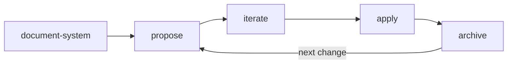

# Till's Claude Code Marketplace

Personal marketplace for [Claude Code](https://claude.ai/code) plugins.

## Setup

Register the marketplace, then install any plugin:

```
/plugin marketplace add tillg/till-claude-code-marketplace
/plugin install spec@till-claude-code-marketplace
/plugin install md2pdf@till-claude-code-marketplace
/plugin install transform@till-claude-code-marketplace
```

Select "Install for all collaborators on this repository (project scope)" or
"Install for just me (user scope)" as needed. Restart Claude Code to load new
plugins.

**Enable auto-updates** so you get notified when plugins change:

```
/plugin → Marketplaces tab → till-claude-code-marketplace → Enable auto-update
```

With auto-update on, Claude Code checks for new versions at startup and prompts
you to run `/reload-plugins` when updates are available.

## Plugins

### spec — Spec-driven change management

A lightweight workflow for thinking through changes before implementing them.
Instead of jumping straight into code, you document what you want to change and
why, explore the design, break it into steps, then implement — with Claude
tracking progress throughout.

#### Workflow



`/spec:explore` can be used at any point — it's a thinking mode, not a phase.

The flow is fluid, not rigid — you can loop back from iterate to propose when
decisions change, and after archiving one change you start the next.

#### Getting started

After installing the plugin, run `/spec:overview` in any project. It shows the
full workflow reference, checks whether a system description exists, and tells
you exactly where you are and what to do next.

#### Skills

| Skill                   | Purpose                                                                          | When to use                                                     |
| ----------------------- | -------------------------------------------------------------------------------- | --------------------------------------------------------------- |
| `/spec:overview`        | Show workflow reference, current status, phase, maturity assessment, and version | Starting a session, checking where you left off                 |
| `/spec:document-system` | Document the system as-is: domain, architecture, functional                      | Once at the start, or after major changes are archived          |
| `/spec:explore`         | Open-ended thinking — investigate, compare approaches, question assumptions      | When you have an idea but aren't ready to commit to a plan      |
| `/spec:propose`         | Create a change with all artifacts (proposal, domain, architecture, plan)        | When you know what you want to build                            |
| `/spec:iterate`         | Review artifacts, apply user annotations, produce clean consolidated version     | After marking up artifacts with decisions, rejections, comments |
| `/spec:apply`           | Implement the plan step by step, tracking progress                               | When artifacts are ready and it's time to code                  |
| `/spec:archive`         | Update system docs, commit, and clean up the change                              | When all steps are complete                                     |

#### Artifacts

The workflow produces two kinds of documentation:

**System description** (`specs/system/`) — a living snapshot of what the system
is and does right now:

| File              | Content                                                                   |
| ----------------- | ------------------------------------------------------------------------- |
| `domain.md`       | Vocabulary, concepts, entities, actors, processes, business rules         |
| `architecture.md` | Tech stack, components, data model, system boundaries, infrastructure     |
| `functional.md`   | Features, user journeys, inputs/outputs, states, permissions, limitations |

**Change artifacts** (`specs/changes/<name>/`) — scoped to a single change:

| File              | Content                                            |
| ----------------- | -------------------------------------------------- |
| `proposal.md`     | What and why — motivation, scope, expected outcome |
| `domain.md`       | New or changed domain concepts                     |
| `architecture.md` | Technical approach, key decisions, tradeoffs       |
| `plan.md`         | Implementation steps as a checkbox list            |

---

### md2pdf — Markdown to PDF converter

Converts Markdown files to beautifully formatted PDFs using
[markdown-it](https://github.com/markdown-it/markdown-it),
[highlight.js](https://highlightjs.org/), and
[Playwright](https://playwright.dev/).

**Features:**

- Syntax-highlighted code blocks (190+ languages)
- Styled tables with striped rows
- Mermaid diagram rendering
- Image embedding (local files inlined as data URIs, remote URLs loaded)
- ASCII art preservation (monospace)
- Footnotes
- Print-optimized CSS with page numbers

**Usage:**

```
/md2pdf:convert <file.md> [output.pdf]
```

## Disable Plugins per Repo

Globally installed plugins can be disabled for a specific project via
`.claude/settings.json` (git-committed, team-wide) or
`.claude/settings.local.json` (local only, not committed):

```json
{
  "enabledPlugins": {
    "spec@till-claude-code-marketplace": false
  }
}
```
