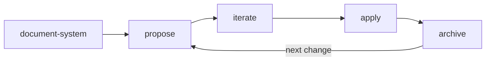

# Till's Claude Code Marketplace

Personal marketplace for [Claude Code](https://claude.ai/code) plugins.

## Setup

Register the marketplace, then install any plugin:

```
/plugin marketplace add tillg/till-claude-code-marketplace
/plugin install spec@till-claude-code-marketplace
/plugin install md2pdf@till-claude-code-marketplace
/plugin install transform@till-claude-code-marketplace
/plugin install agent-bus@till-claude-code-marketplace
```

Select "Install for all collaborators on this repository (project scope)" or
"Install for just me (user scope)" as needed. Restart Claude Code to load new
plugins.

**Enable auto-updates** so you get notified when plugins change:

```
/plugin → Marketplaces tab → till-claude-code-marketplace → Enable auto-update
```

With auto-update on, Claude Code checks for new versions at startup and prompts
you to run `/reload-plugins` when updates are available.

## Plugins

### spec — Spec-driven change management

A lightweight workflow for thinking through changes before implementing them.
Instead of jumping straight into code, you document what you want to change and
why, explore the design, break it into steps, then implement — with Claude
tracking progress throughout.

#### Workflow


```mermaid
graph LR
    DS[document-system] --> P[propose]
    P --> I[iterate]

    I --> A[apply]
    A --> AR[archive]

    AR -->|next change| P
```

`/spec:explore` can be used at any point — it's a thinking mode, not a phase.

The flow is fluid, not rigid — you can loop back from iterate to propose when
decisions change, and after archiving one change you start the next.

#### Getting started

After installing the plugin, run `/spec:overview` in any project. It shows the
full workflow reference, checks whether a system description exists, and tells
you exactly where you are and what to do next.

#### Skills

| Skill                   | Purpose                                                                          | When to use                                                     |
| ----------------------- | -------------------------------------------------------------------------------- | --------------------------------------------------------------- |
| `/spec:overview`        | Show workflow reference, current status, phase, maturity assessment, and version | Starting a session, checking where you left off                 |
| `/spec:document-system` | Document the system as-is: domain, architecture, functional                      | Once at the start, or after major changes are archived          |
| `/spec:explore`         | Open-ended thinking — investigate, compare approaches, question assumptions      | When you have an idea but aren't ready to commit to a plan      |
| `/spec:propose`         | Create a change with all artifacts (proposal, domain, architecture, plan)        | When you know what you want to build                            |
| `/spec:iterate`         | Review artifacts, apply user annotations, produce clean consolidated version     | After marking up artifacts with decisions, rejections, comments |
| `/spec:ready-or-not`    | Audit artifacts for clarity, completeness, coherence, and consistency            | Before `/spec:apply` — verify the spec is actually ready        |
| `/spec:apply`           | Implement the plan step by step, tracking progress                               | When artifacts are ready and it's time to code                  |
| `/spec:adversarial-code-review` | Hostile-mindset review of implemented code for bugs, regressions, edge cases | After implementation, before archiving                          |
| `/spec:archive`         | Update system docs, commit, and clean up the change                              | When all steps are complete                                     |

#### Artifacts

The workflow produces two kinds of documentation:

**System description** (`specs/system/`) — a living snapshot of what the system
is and does right now:

| File              | Content                                                                   |
| ----------------- | ------------------------------------------------------------------------- |
| `domain.md`       | Vocabulary, concepts, entities, actors, processes, business rules         |
| `architecture.md` | Tech stack, components, data model, system boundaries, infrastructure     |
| `functional.md`   | Features, user journeys, inputs/outputs, states, permissions, limitations |

**Change artifacts** (`specs/changes/<name>/`) — scoped to a single change:

| File              | Content                                            |
| ----------------- | -------------------------------------------------- |
| `proposal.md`     | What and why — motivation, scope, expected outcome |
| `domain.md`       | New or changed domain concepts                     |
| `architecture.md` | Technical approach, key decisions, tradeoffs       |
| `plan.md`         | Implementation steps as a checkbox list            |

---

### md2pdf — Markdown to PDF converter

Converts Markdown files to beautifully formatted PDFs using
[markdown-it](https://github.com/markdown-it/markdown-it),
[highlight.js](https://highlightjs.org/), and
[Playwright](https://playwright.dev/).

**Features:**

- Syntax-highlighted code blocks (190+ languages)
- Styled tables with striped rows
- Mermaid diagram rendering
- Image embedding (local files inlined as data URIs, remote URLs loaded)
- ASCII art preservation (monospace)
- Footnotes
- Print-optimized CSS with page numbers

**Usage:**

```
/md2pdf:convert <file.md> [output.pdf]
```

---

### agent-bus — Coordinate multiple Claude Code agents

A file-based inbox protocol for coordinating multiple Claude Code agents
working in sibling repositories. Replaces slow shared-chat polling with
event-driven structured messages — one JSON file per message, atomic handoff
via temp-write + rename, and a human-readable `chat.md` kept as the
transcript, not the transport.

**Use when** you have two or more Claude Code sessions working on related
projects (e.g. an app repo and its deployment playbook) and they need to send
requests, replies, blockers, or alerts to each other reliably.

#### How it works

Agents share a `.agent-bus/` directory at the parent of their projects:

```txt
workspace/
  project-a/
  project-b/
  .agent-bus/
    agents/
      project-a-agent/
        inbox/        # new messages land here
        processing/   # being worked on
        done/         # processed successfully
        failed/       # malformed or rejected
      project-b-agent/
    chat.md           # human-readable transcript
```

Each agent has a stable `AGENT_ID` (e.g. `project-a-agent`). To send a
message, an agent writes a JSON file
(`<timestamp>__<from>__<to>__<type>__<id>.json`) into the recipient's
`inbox/` via temp-write + atomic rename. The recipient sorts inbox by
priority + timestamp, moves each message through `inbox → processing → done`,
and replies in kind.

Message types: `request`, `reply`, `status`, `handoff`, `blocker`,
`decision`, `alert`. Priorities: `low`, `normal`, `high`, `urgent`.

#### Setup

1. Pick an `AGENT_ID` for each agent (e.g. `project-a-agent`,
   `project-b-agent`). Tell each session its own ID in its `CLAUDE.md` or
   project memory.
2. Add `.agent-bus/` to `.gitignore` at the workspace level (or commit only
   `chat.md` if you want the transcript versioned).
3. *(Recommended)* Set up a filesystem watcher in the host runtime to invoke
   each agent when a new inbox file appears. Without that, agents fall back
   to polling — workable, but slower.

#### Usage

Invoke the skill to load the protocol into the session's context:

```
/agent-bus:coordinate
```

The agent then sends messages by writing JSON files, processes its inbox at
the start of each run, and replies as appropriate. See the skill body for the
full message schema, validation rules, escalation guidance, and idempotency
notes.

#### Caveats

- **Protocol only, no runtime.** The skill describes how agents should
  behave; something else has to actually invoke them when new messages
  arrive (IDE runtime, watcher, or `/loop` as fallback).
- **Single-machine, filesystem-first.** No Redis, no HTTP, no central
  orchestrator. For cross-machine coordination, port the same schema to a
  real message bus (NATS, Redis Streams).

---

## Disable Plugins per Repo

Globally installed plugins can be disabled for a specific project via
`.claude/settings.json` (git-committed, team-wide) or
`.claude/settings.local.json` (local only, not committed):

```json
{
  "enabledPlugins": {
    "spec@till-claude-code-marketplace": false
  }
}
```
