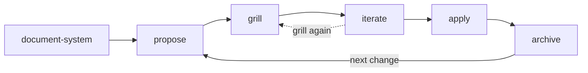
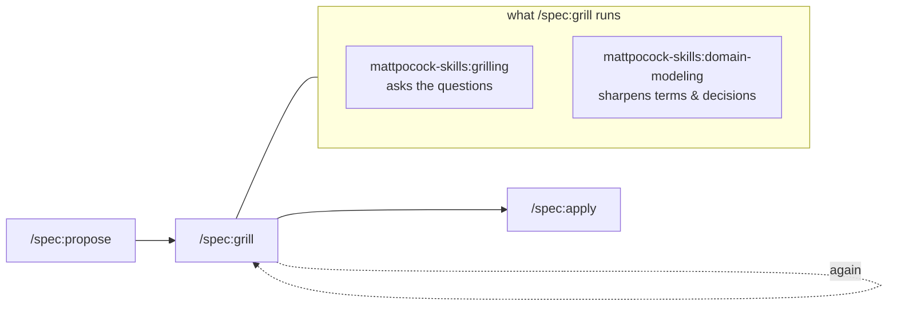

# Till's Claude Code Marketplace

Personal marketplace for [Claude Code](https://claude.ai/code) plugins.

## Setup

Register the marketplace, then install any plugin:

```
/plugin marketplace add tillg/till-claude-code-marketplace
/plugin install spec@till-claude-code-marketplace
/plugin install md2pdf@till-claude-code-marketplace
/plugin install md2html@till-claude-code-marketplace
/plugin install transform@till-claude-code-marketplace
/plugin install agent-bus@till-claude-code-marketplace
```

`spec` depends on Matt Pocock's [`mattpocock-skills`](https://github.com/mattpocock/skills)
(MIT) for `/spec:grill`; installing `spec` installs it from his marketplace and keeps it
current with his releases. If that doesn't happen automatically, add it once:
`/plugin marketplace add mattpocock/skills`.

Select "Install for all collaborators on this repository (project scope)" or
"Install for just me (user scope)" as needed. Restart Claude Code to load new
plugins.

**Enable auto-updates** so you get notified when plugins change:

```
/plugin → Marketplaces tab → till-claude-code-marketplace → Enable auto-update
```

With auto-update on, Claude Code checks for new versions at startup and prompts
you to run `/reload-plugins` when updates are available.

### Link the skills into a project (teammates get them automatically)

To make a repository bring these skills with it, so that everyone who clones it
and opens Claude Code gets them without typing any `/plugin` command, commit a
`.claude/settings.json` like this one (keep only the plugins the project uses):

```json
{
  "extraKnownMarketplaces": {
    "till-claude-code-marketplace": {
      "source": { "source": "github", "repo": "tillg/till-claude-code-marketplace" },
      "autoUpdate": true
    },
    "mattpocock": {
      "source": { "source": "github", "repo": "mattpocock/skills" },
      "autoUpdate": true
    }
  },
  "enabledPlugins": {
    "spec@till-claude-code-marketplace": true,
    "md2html@till-claude-code-marketplace": true,
    "mattpocock-skills@mattpocock": true
  },
  "hooks": {
    "SessionStart": [
      {
        "hooks": [
          {
            "type": "command",
            "command": "f=\"${CLAUDE_CODE_PLUGIN_CACHE_DIR:-$HOME/.claude/plugins}/installed_plugins.json\"; for p in spec@till-claude-code-marketplace md2html@till-claude-code-marketplace mattpocock-skills@mattpocock; do grep -q \"\\\"$p\\\"\" \"$f\" 2>/dev/null || claude plugin install \"$p\" --scope project >/dev/null 2>&1; done; exit 0"
          }
        ]
      }
    ]
  }
}
```

What each part does:

| Key | Effect |
|---|---|
| `extraKnownMarketplaces` | Registers this marketplace (and Matt Pocock's, for `/spec:grill`) on the teammate's machine. `autoUpdate: true` keeps both current without anyone running `/plugin marketplace update`. |
| `enabledPlugins` | Turns the plugins on for this repository (project scope). On its own this does **not** download them: Claude Code fetches a plugin only when the user's own settings enable it. |
| `hooks.SessionStart` | The missing step: at session start it installs each listed plugin that isn't installed yet (`claude plugin install … --scope project`); once installed, it does nothing. Keep its list in sync with `enabledPlugins`. |

What a teammate experiences:

1. `git clone …`, then `claude` in the repo.
2. Claude Code asks whether to **trust the folder**. Marketplaces, plugins and
   hooks from a repository file only apply after that (a safety rule of Claude
   Code).
3. In that first session the marketplaces are registered and the hook installs
   the plugins. They load in the **next** session: restart Claude Code (or run
   `/reload-plugins`). From then on `/spec:…`, `/md2html:…` and Matt's skills
   are simply there, and stay up to date.

A teammate who doesn't want a plugin in this repo can turn it off for
themselves: `/plugin` → Installed → Uninstall → **Disable for me**, which writes
`false` into their untracked `.claude/settings.local.json`.

Verified on a machine with an empty plugin cache: with only `extraKnownMarketplaces` +
`enabledPlugins` the marketplaces were registered but the plugins never loaded; with the
`SessionStart` hook added, all three plugins were installed in the first session and
available in the second.

## Plugins

### spec — Spec-driven change management

A lightweight workflow for thinking through changes before implementing them.
Instead of jumping straight into code, you document what you want to change and
why, explore the design, break it into steps, then implement — with Claude
tracking progress throughout.

#### Workflow


```mermaid
graph LR
    DS[document-system] --> P[propose]
    P --> G[grill]
    G --> I[iterate]
    I -.->|grill again| G

    I --> A[apply]
    A --> AR[archive]

    AR -->|next change| P
```

`/spec:explore` can be used at any point — it's a thinking mode, not a phase.
`/spec:grill` is optional and repeatable: skip it for small changes, or run it
again after iterating until no open decisions are left.

The flow is fluid, not rigid — you can loop back from iterate to propose when
decisions change, and after archiving one change you start the next.

#### Getting started

After installing the plugin, run `/spec:overview` in any project. It shows the
full workflow reference, checks whether a system description exists, and tells
you exactly where you are and what to do next.

#### Skills

| Skill                   | Purpose                                                                          | When to use                                                     |
| ----------------------- | -------------------------------------------------------------------------------- | --------------------------------------------------------------- |
| `/spec:overview`        | Show workflow reference, current status, phase, maturity assessment, and version | Starting a session, checking where you left off                 |
| `/spec:document-system` | Document the system as-is: domain, architecture, functional                      | Once at the start, or after major changes are archived          |
| `/spec:explore`         | Open-ended thinking — investigate, compare approaches, question assumptions      | When you have an idea but aren't ready to commit to a plan      |
| `/spec:propose`         | Create a change with all artifacts (proposal, domain, architecture, plan), then open it as HTML (`/spec:view`) | When you know what you want to build                            |
| `/spec:grill`           | Get grilled on a change (Matt Pocock's `grilling` + `domain-modeling`); answers go into its proposal/domain/architecture/plan | After propose, before apply — settle open decisions |
| `/spec:iterate`         | Review artifacts, apply user annotations, produce clean consolidated version     | After marking up artifacts with decisions, rejections, comments |
| `/spec:apply`           | Implement the plan step by step, tracking progress                               | When artifacts are ready and it's time to code                  |
| `/spec:adversarial-code-review` | Hostile-mindset review in three separate axes: Defects (bugs, regressions, edge cases), Standards (repo standards + code-smell baseline), Spec (matches the change?) | After implementation, before archiving; or `[fixed-point] [change]` for "review since X" |
| `/spec:archive`         | Update system docs, commit, and clean up the change                              | When all steps are complete                                     |
| `/spec:view`            | Open a change (or all specs) as HTML in the browser; a watcher keeps it current  | Reading a change with rendered Mermaid (needs md2html ≥ 0.3.0) |

#### Artifacts

The workflow produces two kinds of documentation:

**System description** (`specs/system/`) — a living snapshot of what the system
is and does right now:

| File              | Content                                                                   |
| ----------------- | ------------------------------------------------------------------------- |
| `domain.md`       | Vocabulary, concepts, entities, actors, processes, business rules         |
| `architecture.md` | Tech stack, components, data model, system boundaries, infrastructure     |
| `functional.md`   | Features, user journeys, inputs/outputs, states, permissions, limitations |

**Change artifacts** (`specs/changes/<name>/`) — scoped to a single change:

| File              | Content                                            |
| ----------------- | -------------------------------------------------- |
| `proposal.md`     | What and why — motivation, scope, expected outcome |
| `domain.md`       | New or changed domain concepts                     |
| `architecture.md` | Technical approach, key decisions, tradeoffs       |
| `plan.md`         | Implementation steps as a checkbox list            |

Every spec file starts with YAML frontmatter that the skills write and update:

```yaml
---
feature: add-auth            # change name = directory name (change files only)
title: "Proposal: add authentication"
status: proposed             # exploring → proposed → applying → (paused) → applied
order: 1                     # nav position: 1 proposal, 2 domain, 3 architecture, 4 plan
created: 2026-09-30
edited: 2026-09-30
---
```

All files of a change share one `status`; `/spec:overview` reads the phase from
it (legacy changes without frontmatter fall back to counting `plan.md`
checkboxes). System docs carry only `title`, `created`, `edited`.
`/spec:view` renders the specs as local, gitignored HTML via md2html's spec
profile and keeps it current with a watcher (committed report HTML is left
alone).

#### Grilling a change: `/spec:grill` (with Matt Pocock's skills)

`/spec:grill <change>` stress-tests a proposed change before you implement it.
It interviews you in rounds about everything the artifacts leave open, hedge on
or contradict — each question comes with a recommended answer — until the open
decisions are settled. Run it between `/spec:propose` and `/spec:apply`, as
often as you like.


```mermaid
graph LR
  P["/spec:propose"] --> G["/spec:grill"]
  G --> A["/spec:apply"]
  G -. "again" .-> G
  subgraph G2["what /spec:grill runs"]
    GR["mattpocock-skills:grilling<br/>asks the questions"]
    DM["mattpocock-skills:domain-modeling<br/>sharpens terms & decisions"]
  end
  G --- G2
```

The interview itself comes from Matt Pocock's
[skills](https://github.com/mattpocock/skills) (MIT): the same `grilling` and
`domain-modeling` skills his `/grill-with-docs` combines. `/spec:grill` points
them at the change and writes the results into **our** spec files instead of
his doc layout:

| His skill would write | `/spec:grill` writes it to |
|---|---|
| a term in `GLOSSARY.md` | the change's `domain.md` |
| an ADR in `docs/adr/` | a row in the "Key decisions" table of the change's `architecture.md` |

Then it folds the answers into `proposal.md` (scope) and `plan.md` (new or
changed steps), bumps `edited` and leaves `status` alone. No `GLOSSARY.md` or
`docs/adr/` is created.

**Referenced, not copied.** The `spec` plugin declares his plugin as a
dependency (`plugin.json` → `"dependencies": [{ "name": "mattpocock-skills",
"marketplace": "mattpocock" }]`), and this marketplace allows that
cross-marketplace dependency (`allowCrossMarketplaceDependenciesOn:
["mattpocock"]`). So:

- installing or updating `spec` installs `mattpocock-skills` from his own
  marketplace — if it doesn't, add it once with
  `/plugin marketplace add mattpocock/skills` and
  `/plugin install mattpocock-skills@mattpocock`;
- you get his updates whenever you update plugins (no version is pinned);
- his other skills (`/tdd`, `/to-spec`, `/grill-with-docs`, …) become available
  too, since he ships them as one plugin.

If his skills aren't installed, `/spec:grill` says how to install them and
stops; every other spec skill works without them. Grilling needs a person to
answer, so it stops in unattended runs.

---

### md2pdf — Markdown to PDF converter

Converts Markdown files to beautifully formatted PDFs using
[markdown-it](https://github.com/markdown-it/markdown-it),
[highlight.js](https://highlightjs.org/), and
[Playwright](https://playwright.dev/).

**Features:**

- Syntax-highlighted code blocks (190+ languages)
- Styled tables with striped rows
- Mermaid diagram rendering
- Image embedding (local files inlined as data URIs, remote URLs loaded)
- ASCII art preservation (monospace)
- Footnotes
- Print-optimized CSS with page numbers

**Usage:**

```
/md2pdf:convert <file.md> [output.pdf]
```

---

### md2html — Deterministic Markdown → HTML reports

Turns report Markdown (`*-report.md`) into styled, self-contained HTML pages
with a fixed house layout (menu bar, header, TL;DR, TOC, numbered sections,
figures) and per-project CSS themes. Built on
[unified/remark](https://unifiedjs.com/). The same input always produces the
same bytes, so the HTML is committed and checked in CI.

**Features:**

- CLI: `new`, `fmt` (canonical form), `lint` (`file:line:col` messages with
  suggestions), `build`, `check` (CI gate, incl. orphaned HTML and menu
  entries), `syntax` (cheat sheet)
- Directives from one registry: `:::tldr`, `::::cards` / `:::card`,
  `:verdict[label]{tone="go"}`
- `PostToolUse` hook: lints every report Claude edits and feeds errors back
  in the same turn; formats it only when lint-clean (silent outside projects
  with `reports.json`)
- Theming via `reports/theme.css` against a versioned class/token contract
- Spec profile (`specs` key in `reports.json`): renders spec plugin files as
  local, gitignored HTML with per-change nav, a project index and client-side
  Mermaid; `build --specs [--watch]` builds only those (used by `/spec:view`)
- Committed single-file bundle: needs only `node`, can be vendored for CI

**Skills:**

| Skill | Purpose |
| --- | --- |
| `/md2html:setup` | Set up a project: `reports.json`, theme stub, `.remarkrc.mjs`, `just` recipes, vendored tool |
| `/md2html:write` | Write or edit a report (Claude also uses it on its own) |
| `/md2html:build` | Build or check reports and open them over `http://localhost` |

See [`plugins/md2html/README.md`](plugins/md2html/README.md) for the CLI,
`reports.json` schema, directives, lint rules, theming contract, and CI setup.

---

### agent-bus — Coordinate multiple Claude Code agents

A file-based inbox protocol for coordinating multiple Claude Code agents
working in sibling repositories. Replaces slow shared-chat polling with
event-driven structured messages — one JSON file per message, atomic handoff
via temp-write + rename, and a human-readable `chat.md` kept as the
transcript, not the transport.

**Use when** you have two or more Claude Code sessions working on related
projects (e.g. an app repo and its deployment playbook) and they need to send
requests, replies, blockers, or alerts to each other reliably.

#### How it works

Agents share a `.agent-bus/` directory at the parent of their projects:

```txt
workspace/
  project-a/
  project-b/
  .agent-bus/
    agents/
      project-a/
        inbox/        # new messages land here
        processing/   # being worked on
        done/         # processed successfully
        failed/       # malformed or rejected
      project-b/
    chat.md           # human-readable transcript
```

Each agent has a stable `AGENT_ID`. **By default it's the normalized basename
of the project's working directory** (e.g. `~/workspace/project-a/` →
`project-a`), which keeps the inbox tree self-documenting. Override
explicitly in the project's `CLAUDE.md` when two sibling projects share a
basename, the dirname is unstable, or a more meaningful name exists.

To send a message, an agent writes a JSON file
(`<timestamp>__<from>__<to>__<type>__<id>.json`) into the recipient's
`inbox/` via temp-write + atomic rename. The recipient sorts inbox by
priority + timestamp, moves each message through `inbox → processing → done`,
and replies in kind.

Message types: `request`, `reply`, `status`, `handoff`, `blocker`,
`decision`, `alert`. Priorities: `low`, `normal`, `high`, `urgent`.

#### Setup

1. Confirm the default `AGENT_ID`s — they fall out of the project basenames
   automatically. Only set `AGENT_ID` explicitly in `CLAUDE.md` if two
   siblings collide or you want a different name.
2. Add `.agent-bus/` to `.gitignore` at the workspace level (or commit only
   `chat.md` if you want the transcript versioned).
3. Pick at least one wake-up mechanism (see below).

#### Waking the agents

The plugin ships three ways to keep agents informed, listed from cheapest to
most event-driven:

| Mechanism | Latency | Limit | Setup |
| --- | --- | --- | --- |
| **A. Prompt-submit hook** (`scripts/check-inbox-hook.sh`) | Next user prompt | Doesn't wake an idle session | Wire into `.claude/settings.json` as a `UserPromptSubmit` hook |
| **C. External watcher** (`scripts/watch.mjs`) | Sub-second | Spawns a fresh Claude session per event | `node plugins/agent-bus/scripts/watch.mjs ~/workspace` as a background daemon |
| **D. Polling loop** | 2 min | Session-local; lost when Claude exits | An agent runs `/loop 2m /agent-bus:coordinate` |

A and C are complementary — the hook catches you when you type, the watcher
catches you when you're idle. D is the fallback when neither host
integration is available.

#### Usage

Invoke the skill to load the protocol into the session's context:

```
/agent-bus:coordinate
```

The agent then sends messages by writing JSON files, processes its inbox at
the start of each run, and replies as appropriate. See the skill body for the
full message schema, validation rules, escalation guidance, and idempotency
notes.

#### Following the conversation

Every sent or processed message also appends a concise summary to
`.agent-bus/chat.md` — the human-readable transcript. To watch the agents
talk live:

```
tail -f .agent-bus/chat.md
```

The JSON inbox files are the source of truth for pending work; `chat.md` is
purely a scrollback for humans.

#### Caveats

- **Protocol only — the runtime is opt-in.** The skill describes how agents
  should behave; the bundled hook, watcher, and polling loop are the
  invocation mechanisms. Without at least one, agents only check their
  inbox when manually told to.
- **Single-machine, filesystem-first.** No Redis, no HTTP, no central
  orchestrator. For cross-machine coordination, port the same schema to a
  real message bus (NATS, Redis Streams).

---

## Disable Plugins per Repo

Globally installed plugins can be disabled for a specific project via
`.claude/settings.json` (git-committed, team-wide) or
`.claude/settings.local.json` (local only, not committed):

```json
{
  "enabledPlugins": {
    "spec@till-claude-code-marketplace": false
  }
}
```
