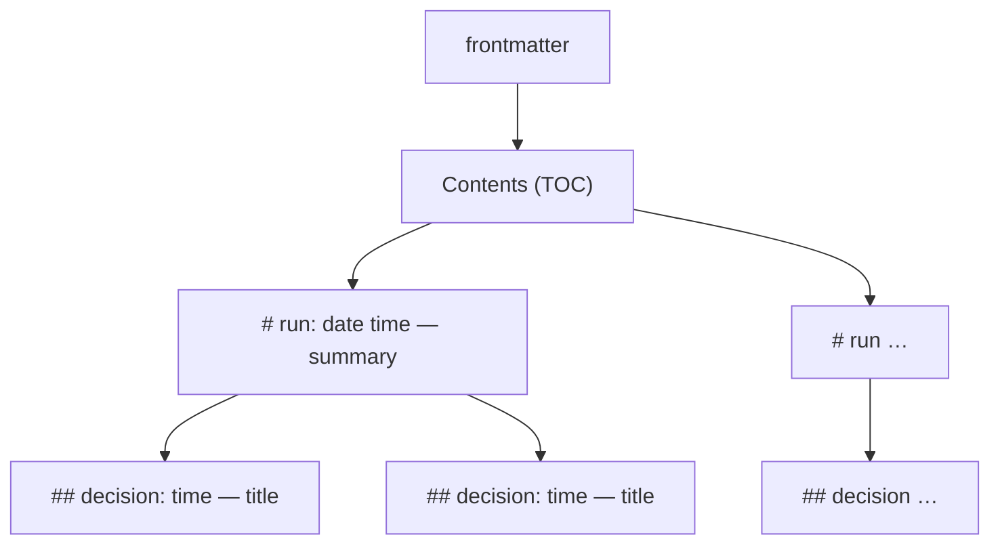

# Decisions log (`DECISIONS.md`)

When a skill runs **unattended** (no user to answer) and has to make a choice it would
normally ask about, it records that choice in `DECISIONS.md` at the **project root** (the git
root). One file per project, shared by all changes and all skills that write to it (the spec
skills and `/autonomous`), so the user can review every choice made without them in one place.
`/spec:view` renders it as HTML next to the specs.

Interactive runs don't write here: the user answered, and the answer lands in the artifacts.

## What goes in

A choice that the user would otherwise have been asked about, or that the artifacts leave
open:

- an unclear plan step and how it was read
- picking one option where the architecture names several (or none)
- a change selected by inference instead of by the user
- a check skipped (e.g. the Spec axis of a review with no spec)
- an open change left in place when proposing a new one

Not: routine work the plan already spells out.

## Structure



- **Run** (`#`, h1) — one unattended invocation: a skill or `/autonomous` given a task.
- **Decision** (`##`, h2) — one choice made during that run.
- **Contents** at the top lists every run and, nested under it, its decisions.

Runs and decisions are in chronological order: new ones go at the end. Old entries are never
rewritten, except a decision's `Status` and lines **appended** to its `Consequences` (later
occurrences of an override kind, `Undone in …`, `Promoted to …`; see "Reviewing decisions").

## Complete example

```markdown
---
title: "Decisions"
created: 2026-10-02
edited: 2026-10-02
---

**Contents**

- [2026-10-02 14:30 — Implement login for add-auth](#run-2026-10-02-1430)
  - [14:42 — Store sessions in Postgres](#run-2026-10-02-1430-1)
  - [15:05 — Lock accounts after 5 failed logins](#run-2026-10-02-1430-2)

# 2026-10-02 14:30 — Implement login for add-auth {#run-2026-10-02-1430}

- **Started by:** `/autonomous` (driving `/spec:apply add-auth`)
- **Task, as given:**

  > Implement the login part of add-auth while I'm in meetings.

## 14:42 — Store sessions in Postgres {#run-2026-10-02-1430-1}

- **Status:** open
- **Context:** plan step 3 of `add-auth`; `architecture.md` names no session store.
- **Question:** Redis or Postgres for sessions?
- **Decision:** Postgres.
- **Why:** already a dependency of the project; one less service to run and back up.
- **Alternatives:** Redis (faster expiry handling, but a new service).
- **Consequences:** adds a `sessions` table migration; revisit if session load grows.

## 15:05 — Lock accounts after 5 failed logins {#run-2026-10-02-1430-2}

- **Status:** open
- **Overrides:** `/spec:apply` — pause when a step is unclear (the lockout limit isn't in the plan)
- …
```

## Rules

**File**
- Create `DECISIONS.md` on the first decision, with the frontmatter above (`title`, `created`,
  `edited`; nothing else) and an empty `**Contents**` list.
- Set `edited` to today on every write.

**Run** — written once, with the run's first decision (a run without decisions leaves no trace)
- Heading: `# YYYY-MM-DD HH:MM — <summary title> {#run-YYYY-MM-DD-HHMM}` — the run's start
  time (local, 24 h, from `date`), a short title of what the run is about, and an explicit id.
  If that id already exists, append `-b`, `-c`, … to it.
- Under the heading:
  - `**Started by:**` the skill and its arguments (e.g. `/spec:apply add-auth`, `/autonomous`)
  - `**Task, as given:**` the user's exact words, verbatim, as a quote — not a paraphrase.
- A skill called from inside a run (`/autonomous` driving `/spec:apply`) adds its decisions to
  that run; it does not start a new one.

**Decision**
- Heading: `## HH:MM — <decision title> {#<run-id>-<n>}` — the time the decision was made, a
  title that states the choice ("Store sessions in Postgres", not "Session store"), and the
  run's id plus the decision's number in the run (1, 2, …).
- Then, in this order:

| Field | Content |
|---|---|
| Status | `open` when written; the user changes it to `confirmed` or `reverted` |
| Overrides | **Only when the decision bends a guardrail**: a rule from a skill, a CLAUDE.md or the user's instructions. Names the rule and where it lives, e.g. `` `/spec:archive` — re-run the suite before archiving ``. Left out otherwise. |
| Context | where it came up: change (its name in backticks, e.g. `` `add-auth` ``), plan step, file — and why nothing settled it |
| Question | what had to be decided |
| Decision | the choice |
| Why | the reasons, specific to this project |
| Alternatives | the options not taken, and what spoke for them |
| Consequences | what follows from it: follow-up work, risks, when to revisit |

**Contents**
- One line per run: `- [YYYY-MM-DD HH:MM — <summary title>](#<run-id>)`.
- Nested under it, one line per decision: `  - [HH:MM — <decision title>](#<run-id>-<n>)`.
- Update it in the same edit that adds the heading. md2html's lint warns about a Contents
  link whose target doesn't exist.

**Editing**
- Use the Edit/Write tools, not sed/python in Bash, so the md2html lint hook checks the file.

## Reviewing decisions

Unattended runs decide; the user reviews. A decision is reviewed by setting its `Status`:

- `confirmed`: the choice stands.
- `reverted`: the choice must be undone. Undoing it is implementation work (`/spec:tweak` or
  `/spec:apply`), test-first. When it is undone, append `Undone in <commit>.` to the
  decision's Consequences; until then the revert is **pending**.

A review edit (a `Status`, an appended line) is a content change: set the file's `edited` to
today.

**Counting** — mechanical, never by eye; the format puts `Overrides` right after `Status`:

- open: `grep -c '^- \*\*Status:\*\* open' DECISIONS.md`
- open overrides: `grep -A1 '^- \*\*Status:\*\* open' DECISIONS.md | grep -c '^- \*\*Overrides:\*\*'`
- pending reverts: every `- **Status:** reverted` decision whose section (up to the next `##`)
  has no `Undone in` line — list them by heading.

**Marking a revert undone.** Whoever undoes a reverted decision — `/spec:tweak` at its commit,
`/spec:apply` when it ticks the step that undoes it — appends `Undone in <commit hash>.` to
that decision's Consequences in the same turn.

**A change's decisions** are the decisions (any `Status`) in a run whose `Started by` or
`Task, as given` names the change, plus those whose `Context` names it. "Names" means the
whole name as a token — `` `<name>` `` or `specs/changes/<name>/` — never a substring
(`auth` must not match `oauth` or `add-auth-v2`).

**The review flow** (used by `/spec:archive` and `/spec:overview`):

1. Collect the open decisions to review (grouped by run, oldest first; decisions with
   `Overrides` first within a run).
2. Ask with the **AskUserQuestion tool**, at most 4 decisions per call, showing each one's
   title, Decision and Overrides: **Confirm** or **Revert**, plus **Stop reviewing** to end
   early.
3. Write each answer to its `Status` with Edit, and bump `edited`.
4. List every pending revert with what has to be undone and how (`/spec:tweak` or
   `/spec:apply`).

**Where reviews happen**

- `/spec:archive` runs the flow over the change's open decisions and **does not archive while
  any of the change's decisions is `open` or a pending revert**. Inside an `/autonomous` run
  there is nobody to ask: the decisions stay `open` and are listed in the archive commit.
- `/spec:overview` shows `Decisions: N open (K overrides)` plus any pending reverts,
  and offers the flow over all open decisions. This catches decisions that never reach an
  archive gate. A decision confirmed there whose change is already archived (no
  `specs/changes/<name>/` any more) is promoted right away, as "Promotion" below says.

**Override kinds.** An `/autonomous` run logs **one** decision per kind of bent rule (e.g.
"push to the default branch"), on its first occurrence. Later occurrences in the same run are
appended to that decision's Consequences, not logged again.

**Promotion.** At `/spec:archive`, every `confirmed` decision of the change that has no
`Promoted to …` line yet, and that is hard to reverse, surprising without context **and** the
result of a real trade-off, is promoted: into `docs/adr/NNNN-<slug>.md` if `docs/adr/` exists
(next free number), else as a row of the decisions table in `specs/system/architecture.md` (a
new "Key decisions" table — Decision · Alternatives · Why — if there is none). The ADR or row
links back with a path relative to its own file (from `specs/system/`:
`../../DECISIONS.md#<id>`; from `docs/adr/`: `../../DECISIONS.md#<id>`). Then append
`Promoted to <path>.` to the decision's Consequences. Its `Status` stays `confirmed`.

## After the run

The skill's final summary names the run and how many decisions it logged ("3 decisions logged
in `DECISIONS.md`, run 2026-10-02 14:30"). A choice that turns out to matter for the change is
also written into the change's artifacts (usually `architecture.md`, Key decisions) once the
user confirms it.
