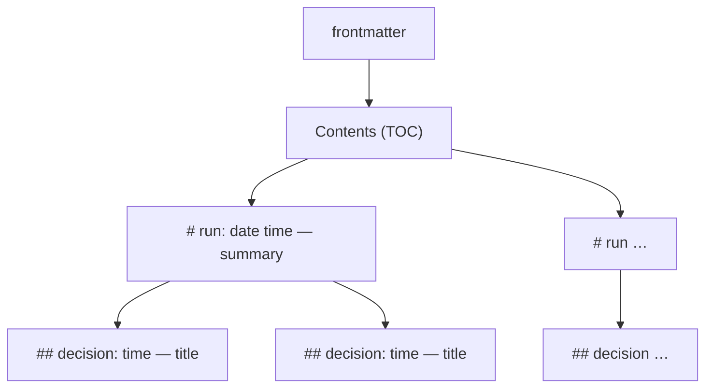

# Decisions log (`DECISIONS.md`)

When a skill runs **unattended** (no user to answer) and has to make a choice it would
normally ask about, it records that choice in `DECISIONS.md` at the **project root** (the git
root). One file per project, shared by all changes and all skills that write to it (the spec
skills and `/autonomous`), so the user can review every choice made without them in one place.
`/spec:view` renders it as HTML next to the specs.

Interactive runs don't write here: the user answered, and the answer lands in the artifacts.

## What goes in

A choice that the user would otherwise have been asked about, or that the artifacts leave
open:

- an unclear plan step and how it was read
- picking one option where the architecture names several (or none)
- a change selected by inference instead of by the user
- a check skipped (e.g. the Spec axis of a review with no spec)
- an open change left in place when proposing a new one

Not: routine work the plan already spells out.

## Structure



- **Run** (`#`, h1) — one unattended invocation: a skill or `/autonomous` given a task.
- **Decision** (`##`, h2) — one choice made during that run.
- **Contents** at the top lists every run and, nested under it, its decisions.

Runs and decisions are in chronological order: new ones go at the end. Old entries are never
rewritten, except a decision's `Status`.

## Complete example

```markdown
---
title: "Decisions"
created: 2026-10-02
edited: 2026-10-02
---

**Contents**

- [2026-10-02 14:30 — Implement login for add-auth](#run-2026-10-02-1430)
  - [14:42 — Store sessions in Postgres](#run-2026-10-02-1430-1)
  - [15:05 — Lock accounts after 5 failed logins](#run-2026-10-02-1430-2)

# 2026-10-02 14:30 — Implement login for add-auth {#run-2026-10-02-1430}

- **Started by:** `/autonomous` (driving `/spec:apply add-auth`)
- **Task, as given:**

  > Implement the login part of add-auth while I'm in meetings.

## 14:42 — Store sessions in Postgres {#run-2026-10-02-1430-1}

- **Status:** open
- **Context:** plan step 3 of `add-auth`; `architecture.md` names no session store.
- **Question:** Redis or Postgres for sessions?
- **Decision:** Postgres.
- **Why:** already a dependency of the project; one less service to run and back up.
- **Alternatives:** Redis (faster expiry handling, but a new service).
- **Consequences:** adds a `sessions` table migration; revisit if session load grows.

## 15:05 — Lock accounts after 5 failed logins {#run-2026-10-02-1430-2}

- **Status:** open
- …
```

## Rules

**File**
- Create `DECISIONS.md` on the first decision, with the frontmatter above (`title`, `created`,
  `edited`; nothing else) and an empty `**Contents**` list.
- Set `edited` to today on every write.

**Run** — written once, with the run's first decision (a run without decisions leaves no trace)
- Heading: `# YYYY-MM-DD HH:MM — <summary title> {#run-YYYY-MM-DD-HHMM}` — the run's start
  time (local, 24 h, from `date`), a short title of what the run is about, and an explicit id.
  If that id already exists, append `-b`, `-c`, … to it.
- Under the heading:
  - `**Started by:**` the skill and its arguments (e.g. `/spec:apply add-auth`, `/autonomous`)
  - `**Task, as given:**` the user's exact words, verbatim, as a quote — not a paraphrase.
- A skill called from inside a run (`/autonomous` driving `/spec:apply`) adds its decisions to
  that run; it does not start a new one.

**Decision**
- Heading: `## HH:MM — <decision title> {#<run-id>-<n>}` — the time the decision was made, a
  title that states the choice ("Store sessions in Postgres", not "Session store"), and the
  run's id plus the decision's number in the run (1, 2, …).
- Then, in this order:

| Field | Content |
|---|---|
| Status | `open` when written; the user changes it to `confirmed` or `reverted` |
| Context | where it came up: change, plan step, file — and why nothing settled it |
| Question | what had to be decided |
| Decision | the choice |
| Why | the reasons, specific to this project |
| Alternatives | the options not taken, and what spoke for them |
| Consequences | what follows from it: follow-up work, risks, when to revisit |

**Contents**
- One line per run: `- [YYYY-MM-DD HH:MM — <summary title>](#<run-id>)`.
- Nested under it, one line per decision: `  - [HH:MM — <decision title>](#<run-id>-<n>)`.
- Update it in the same edit that adds the heading. md2html's lint warns about a Contents
  link whose target doesn't exist.

**Editing**
- Use the Edit/Write tools, not sed/python in Bash, so the md2html lint hook checks the file.

## After the run

The skill's final summary names the run and how many decisions it logged ("3 decisions logged
in `DECISIONS.md`, run 2026-10-02 14:30"). A choice that turns out to matter for the change is
also written into the change's artifacts (usually `architecture.md`, Key decisions) once the
user confirms it.
