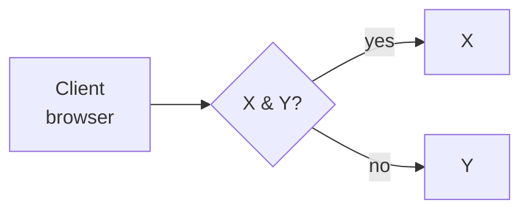
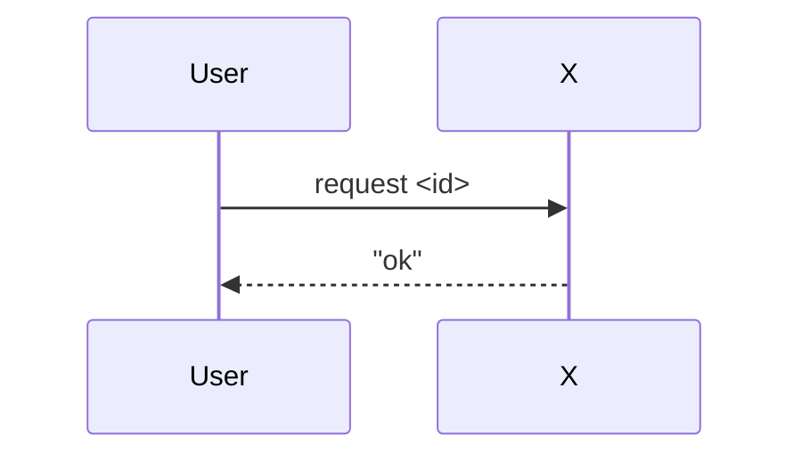

# Architecture: add X

## Components


```mermaid
graph LR
  A["Client<br/>browser"] --> B{"X & Y?"}
  B -- "yes" --> C[X]
  B -- "no" --> D[Y]
```

## Flow


```mermaid
sequenceDiagram
  participant U as User
  participant X
  U->>X: request <id>
  X-->>U: "ok"
```

```js
const notMermaid = '<b>';
```
