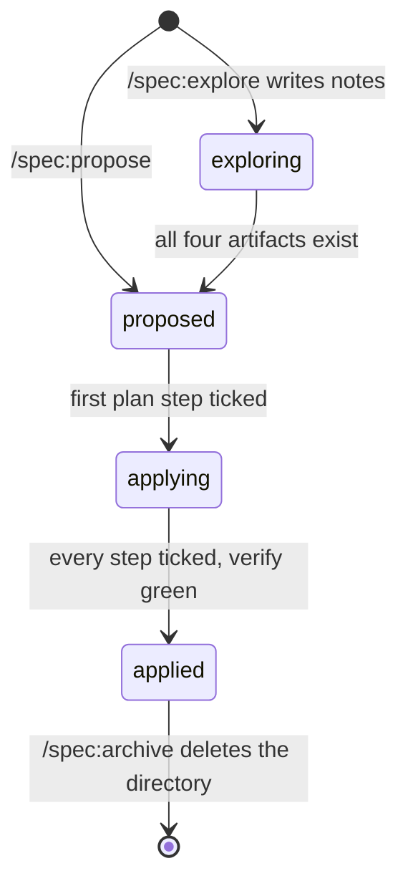

# Spec frontmatter

The one definition of the YAML block every spec file starts with. All spec skills follow it;
md2html's lint (`md2html:spec-frontmatter`, `spec-consistency`) enforces the parts marked
**linted**.

## Change files (`specs/changes/<name>/*.md`)

```yaml
---
feature: add-auth
title: "Proposal: add authentication"
status: proposed
order: 1
created: 2026-09-30
edited: 2026-10-01
---
```

Exactly these keys, in this order. Any other key is an error (**linted**); keys out of order
are a warning.

| Key | Required | Type / allowed values | What it means in practice |
|---|---|---|---|
| `feature` | yes | kebab-case string, **= the directory name** (**linted**) | Which change this file belongs to. Renaming the directory means renaming `feature` in every file. |
| `title` | yes | non-empty string, quoted (**linted**: a `: ` inside an unquoted value breaks YAML) | Page title in the HTML view and its nav. Form `"<Artifact>: <short title>"`, same text as the file's `# …` heading. |
| `status` | yes | one of `exploring` · `proposed` · `applying` · `applied` (**linted**) | Where the **whole change** really is — see the status table. Identical in every file of the change (**linted**). |
| `order` | no | integer ≥ 0 (**linted**) | Position in the change's nav; the lowest opens first. `1` proposal, `2` domain, `3` architecture, `4` plan; extra files (`decisions.md`, notes) use `5`+ or omit it (sorted after numbered files, then by name). |
| `created` | yes | ISO date `YYYY-MM-DD` (**linted**) | Day the file was first written. Never changes. |
| `edited` | yes | ISO date, ≥ `created` (**linted**) | Day of the last **content** change. A status-only change does not bump it. |

### `status` — the lifecycle of a change



| Value | Set by | True in reality when… | Not yet true |
|---|---|---|---|
| `exploring` | `/spec:explore` writing into a change dir | Notes or some artifacts exist; the change is an idea being shaped. | No code or tests have been written for it. |
| `proposed` | `/spec:propose`; `/spec:iterate` once all four artifacts exist | `proposal`, `domain`, `architecture` and `plan` exist; every plan step names its test and verify command; nothing is ticked. | No implementation has started. |
| `applying` | `/spec:apply` when it ticks the first step | At least one plan step is `[x]` — its test was written first, seen failing, and now passes. The code base contains part of the change. | The change is incomplete; the suite may be missing tests for later steps. |
| `applied` | `/spec:apply` when the last step is ticked | Every step is `[x]`, every verify command passed and the full test suite is green. | `specs/system/` has **not** been updated and nothing is archived — run `/spec:adversarial-code-review`, then `/spec:archive`. Meant to be short-lived. |

There is no `archived` value: `/spec:archive` folds the change into `specs/system/`, commits,
and deletes the directory. Git history is the archive.

There is no `paused` value either (removed in spec 9.0.0 / md2html 0.5.0): a change that is
on hold simply stays `applying`. Files that still say `paused` fail lint; set them to
`applying`.

A skill that changes the status writes it to **every** file of the change in the same step.
It never downgrades (`applying` or `applied` never go back to `proposed` or `exploring`).

### When the files disagree

Read the value most files carry; on a tie, the value of the tied file with the lowest
`order` (md2html's lint and index use the same rule). Report the mismatch and fix the
outliers.

The status must also match the plan's checkboxes (not linted — `/spec:overview` warns):
`proposed` has no `[x]`; `applying` has some; `applied` has all.

## System files (`specs/system/*.md`)

```yaml
---
title: "Domain: <system name>"
created: 2026-04-15
edited: 2026-10-01
---
```

Only `title`, `created`, `edited`, same meaning as above. System docs describe what the
system **is**; they have no lifecycle, so never copy `feature`, `status` or `order` into them.

## Writing rules for every skill

- New file: `created` = `edited` = today. A file without frontmatter gets it now (`created`
  from its first git commit if it has one, else today).
- Changed content: set `edited` to today on that file only.
- Edit spec files with the Edit/Write tools, not sed/python in Bash, so the md2html lint hook
  sees every change.
