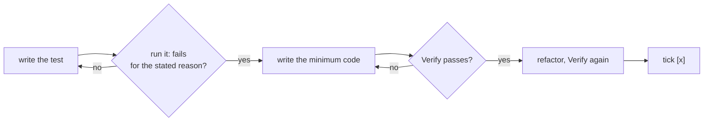

# Plan steps and test-first

How `plan.md` steps are written (`/spec:propose`, `/spec:grill`, `/spec:iterate`) and executed
(`/spec:apply`). The rule behind both: **a test is written and seen failing before the code
that makes it pass.** A step is done when its verify command passes, not when the code
"looks right".

## Step format

```markdown
- [ ] Reject `order` values below 0
  - Test first: `test/frontmatter.test.mjs` › "order -1 is an error" — fails today: no check exists
  - Verify: `npm test` → all green
```

Every checkbox step carries both sub-bullets. They are plain bullets, not checkboxes, so
progress (`N/M`) still counts only the `- [ ]` / `- [x]` lines.

| Line | Content |
|---|---|
| `- [ ] <step>` | One small, imperative unit of behavior — small enough for one red → green cycle. |
| `Test first:` | The test to write before any code: file › case, what it asserts, and why it fails today. |
| `Verify:` | A command that exits 0 only when the step is done, and what passing looks like. Usually the targeted test plus the full suite. |

By kind of step:

- **Feature / behavior** — a test for the new behavior, failing because the behavior is
  missing.
- **Bug fix** — a test that reproduces the bug, failing for the bug's reason.
- **Refactor** — `Test first: existing <tests> pass before and after`; if the area has no
  coverage, the step before adds it.
- **No runtime surface** (docs, config, renames, prompts) — `Test first: none — <why>`, and
  `Verify` is the strongest mechanical check there is (lint, build, a `grep` that must
  match or must not).
- **No test harness yet** — the first step sets one up, and its verify runs one trivial test.

Order steps so each test can be written against what earlier steps built. The plan ends with
a plain note (not a checkbox): "System docs are updated at `/spec:archive`."

## Step dependencies (optional)

A plan whose steps don't all build on each other can say which do, so `/spec:apply
--parallel` can run independent steps at the same time:

```markdown
- [ ] Parse the config file
  - Depends on: none
  - Test first: `test/config.test.mjs` › "reads reports.json" — fails today: no parser
  - Verify: `npm test` → all green
- [ ] Render the menu from the config
  - Depends on: 1
  - Test first: …
  - Verify: …
```

- `Depends on:` is a plain sub-bullet like `Test first:` and `Verify:`; it doesn't count
  toward `N/M`.
- Its value is the numbers of the steps that must be ticked first (counting checkbox steps
  from 1 in plan order, across all sections), comma-separated, or `none` for a step that can
  start right away.
- **All or nothing:** if any step has `Depends on:`, every step has it. A plan without such
  lines is a plain sequence — each step depends on the one before.
- A step's dependencies come earlier in the plan; no cycles.
- A **ready step** is an unticked step whose dependencies are all ticked.

## The cycle `/spec:apply` runs per step



1. **Red** — write the test from `Test first`. Run it and see it fail for the reason the
   plan states. A test that passes before the code exists tests nothing: fix the test.
2. **Green** — write the least code that makes it pass.
3. **Refactor** — clean up with the test green.
4. **Verify** — run the step's `Verify` command and the project's full test suite. Both
   must pass.
5. **Tick** — only now `- [ ]` → `- [x]`.

Never make a test pass by weakening, skipping or deleting it, or by mocking what the step is
meant to exercise, unless the user explicitly agrees.

**Legacy steps** without `Test first` / `Verify`: derive both from the step and the
architecture, write them into `plan.md` first, then run the cycle.
