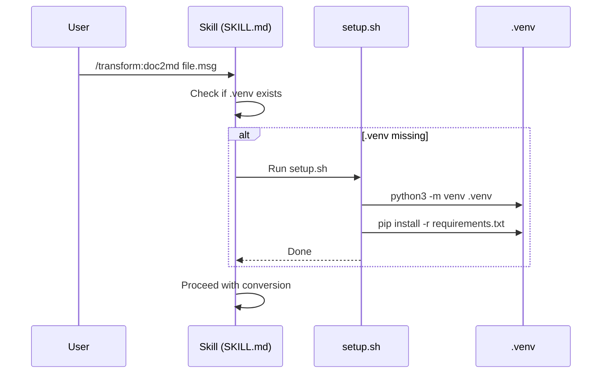
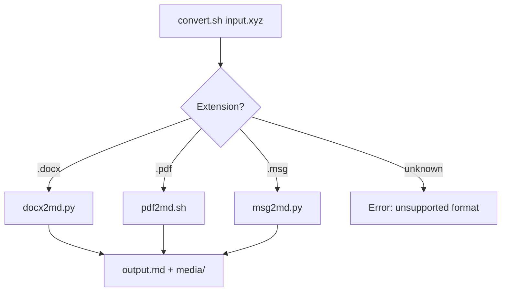
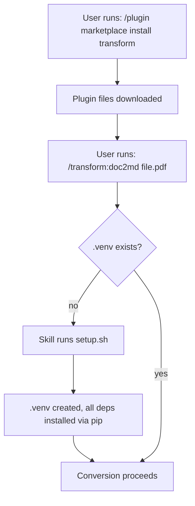

# Architecture: transform Plugin

## Approach

Real conversion scripts that do the deterministic work, with SKILL.md prompts
that tell Claude how to invoke them and handle the user-facing parts. This
matches the `md2pdf` pattern exactly: `md2pdf` has `scripts/convert.mjs` for
the actual conversion and a SKILL.md that orchestrates it.

The split:
- **Scripts** — deterministic, testable, repeatable conversion logic
- **Skills** — user interaction, file resolution, dependency guidance, optional
  LLM cleanup

## Plugin Structure

```
plugins/transform/
  .claude-plugin/
    plugin.json                  # Plugin metadata
  requirements.txt               # Python deps (all conversion tools)
  scripts/
    setup.sh                     # Create .venv + install deps
    docx2md.py                   # DOCX → Markdown (pypandoc)
    pdf2md.sh                    # PDF → Markdown (wraps Marker)
    msg2md.py                    # MSG → Markdown (extract-msg + pypandoc)
    convert.sh                   # Dispatcher: detect format, call the right script
    batch.sh                     # Batch: walk directory, call convert.sh per file
  skills/
    doc2md/
      SKILL.md                   # Single-file conversion skill
    batch/
      SKILL.md                   # Directory batch conversion skill
```

Files NOT checked in (created at runtime):
```
plugins/transform/
  .venv/                         # Python virtualenv (created by setup.sh)
```

## Key Decisions

### 1. Real scripts, not prompt-driven shell commands

Each format gets a dedicated script that handles the full pipeline: argument
parsing, tool invocation, media extraction, output placement, error handling.
These scripts are deterministic — same input, same output, every time.

Claude's role is the intelligent layer on top: resolving ambiguous file paths,
dependency setup, optionally cleaning up the output with LLM, and reporting
results to the user.

### 2. All dependencies via pip — zero manual installs

`pypandoc_binary` bundles the Pandoc binary as a pip package. Combined with
`marker-pdf` and `extract-msg`, **every dependency** lives in `requirements.txt`
and installs into the plugin's `.venv`. The user never has to run
`brew install` or `apt install` anything.

```
requirements.txt:
  pypandoc_binary    # Pandoc binary + Python API
  extract-msg        # MSG file parsing
  marker-pdf         # PDF → Markdown
```

This eliminates the "system vs plugin" dependency split entirely. One tier,
one install mechanism, fully automatic.

### 3. Plugin-local Python venv

When a user installs the plugin from the marketplace, they get the scripts and
skills but NOT the Python dependencies. On first use, the skill runs
`scripts/setup.sh` which:

1. Creates a `.venv` in the plugin directory
2. Installs Python deps from `requirements.txt` into the .venv
3. Verifies the install

This mirrors how `md2pdf` handles it — its SKILL.md runs `npm install` in the
plugin directory if `node_modules/` is missing. Same pattern, Python edition.



The `.venv` directory is in `.gitignore` — it's a local artifact, not
checked in.

### 4. Python scripts for DOCX and MSG, shell for PDF

Since Pandoc is now a Python library (`pypandoc`), the DOCX and MSG converters
are both Python scripts. This is cleaner — they use `pypandoc.convert_file()`
directly instead of shelling out.

- `docx2md.py` — uses `pypandoc` to convert DOCX → GFM Markdown with media
  extraction
- `msg2md.py` — uses `extract_msg` for parsing + `pypandoc` for HTML→MD
- `pdf2md.sh` — shell script because Marker's CLI (`marker_single`) is the
  natural interface

### 5. A `convert.sh` dispatcher

Rather than having the skill figure out which script to call, a single
`convert.sh` script does format detection by extension and routes to the
right converter. This means:
- The batch script just calls `convert.sh` in a loop
- The skill just calls `convert.sh` (or `batch.sh`)
- Adding a new format means adding a script and a case in `convert.sh`



### 6. Consistent output contract

All scripts follow the same contract:

```
Input:  <script> <input-file> [output-dir]
Output: <output-dir>/<basename>.md
Media:  <output-dir>/media/<basename>/  (if any)
Exit:   0 = success, 1 = error (message on stderr)
```

If `output-dir` is omitted, output goes next to the input file. This makes
the scripts composable and the batch script trivial.

### 7. LLM cleanup stays in the skill, not the scripts

The scripts produce deterministic output. The optional LLM cleanup pass is
handled by the SKILL.md prompt — Claude reads the output file and rewrites it
if the user opted in. This keeps the scripts pure and testable.

### 8. One skill per concern, not one skill per format

`/transform:doc2md` handles all three formats. The user doesn't need to know
which tool is used underneath. `/transform:batch` handles directories.
Adding a new format means adding a script — no new skills needed.

## Script Details

### setup.sh

```bash
#!/usr/bin/env bash
set -euo pipefail

SCRIPT_DIR="$(cd "$(dirname "$0")" && pwd)"
PLUGIN_DIR="$(dirname "$SCRIPT_DIR")"
VENV_DIR="$PLUGIN_DIR/.venv"

if [ ! -d "$VENV_DIR" ]; then
    echo "Creating Python virtual environment..."
    python3 -m venv "$VENV_DIR"
fi

echo "Installing Python dependencies..."
"$VENV_DIR/bin/pip" install --upgrade pip -q
"$VENV_DIR/bin/pip" install -r "$PLUGIN_DIR/requirements.txt" -q

echo "Setup complete."
```

### docx2md.py

```python
#!/usr/bin/env python3
import pypandoc

# Core logic:
output = pypandoc.convert_file(
    input_path,
    'gfm',
    extra_args=['--extract-media', media_dir, '--wrap=none']
)
Path(output_path).write_text(output)
```

Uses `pypandoc` (which uses the bundled Pandoc binary from `pypandoc_binary`)
to convert DOCX → GFM Markdown. `--extract-media` pulls images into
`media/<basename>/`.

### pdf2md.sh

```bash
# Core logic — uses venv for marker:
"$VENV_DIR/bin/marker_single" "$input" --output_dir "$tmp_dir"
# Marker outputs to a subdirectory — move files to expected locations
```

Marker produces a Markdown file plus an images directory. The script
normalizes the output to match the common contract.

### msg2md.py

```python
#!/usr/bin/env python3
import extract_msg
import pypandoc

msg = extract_msg.Message(input_path)
# Extract headers → build header block
# Convert body HTML → Markdown via pypandoc
body_md = pypandoc.convert_text(msg.htmlBody, 'gfm', format='html')
# Prepend header block, write output
# Move attachments to media/
```

Uses `extract_msg` for MSG parsing and `pypandoc` for HTML→MD. No subprocess
calls needed — everything is Python.

### convert.sh (dispatcher)

```bash
SCRIPT_DIR="$(cd "$(dirname "$0")" && pwd)"
VENV_PYTHON="$(dirname "$SCRIPT_DIR")/.venv/bin/python3"

case "${ext}" in
  docx) exec "$VENV_PYTHON" "$SCRIPT_DIR/docx2md.py" "$input" "$output_dir" ;;
  pdf)  exec "$SCRIPT_DIR/pdf2md.sh" "$input" "$output_dir" ;;
  msg)  exec "$VENV_PYTHON" "$SCRIPT_DIR/msg2md.py" "$input" "$output_dir" ;;
  *)    echo "Unsupported: $ext" >&2; exit 1 ;;
esac
```

### batch.sh

```bash
find "$dir" -maxdepth 1 \( -iname "*.docx" -o -iname "*.pdf" -o -iname "*.msg" \) |
while read -r file; do
  convert.sh "$file" "$output_dir"
done
# Print summary
```

## User Installation Flow



Zero manual steps. Everything installs automatically via the venv on first use.

## Error Handling: venv Setup Failure

`setup.sh` uses `set -euo pipefail` and exits non-zero on failure. The skill
sees the exit code and stderr output. Common failure modes and what the skill
should do:

| Failure | stderr signal | Skill guidance |
|---------|--------------|----------------|
| No Python 3 | `python3: command not found` | Tell user to install Python 3 (`brew install python3` / `apt install python3`) |
| Old Python | `venv: error` or version mismatch | Tell user to upgrade to Python 3.9+ |
| pip network error | `ConnectionError`, `SSL` | Check internet connection, proxy settings |
| Disk full | `No space left on device` | Free disk space |
| Permission denied | `Permission denied` | Check directory permissions on the plugin install path |
| marker-pdf build fails | Compiler/wheel errors | May need build tools (`xcode-select --install` on macOS) |

The skill reads stderr, diagnoses the cause, and gives the user a concrete
fix. If the fix requires the user to act (install Python, free disk space),
the skill stops and waits. After the user fixes the issue, re-running the
skill retries setup automatically (since `.venv` still won't exist).

`setup.sh` is idempotent — if it partially completed (venv created but pip
failed), re-running it picks up where it left off.

## Integration Points

- `plugins/transform/.claude-plugin/plugin.json` — plugin metadata
- `.claude-plugin/marketplace.json` — marketplace entry
- `.gitignore` — add `plugins/transform/.venv/`
- No changes to existing plugins
