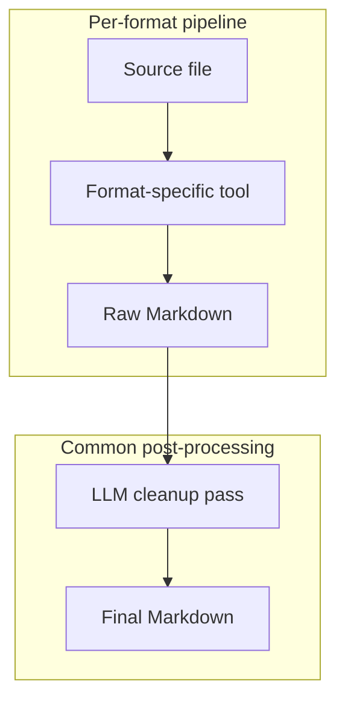

# Domain: transform Plugin

## File Formats

### DOCX (Word)
Microsoft Word's XML-based format. Contains structured content (headings,
paragraphs, lists, tables) plus embedded media. The structure maps well to
Markdown — this is the easiest conversion.

### PDF
Portable Document Format. Layout-oriented, not content-oriented — text is
positioned absolutely, not structured semantically. Tables, columns, and
reading order must be inferred. This is the hardest conversion.

### MSG (Outlook Email)
Microsoft Outlook's proprietary email format. Contains headers (from, to,
subject, date), HTML or plain text body, and attachments. The body is
typically HTML which converts to Markdown; the metadata needs special
handling.

## Conversion Tools

### Pandoc
The universal document converter. Handles DOCX -> Markdown natively with
high fidelity. Also converts HTML -> Markdown, which makes it useful as a
second stage for email conversion. Installed via Homebrew, apt, or binaries.

### Marker (datalab-to/marker)
A modern PDF-to-Markdown tool that understands layout, tables, math, and
images. Significantly better than Pandoc for PDFs. Python-based, installable
via pip. Can optionally use LLMs for improved formatting.

### extract-msg
Python library that reads .msg files and extracts headers, body (HTML/text),
and attachments. Output feeds into Pandoc for the HTML -> Markdown step.

## Concepts

### Conversion Pipeline
A chain of tools that transforms a source format into Markdown. Each format
has its own pipeline, but they share a common structure:

### LLM Cleanup Pass
An optional step where Claude reads the raw Markdown output and fixes common
conversion artifacts: broken headings, malformed tables, stray line breaks,
OCR errors in PDFs, and inconsistent formatting. This is what makes the
output production-quality rather than "good enough."

### Media Extraction
During conversion, embedded images and attachments are extracted to a `media/`
subdirectory alongside the output Markdown file. Image references in the
Markdown use relative paths to this directory.

### Batch Conversion
Converting an entire directory of mixed-format documents. The skill walks the
directory, detects each file's format by extension, routes it through the
appropriate pipeline, and reports progress.

### Dependency Management
Each conversion tool must be installed on the user's system. The skills check
for required tools at runtime and guide installation if missing:
- Pandoc: `brew install pandoc` / `apt install pandoc`
- Marker: `pip install marker-pdf`
- extract-msg: `pip install extract-msg`
