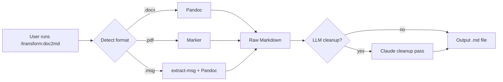

# Proposal: Add transform Plugin

## What

Add a new `transform` plugin to the marketplace that converts documents (DOCX,
PDF, MSG) to clean Markdown. The plugin bundles real conversion scripts
(shell and Python) that wrap best-of-breed tools (Pandoc, Marker, extract-msg),
plus Claude Code skills that invoke those scripts and optionally apply LLM
cleanup.

The name `transform` is intentionally general — it starts with doc-to-Markdown
conversions but can grow to accommodate other format transformations. Together
with the existing `md2pdf` plugin, it forms a conversion toolkit.

## Why

Converting legacy documents to Markdown is a common need: migrating
documentation, archiving email, making content searchable and version-controlled.
The tools exist but the pipeline is fragmented — different tools for different
formats, each with quirks, and raw output that needs cleanup. A Claude Code
plugin can wrap this into simple skills that handle format detection, tool
selection, conversion, and LLM-assisted cleanup in one step.

The user has hundreds of documents across three formats (DOCX, PDF, MSG) that
need bulk conversion. A plugin makes this repeatable and shareable.

## Scope

- New plugin: `plugins/transform/`
- Skills:
  - `/transform:doc2md` — convert a single file (auto-detects format)
  - `/transform:batch` — convert a directory of mixed documents
- Conversion pipeline per format:
  - DOCX -> Pandoc -> Markdown
  - PDF -> Marker -> Markdown
  - MSG -> extract-msg -> HTML -> Pandoc -> Markdown
- Optional LLM cleanup pass (fix headings, tables, line breaks)
- Dependency management (check/install Pandoc, Marker, extract-msg)
- Marketplace registration (plugin.json, marketplace.json entry)

Out of scope:
- Other formats (PPT, XLS, etc.) — can be added later
- GUI or web interface
- Custom Marker model training

## Expected Outcome

After this change, users can install the transform plugin and run:

```
/transform:doc2md report.pdf
/transform:doc2md meeting-notes.docx
/transform:doc2md email.msg
/transform:batch ./legacy-docs/
```

Each produces a clean `.md` file alongside the original, with images extracted
to a `media/` subdirectory where applicable.


