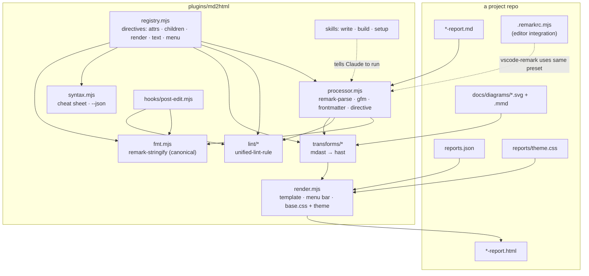

# Architecture: md2html

Follows the marketplace's **script + prompt** pattern (see `specs/system/architecture.md`). A
deterministic Node program does all the transformation work. The skills tell Claude how to
write the source and when to run the program. A plugin hook closes the feedback loop.

## Plugin layout

```
plugins/md2html/
  .claude-plugin/plugin.json      # name, version 0.1.0, description
  package.json                    # devDependencies only (unified stack, esbuild); "type": "module"
  package-lock.json               # exact versions: part of the determinism guarantee
  src/
    cli.mjs                       # arg parsing, subcommand dispatch, exit codes
    config.mjs                    # load + validate reports.json (closed schema)
    registry.mjs                  # THE directive table (see below)
    processor.mjs                 # the one unified pipeline, shared by fmt / lint / build
    transforms/                   # one small mdast/hast transform per layout rule
      frontmatter.mjs  headings.mjs  toc.mjs  directives.mjs
      figures.mjs  tables.mjs  links.mjs
    render.mjs                    # fixed page template (string function), menu bar, header
    fmt.mjs                       # canonical remark-stringify settings + normalizers
    lint/                         # unified-lint-rule rules
      directives.mjs  frontmatter.mjs  links.mjs  figures.mjs  theme.mjs
    syntax.mjs                    # cheat sheet (Markdown) / --json, generated from registry
    base.css                      # house style: tokens, light + dark, phone width
  dist/md2html.mjs                # esbuild bundle incl. base.css; COMMITTED; no npm install at runtime
  hooks/
    hooks.json                    # PostToolUse on Write|Edit|MultiEdit
    post-edit.mjs                 # runs fmt + lint on the edited report, exit 2 with messages
  skills/
    write/SKILL.md                # model-invocable: how to write/edit a report
    write/syntax.md               # generated by `md2html syntax`; referenced from SKILL.md
    build/SKILL.md                # user-invoked: build / check / open
    setup/SKILL.md                # user-invoked: initialise a project
  test/
    fixtures/<case>.md  <case>.html        # golden pairs, one per directive and edge case
    fixtures/fmt/<case>.in.md  <case>.out.md
    *.test.mjs                             # node:test
```

**Why a committed bundle:** the plugin runs from `~/.claude/plugins/cache/...`. A single
`dist/md2html.mjs` needs only `node`, with no first-use `npm install` (unlike `md2pdf`). It is
byte-identical for everyone on the same plugin version, and `setup` can copy it into a project
for CI (open question 1 in the proposal, option b). A test checks that `dist/` matches `src/`,
so a stale bundle can't ship.

## Components



### The registry (single source of truth)

```js
// src/registry.mjs (shape, not final code)
export const directives = [
  { type: 'container', name: 'tldr', attrs: {}, children: 'flow',
    render: (node, h) => h('div', { class: 'tldr' }, node.children),
    menu: { label: 'TL;DR', keywords: ['summary', 'short'], snippet: ':::tldr\n${}\n:::' } },
  { type: 'container', name: 'cards', attrs: {}, children: ['card'],
    render: (node, h) => h('div', { class: 'cards' }, node.children),
    menu: { label: 'Cards', keywords: ['pros', 'cons', 'compare'],
            snippet: '::::cards\n:::card{title=${Pros}}\n${}\n:::\n::::' } },
  { type: 'container', name: 'card', attrs: { title: { type: 'string' } }, parent: 'cards', /* … */ },
  { type: 'text', name: 'verdict', attrs: { tone: { enum: ['go', 'partial', 'no'], required: true } },
    render: (node, h) => h('span', { class: ['v', node.attributes.tone] }, node.children),
    menu: { label: 'Verdict pill', keywords: ['pill', 'status'], snippet: ':verdict[${works}]{tone=go}' } },
];
```

The renderer, the lint rules, `fmt` (fence length per depth, attribute order = key order in
`attrs`; fence length is computed from nesting, see domain.md) and `syntax` all iterate over this array. Adding a directive means one entry plus its
golden fixtures.

### The pipeline

One unified processor, built once in `processor.mjs`. The three commands differ only in their tail:

| Command | Pipeline tail | Writes |
|---|---|---|
| `fmt` | `→ normalize → remark-stringify(canonical)` | the `.md`, only if bytes changed; `--check` writes nothing and exits 1 on diff |
| `lint` | `→ lint rules` → vfile messages | nothing |
| `build` | `→ transforms → remark-rehype → render → rehype-stringify` | the `.html`, only if bytes changed; `--check` exits 1 on diff |
| `check` | `fmt --check && lint && build --check` over all sources | nothing |

Plugins (pinned exactly): `remark-parse`, `remark-gfm`, `remark-frontmatter`, `yaml`,
`remark-directive`, `remark-stringify`, `remark-rehype`, `rehype-stringify`,
`unified-lint-rule`, `unist-util-visit`. The lint output formatter is our own (the
`vfile-reporter` layout differs from the one specified below). Heading ids (`## Title {#id}`) are parsed by our
`headings.mjs` transform, which strips the trailing `{#…}` from the last text node, rather than
by another dependency.

**Unknown or invalid directives** are replaced before rendering with a text node holding their
exact source slice (`node.position.start.offset … end.offset`), as in W12's
`directiveFallback.ts`. Content is never lost, and prose colons such as `16:00` or `:443` render
as written.

### Page template

`render.mjs` is a pure function `(frontmatter, bodyHast, toc, config, css) → string`. The fixed
order is:

1. `<head>`: charset, viewport, `<title>`, description, `<meta name="generator" content="md2html x.y.z">`,
   and one `<style>` holding `@layer base, theme;` + `base.css` + the project theme
2. `<nav class="reports-nav">`, rendered at build time from `reports.json` (relative hrefs,
   `aria-current` on the current page)
3. `<header class="top">` with `<h1>` + app icon
4. `<dl class="report-meta">` with Created / Last edited / Status
5. `<p class="sub">`
6. the TL;DR (the first `:::tldr` is hoisted here)
7. `<nav class="toc">`, when there are ≥ 4 sections
8. the body
9. no footer, no scripts

CSS is inlined so every report is a single file that works over `file://`, as an attachment,
or published elsewhere.

### Determinism rules (enforced in code and tests)

| Source of drift | Rule |
|---|---|
| Clock | Never read. Dates come only from frontmatter. `new` is the only command that reads today's date, and only to write the skeleton. |
| File mtimes, git | Never read. |
| Paths | Output contains only paths relative to the report. |
| Locale / TZ | No `toLocale*`. Dates stay the ISO strings as written. |
| Ordering | Sort globs and directory listings. Keep config order for the menu. |
| Input normalization | CRLF → LF, NFC. Output is LF with one final newline. |
| Dependencies | Exact pins plus a lockfile. The tool version goes into `<meta name="generator">`, so a version bump shows as a diff. |
| Mermaid | Not rendered by `build`. `.svg` files are committed inputs. |
| Network | None. |

Tests: `build` all fixtures twice and compare hashes, `fmt(fmt(x)) === fmt(x)`,
`render(x) === render(fmt(x))`, and golden `.md → .html` byte comparison.

### Lint rules and messages

Format: `path:line:col  severity  message  [rule-id]`. `--format json` prints the same data for
tools.

| Rule | Examples |
|---|---|
| `directive-known` | `unknown directive ":::tdlr". Did you mean ":::tldr"?` (Levenshtein ≤ 2 over registry names) |
| `directive-closed` | `":::card" opened here is never closed (file ends at line 212)` |
| `directive-attrs` | `":verdict" tone="yes" is not allowed. Use go \| partial \| no` |
| `directive-nesting` | `":::card" must be inside "::::cards"` |
| `frontmatter` | unknown key (with suggestion), missing required key, non-ISO date, `edited` < `created`, bad `status` |
| `links` | relative file missing; `#fragment` not found in the target report |
| `figure` | image without alt text; `.svg` without a sibling `.mmd` (warning) |
| `no-raw-html` | raw HTML node; the text renders escaped (warning) |
| `callout-alias` | `> [!tldr]` found. Use `:::tldr` (`fmt` converts it) (warning) |
| `heading-number` | `section numbers are added by the build; remove "1. "` (warning) |
| `heading-id` | `duplicate id "#dup" (first used at line 12)` |
| `theme-tokens` | a custom property in `theme.css` that is not in the contract (warning) |
| `menu` | `menu entry "v1 plan" points at "specs/v1-plan.html", which does not exist` (`reports.json` entries; CLI `lint` over all sources and `check` only) |

Exit codes: `0` clean, `1` lint errors / stale output / non-canonical, `2` usage or config error.

### Hook

`hooks/hooks.json`:

```json
{ "hooks": { "PostToolUse": [ { "matcher": "Write|Edit|MultiEdit",
  "hooks": [ { "type": "command", "command": "node \"${CLAUDE_PLUGIN_ROOT}/hooks/post-edit.mjs\"" } ] } ] } }
```

```mermaid
sequenceDiagram
  participant C as Claude
  participant CC as Claude Code
  participant H as post-edit.mjs
  participant T as md2html (dist)
  C->>CC: Edit specs/07_x/x-report.md
  CC->>H: PostToolUse JSON on stdin (tool_input.file_path)
  H->>H: find reports.json upward; file matches sources?
  alt not a report / no reports.json
    H-->>CC: exit 0 (silent)
  else report
    H->>T: lint <file> as written
    alt lint errors
      H-->>CC: exit 2, stderr = messages (file not rewritten)
      CC-->>C: messages shown to Claude, which fixes them in the same turn
    else clean
      H->>T: fmt <file>, then lint the result
      H-->>CC: exit 0 (rewrite notice / warnings in additionalContext)
    end
  end
```

**Lint before fmt.** The hook lints the file as Claude wrote it first. With lint errors it exits
2 and does **not** rewrite the file, since `fmt` could hide an error (e.g. close an unclosed
container at EOF). Only a lint-clean file is formatted. Files under dot-dirs or `node_modules`
are skipped, as in `check`.

**Rewrite notice.** When `fmt` changed the file, Claude Code's copy of it is stale and the next
`Edit` would fail with "file modified since read". So the hook then prints PostToolUse JSON
`{"hookSpecificOutput":{"hookEventName":"PostToolUse","additionalContext":"md2html fmt
rewrote <file>; Read it again before the next Edit."}}` on stdout with exit 0. Lint
**warnings** (no errors) go into the same `additionalContext`. Only lint **errors** use exit 2.

The hook is **silent outside projects with a `reports.json`**, so installing the plugin never
touches unrelated Markdown. It never runs `build`, so edits stay fast and HTML is regenerated
on purpose.

### Skills

| Skill | Invocation | Job |
|---|---|---|
| `write` | model-invocable (description triggers on "write/update a report") | The workflow: `new` for new reports, edit the `.md` (never the `.html`), update `edited`, let the hook `fmt` + `lint`, then `build` and open the result. It embeds the house layout rules (TL;DR first, numbered sections, sources last) and links `syntax.md`. |
| `build` | `disable-model-invocation: true` | `md2html build` (or `check`), report stale or failed files, `open` the HTML over a local `http://localhost` URL (a fresh load, not a cached `file://` tab), served by `python3 -m http.server` on a free port with the project root as document root. |
| `setup` | `disable-model-invocation: true` | Creates `reports.json` (asks for brand/icon, proposes `sources` globs from existing files), an optional `reports/theme.css` stub, `.remarkrc.mjs`, `just` recipes (`reports`, `reports-check`), and optionally copies `dist/md2html.mjs` to `tools/md2html.mjs` for CI. Adds a line to the project's CLAUDE.md pointing at `/md2html:write`. |

Skills find the program the same way `md2pdf` does: they locate `*/md2html/dist/md2html.mjs`
under `~/.claude/plugins`, and a project-local `tools/md2html.mjs` takes precedence.

## Resolved details (post-audit)

**Library API.** `src/index.mjs` is the bundle entry. `dist/md2html.mjs` exports the API
below and runs the CLI only when executed directly (`node dist/md2html.mjs …`):

```js
format(source: string) → string                          // canonical form
lint(source, {file, root, config, readFile?}) → Message[]  // {line, column, severity: 'error'|'warning', message, ruleId}
build(source, {file, root, config, themeCss, exists}) → string   // full HTML page
preset                                                    // unified preset for .remarkrc.mjs
loadConfig(root) / findRoot(fromDir)                      // reports.json discovery + validation
```

`file` is the report path relative to `root`. `exists(relPath)` answers the `.mmd` lookup,
so `build` itself never touches the filesystem and tests can stub it without mocks of
Node APIs.

**`remark-stringify` options (fmt).** `bullet: '-'`, `emphasis: '*'`, `strong: '*'`,
`fence: '`'`, `fences: true`, `rule: '-'`, `listItemIndent: 'one'`, `incrementListMarker:
true`, `tightDefinitions: true`, and `remark-gfm` with `tablePipeAlign: false` (aligned
tables cause whole-table diffs on a one-cell edit). The `fmt(x)` → same-HTML property is a
golden test over every build fixture, which is what catches escaping drift.

**`new <path> [--title "…"]`.** Refuses to overwrite (exit 2). Writes frontmatter (`title`
from `--title`, else the file name minus `-report.md`, dashes → spaces, first letter upper;
`created` = `edited` = today; `status: research`), a `:::tldr` with a one-line placeholder,
and four sections: `## Context {#context}`, `## Findings {#findings}`,
`## Recommendation {#recommendation}`, `## Sources {#sources}`, each with a placeholder
paragraph. The skeleton passes `lint` and `fmt --check` unchanged.

**Paths.** `lint` messages print the path relative to the cwd. Menu hrefs, icon, theme and
figure/`.mmd` links in the HTML are relative to the report's directory.

**`[paths]` arguments.** When omitted, `fmt`, `lint`, `build` and `check` run over every file
matching `sources`, sorted. Explicit paths outside `sources` are still processed.

**Missing HTML** counts as stale for `build --check` / `check`.

## Key decisions and trade-offs

| Decision | Alternatives considered | Why |
|---|---|---|
| unified/remark | markdown-it (what `md2pdf` uses), marked, Pandoc | A real AST for section-level transforms, the same parser for fmt, lint and render, and it runs in Node. Pandoc is an external binary. |
| `remark-directive` syntax | Obsidian callouts (`> [!tldr]`), raw HTML | Nests (`cards` > `card`), has a generic grammar and one syntax. Callouts are accepted only as a lint alias. |
| No raw HTML | allow it as an escape hatch | Everything goes through the theme, which rules out drift and injection (following W12's ADR-056). |
| Theme = plain CSS + contract | theme JSON → CSS vars (W12's ADR-020), template overrides | Simplest, and allows component restyling. We keep the closed token list as a lint warning. |
| Committed `dist` bundle | `npm install` on first use | Zero setup, byte-identical across machines, and can be vendored for CI. |
| Hook runs fmt + lint only | also build | Fast, and it doesn't produce HTML churn on every intermediate edit. |
| Mermaid outside the build | render in the build | Headless Chromium output differs between machines, which would break determinism. |

## Integration points

- **Marketplace:** a new entry in `.claude-plugin/marketplace.json` (version 0.1.0, same in
  `plugin.json`), `README.md`, and the root `CLAUDE.md` "Current Plugins" list.
- **karpathy.app (first consumer):** its `specs/reports-nav.js` and hand-written HTML are
  replaced over time, and its CLAUDE.md "Reports and docs" section shrinks to a pointer to
  `/md2html:write`. It is tracked in that repo, not here.
- **Editors:** `.remarkrc.mjs` imports the preset from the vendored or plugin path, so
  `vscode-remark` gives lint squiggles and format-on-save. `md2html syntax --json` feeds the
  CodeMirror `/` menu in karpathy.app.
