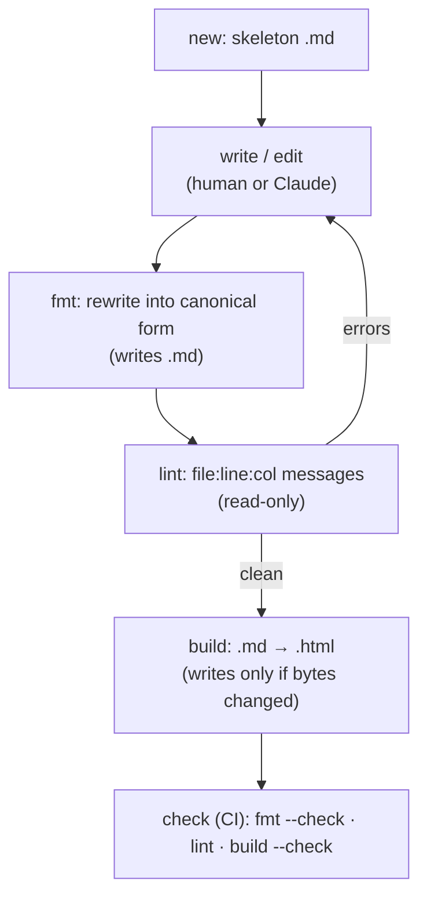

# Domain: md2html

## New concepts

### Report
A Markdown file (`*-report.md` by default) with report frontmatter, written by a human or by
Claude and rendered into one self-contained HTML file next to it. The `.md` is the source of
truth, and the `.html` is generated, committed and never edited by hand.

### Report frontmatter
A closed YAML schema. Unknown keys are a lint error. Keys are always written in this order:

| Key | Required | Meaning |
|---|---|---|
| `title` | yes | The `<h1>` and the `<title>` |
| `created` | yes | ISO date, written by `new` |
| `edited` | yes | ISO date, set by the author (human or AI) when the content changes; **never read from the clock by `build`** |
| `status` | yes | `research` · `ongoing` · `implemented` |
| `subtitle` | no | Inline Markdown; the muted line under the header |
| `description` | no | `<meta name="description">`; defaults to the plain-text subtitle |

### Directive
A named Markdown extension in `remark-directive` syntax, in three forms: container `:::name`,
leaf `::name`, and inline `:name[label]{attrs}`. Only directives in the **registry** are valid.

| Directive | Form | Attributes | Renders |
|---|---|---|---|
| `tldr` | container | none | `
` |
| `cards` | container (outer, `::::`) | none; children must be `card` | `
` |
| `card` | container | `title` (string, optional) | `
<h4>…` (no `<h4>` without title) |
| `verdict` | inline | `tone`: `go` · `partial` · `no` (required) | `label` |

### Directive registry
One table, with one entry per directive: `{type, name, attrs (closed schema), children,
render, text fallback, menu: {label, keywords, snippet}}`. It is the single source for the
renderer, the linter, the formatter, the cheat sheet (`syntax`) and editor insert menus
(`syntax --json`). An unknown or invalid directive renders as its **literal source text**
(it is never dropped), and `lint` reports it.

### Derived layout
Layout elements computed from plain Markdown with no extra syntax:

- section numbers on `##`: `1. Title`, counting every `##` in order
- ids: explicit `{#id}`, otherwise a slug (lowercase, NFKD, drop combining marks, keep
  `[\p{L}\p{N}_-]`, whitespace → `-`); duplicates get `-1`, `-2`, … in document order
- the TOC, when there are 4 or more `##` sections
- the header block, from frontmatter
- table frames
- figures: an image alone in a paragraph, with alt text as the caption and a sibling `.mmd`
  (same path, extension swapped) linked as its source when that file exists
- the reports menu bar, from `reports.json`
- rewriting links between reports from `.md` to `.html`

### Theme
A project's `theme.css`, layered after the tool's `base.css` using `@layer base, theme`. It may
override **tokens** (custom properties such as `--accent` and `--bg`, including the dark-mode
blocks) and **restyle the contract classes**. It cannot change the HTML structure. With no
theme, the page uses the default house style.

### Class and token contract
The stable, versioned list of names a theme may target. Renaming or removing one is a MAJOR
version bump.

- **Classes:** `reports-nav`, `brand`, `item`, `top`, `appicon`, `report-meta`,
  `report-status` (+ `research`/`ongoing`/`implemented`), `sub`, `tldr`, `toc`, `tbl`, `v`,
  `go`/`partial`/`no`, `cards`, `card`, `mmd-src`
- **Elements with fixed roles:** `main`, `figure`, `figcaption`, `h1`–`h4`, `table`
- **Tokens:** `--bg`, `--fg`, `--muted`, `--line`, `--card`, `--accent`, `--go`, `--go-bg`,
  `--partial`, `--partial-bg`, `--no`, `--no-bg`, `--code`, `--figure-bg`

### Project config (`reports.json`)
One JSON file per repo, found by walking up from the cwd (CLI) or from the edited file (hook).
Its directory is the **project root**; every path in it is relative to that root. Closed
schema: unknown keys are a config error (exit 2).

| Key | Type | Required | Default | Meaning |
|---|---|---|---|---|
| `sources` | string[] (globs) | no | `["specs/**/*-report.md"]` | Which `.md` files are reports. Globs support `**`, `*`, `?`. |
| `reports` | `{path, label}[]` | no | `[]` | Menu bar entries, in order. `path` may name a `.md` (rewritten to `.html`) or any other file. |
| `brand` | `{name, icon?}` | no | `{name: "Reports"}` | Menu bar brand and the header app icon (`icon` is an image path). |
| `lang` | string | no | `"en"` | `<html lang>` |
| `theme` | string | no | none | Path to the theme CSS, e.g. `reports/theme.css` |

### Canonical form
The one way `fmt` writes a report:

- colon counts by nesting depth: a container fence has `3 + d` colons, where `d` is the
  depth of the deepest container nested inside it (`:::card` alone = 3, `::::cards` holding
  cards = 4)
- attributes in registry key order, values always double-quoted (`{title="Pros"}`); there
  are no defaults today, so nothing is omitted
- frontmatter keys in schema order, dates unquoted ISO, strings quoted only when YAML needs it
- `-` bullets, `*` emphasis, `**` strong, backtick fences, `---` rules
- `> [!tldr]` (any case) is rewritten to `:::tldr`
- LF line endings, NFC, one final newline

Prose is **never re-wrapped**.

## Processes

- **fmt** is the "Prettier": it rewrites layout only, is idempotent, and leaves the rendered HTML unchanged.
- **lint** is the "ESLint": syntax, frontmatter, nesting, links/anchors, figure alt text, `edited ≥ created`.
- **build** is a pure function of (source bytes, registry, template, `base.css`, theme, config,
  tool version, and which sibling `.mmd` files exist). It uses no clock, no network, no mtimes and no absolute paths.
- **check** is the CI gate. It fails on stale HTML, non-canonical `.md` or lint errors.

## Actors

- **Report author (human)**: writes in any editor. They get `new`, the `syntax` cheat sheet and
  lint messages, and optionally format-on-save via `vscode-remark` (it reads `.remarkrc.mjs`).
- **Claude**: writes reports through `/md2html:write`. The `PostToolUse` hook gives it lint
  feedback after every edit.
- **Project maintainer**: runs `/md2html:setup` once, owns `reports.json` and `theme.css`.
- **CI**: runs `md2html check`.

## Vocabulary

| Term | Meaning |
|---|---|
| Report | `*-report.md` + generated `*-report.html` |
| Directive | `:::name` / `::name` / `:name[]` extension from the registry |
| Registry | The single table defining all valid directives |
| Theme | A project's `theme.css` on top of `base.css` |
| Contract | The stable class and token names themes may target |
| Canonical form | The exact text `fmt` produces |
| Golden fixture | A committed `in.md` → `out.html` pair the tests compare byte-for-byte |
