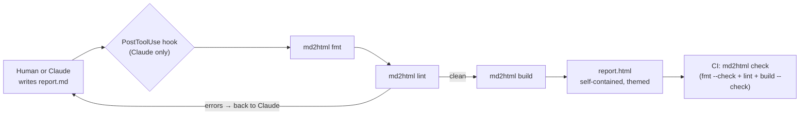

# Proposal: add the `md2html` plugin (deterministic Markdown → HTML reports)

## What

A new plugin, **`md2html`**, that turns report Markdown files into styled, self-contained HTML
pages. It has two parts:

1. **A deterministic program** (`md2html` CLI, Node, unified/remark) with the subcommands
   `new`, `fmt`, `lint`, `build`, `check` and `syntax`. The same input bytes, theme and tool
   version always produce the same output bytes.
2. **Skills** that teach Claude (and remind the human) how to write report Markdown and run the
   program:
   - `/md2html:write`: writing and editing reports; the model may invoke it on its own
   - `/md2html:build`: building and checking; user-invoked
   - `/md2html:setup`: setting up reports in a project; user-invoked

The plugin also ships a **`PostToolUse` hook**. It runs `fmt` + `lint` on every report `.md`
that Claude writes or edits and feeds the remaining lint messages back, so the model fixes
its own mistakes in the same turn.

The design comes from the research report in karpathy.app:
`/Users/tgartner/git/karpathy_app/specs/06_md_to_html/md-to-html-report.html` (§3–§12). That
report is the rationale. This change is what we build.

## Why

- **Reports multiply.** In karpathy.app, four HTML reports are hand-written. Each one repeats
  the ~55-line house style, and the layout rules (menu bar, title + icon, header block, TL;DR,
  TOC, numbered sections, figures) are retyped every time. A layout change means editing N
  files.
- **Markdown is the better source.** It is shorter to write, cheaper for the AI to edit (the
  feature report: 182 KB of Markdown vs 265 KB of HTML), diffs cleanly, and reads in GitHub,
  Obsidian and any editor.
- **Determinism makes the HTML trustworthy.** HTML output can be committed and checked in
  CI (`check` fails when a file is stale). Nobody hand-edits it, and the AI can't drift from
  the layout.
- **Several projects, several looks.** Each project brings its own `theme.css` on top of a
  fixed template and class contract. It is plain CSS, not a templating language.
- **It belongs in the marketplace.** It is reusable across repos, it follows the existing
  "script + prompt" pattern (`md2pdf`, `transform`), and the skill is how the AI learns the
  format.

## Scope

In scope:

- The CLI with `new | fmt | lint | build | check | syntax`, a directive registry, the base
  template and `base.css` (today's Apple-like house style, light and dark, phone width).
- The source format: GFM, a closed frontmatter schema, and three directives: `:::tldr`,
  `::::cards` / `:::card{title=…}`, and `:verdict[label]{tone=go|partial|no}`.
- Derived layout: numbered `##` sections, stable ids (`{#id}`), TOC, table frames, figures
  from image-only paragraphs (with a `.mmd` source link), and a reports menu bar built from
  `reports.json`.
- Per-project theming via `reports/theme.css`, layered after `base.css`, with a warning for
  custom properties that are not in the contract.
- The skills `write`, `build` and `setup`, and the `PostToolUse` hook.
- Golden fixtures and a build-twice determinism test.

Out of scope (later changes):

- Interactive reports: a report-local `script:` escape hatch, needed for karpathy.app's
  `feature-report`.
- Rendering Mermaid inside the build. `.svg` files stay committed inputs. A separate
  `md2html diagrams` command that re-renders only changed `.mmd` files may come later.
- The `/` insert menu in karpathy.app's CodeMirror editor. It lives in that repo. This change
  only provides its data (`md2html syntax --json`).
- Migrating karpathy.app's existing hand-written reports. That is a follow-up task in that repo.
- Publishing to npm. See open questions.
- Merging with `md2pdf`. Possible later: `md2pdf` could print `md2html` output.

## Expected outcome

- `/md2html:setup` in a repo creates `reports.json`, an optional `reports/theme.css`, a
  `.remarkrc.mjs`, and `just` recipes. From then on the project has working reports.
- `md2html new specs/07_x/x-report.md` gives a valid skeleton, and `md2html build` renders it
  in the house layout.
- Running `build` twice with no changes produces byte-identical files, and `check` exits 0.
- An AI edit that introduces `:::tdlr` gets `file:line:col unknown directive ":::tdlr". Did you
  mean ":::tldr"?` back in the same turn.

## Compatibility

New plugin, no existing users or data: no migration. "W12" in the architecture refers to the
external editor project the research report borrows from (see its §6).

## Open questions (resolved: 1 → b, 2 → `md2html`, 3 → `sources` globs)

1. **Distribution for CI.** A plugin lives in `~/.claude/plugins/cache`, and CI can't see it.
   Options:
   - (a) publish `plugins/md2html` as an npm package and pin it as a devDependency;
   - (b) have `setup` copy a pinned `md2html.mjs` bundle into the project (`tools/md2html/`);
   - (c) CI without the tool.

   Recommendation: start with **(b)**, which needs no npm account and pins exactly, and move
   to (a) once a second project uses it.
2. **Name.** `md2html` mirrors `md2pdf` but undersells the lint/fmt part. The alternative is
   `reports`. Recommendation: `md2html`, for discoverability next to `md2pdf`.
3. **The hook's file scope.** Which `.md` files count as reports? Recommendation: files
   covered by `reports.json` → `sources` globs (default `specs/**/*-report.md`). Never
   arbitrary Markdown, and never vault notes.
