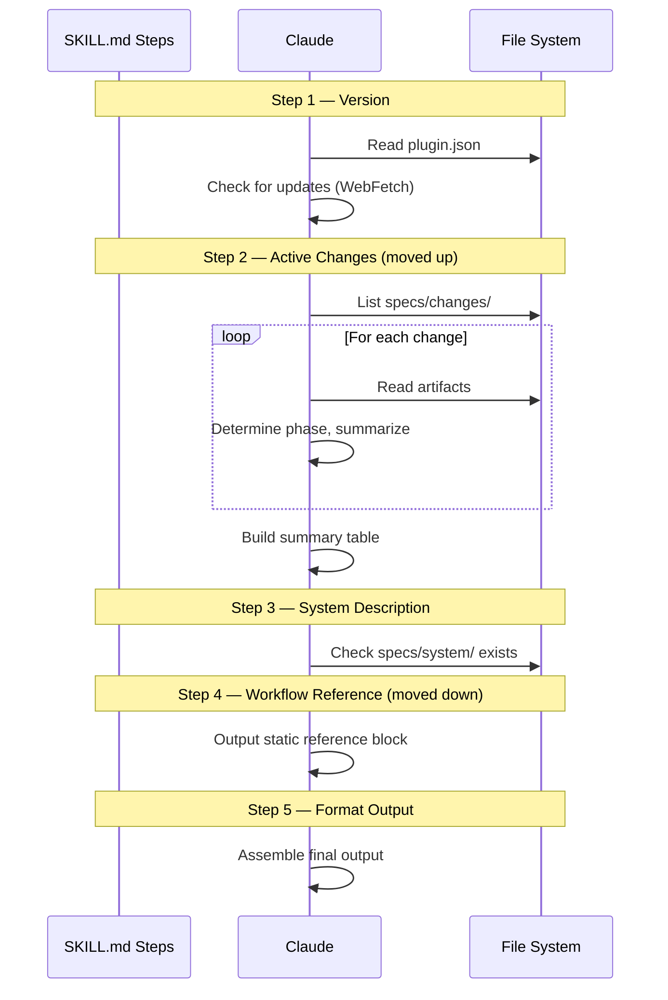

# Architecture: Overview Table-First Layout

## Approach

This is a pure prompt restructuring — the only file that changes is
`plugins/spec/skills/overview/SKILL.md`. The skill is a Markdown prompt with
YAML frontmatter that instructs Claude how to gather information and format the
output. We reorder the steps and rewrite the output format template.

## Key Decisions

### 1. Reorder steps, don't add new ones

The current SKILL.md has 5 steps:

1. Show plugin version and check for updates
2. Show the workflow reference
3. Check system description status
4. Assess the current change
5. Format the output

The new order:

1. Show plugin version and check for updates *(unchanged)*
2. Assess active changes and build the summary table *(moved up from step 4)*
3. Check system description status *(unchanged)*
4. Show the workflow reference *(moved down from step 2)*
5. Format the output *(updated template)*

The version check stays first since it's a one-liner. The change assessment
moves to step 2 because it produces the primary content. The workflow reference
moves to step 4 since it's static reference material.



### 2. Changes table replaces per-change detail blocks

Currently, each change gets a full detail block with summary, phase diagram,
next suggestion, and maturity assessment. The new format uses a table for the
quick scan, followed by detail blocks only when there are active changes.

The table columns:

| Column | Source |
|--------|--------|
| Change | Directory name from `specs/changes/<name>/` |
| Description | 1-line summary from reading `proposal.md` |
| Phase | Derived from existing phase detection logic |
| Next Step | Derived from phase → suggested action mapping |

The per-change detail (workflow position diagram, maturity assessment) is kept
**below the table** for each change, preserving the depth of the current output
while front-loading the scannable summary.

### 3. Keep the workflow reference verbatim

The workflow reference block (skills table, typical flow, artifacts list) is
moved but not edited. This avoids scope creep and ensures the reference stays
in sync with the README.

### 4. Output format template

The new template in the "Format the output" step:

```
## Spec Overview

**spec** v<version>
[update notice if applicable]

---

## Active Changes

| Change | Description | Phase | Next Step |
|--------|-------------|-------|-----------|
| <name> | <summary>   | <phase> | <action> |

### <name>
<2-line summary>

**Phase:** <phase name>
```
explore → propose → apply ← HERE → archive
```

**Next:** <suggested action>

**Maturity:** <rating>
<1-3 sentences>

---

## System Description

**System description:** [present / not yet / suggested]

---

## Workflow Reference

[existing static reference block]
```

When there are no active changes, the "Active Changes" section shows:

```
No active changes. Run `/spec:explore` to think through an idea,
or `/spec:propose` to start a new change.
```

## Tradeoffs

- **Longer output for multi-change projects**: The table adds a few lines, but
  the scanability gain is worth it.
- **Workflow reference at the bottom**: First-time users have to scroll past
  the status section. Acceptable because first-time users typically arrive via
  the README or `/spec:overview` documentation, and the reference is still
  always present.

## Integration Points

- Only `plugins/spec/skills/overview/SKILL.md` is modified
- Version bump required in `plugins/spec/.claude-plugin/plugin.json` and
  `.claude-plugin/marketplace.json`
