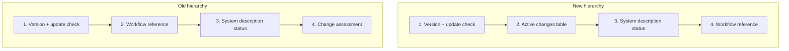

# Domain: Overview Table-First Layout

## Changed Concepts

### Overview Output Structure

The `/spec:overview` output currently treats the workflow reference as the
primary content and the change status as secondary. This change inverts that
hierarchy:

- **Active Changes Table** — A new first-class element in the overview output.
  A summary table with columns: Change name, Description, Phase, Next Step.
  This is the entry point for returning users.

- **Workflow Reference** — Demoted from leading section to trailing reference.
  Still always shown, but positioned as supplementary material rather than the
  main content.

### Information Hierarchy

The overview now follows an **action-first** information hierarchy:

### Phase Summary Format

The phase column in the changes table uses a compact format that conveys both
state and progress:

| Phase | Format |
|-------|--------|
| Exploring | `Exploring` |
| Proposing | `Proposing (in progress)` |
| Proposed | `Proposed (ready)` |
| Applying | `Applying (3/7)` |
| Applied | `Applied (ready to archive)` |

This is a condensed version of the existing phase detection logic — no new
phases are introduced.
