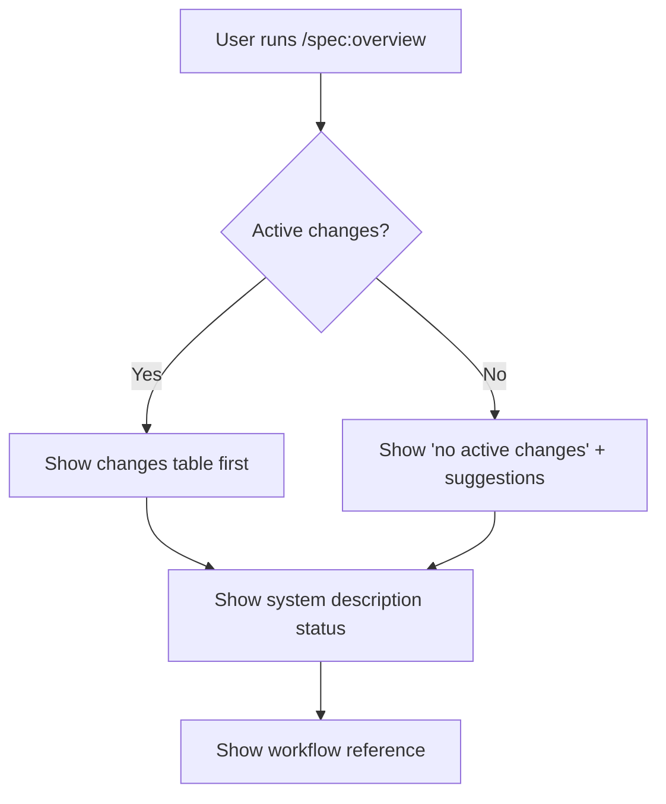

# Proposal: Overview Table-First Layout

## What

Restructure the `/spec:overview` skill output so it **leads with a table of
active changes** instead of the static workflow reference.

Currently, `/spec:overview` always starts with the full workflow description
(skills table, typical flow, artifacts reference) before showing the current
status. This means the most actionable information — what changes are in flight
and what to do next — is buried below a wall of static documentation that
returning users already know.

## Why

The primary use case for `/spec:overview` is **"where did I leave off?"** — a
returning user opening a session wants to immediately see:

- Which changes exist
- What state each one is in
- What to do next

The workflow reference is useful for onboarding, but after the first use it
becomes noise that pushes the actionable content down. The current layout
optimizes for first-time users at the expense of repeat users.

## Scope

- Reorder the output sections in the overview SKILL.md prompt
- Introduce a summary table format for active changes
- Keep the workflow reference intact but move it below the status section
- No changes to other skills or artifacts

## Expected Outcome

After this change, `/spec:overview` output follows this structure:

```
## Spec Overview

**spec** v<version>

## Active Changes

| Change | Description | Phase | Next Step |
|--------|-------------|-------|-----------|
| <name> | <2-line summary> | Applying (3/7) | `/spec:apply` to continue |

(or "No active changes" message with suggestions)

---

## System Description

<status>

---

## Workflow Reference

<existing reference content>
```


