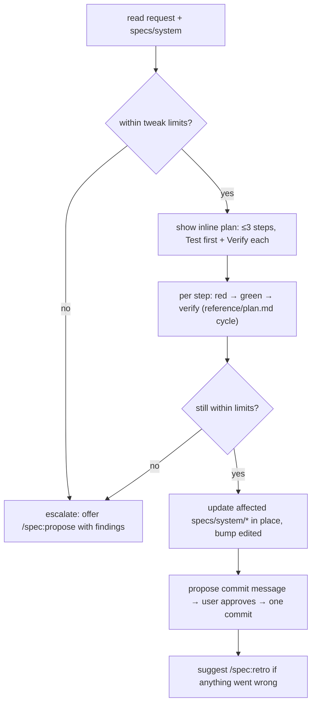
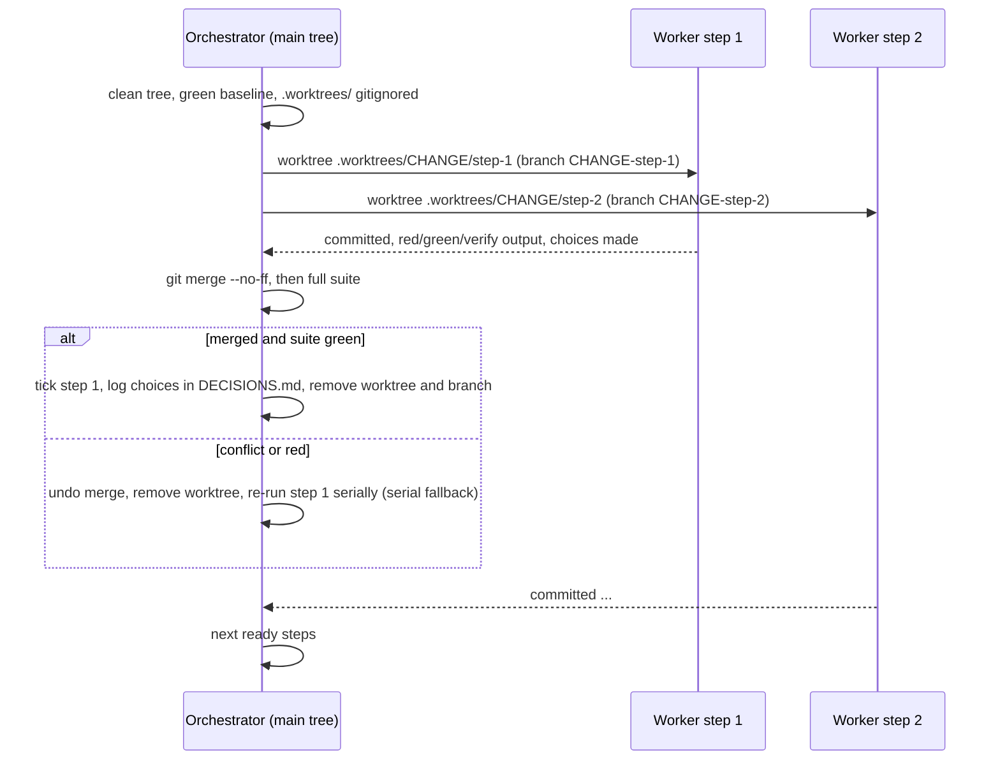
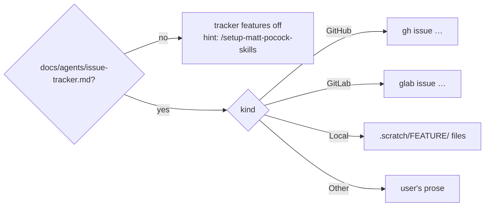
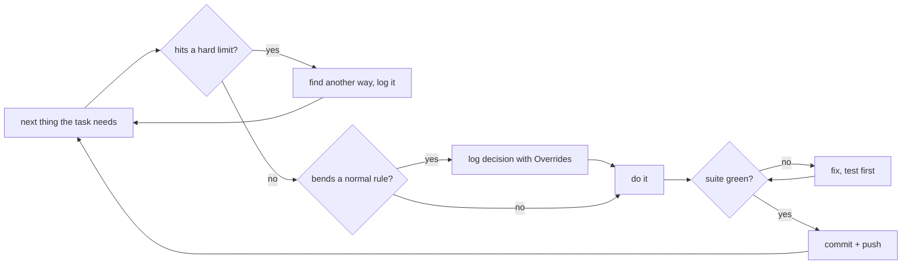

# Architecture: Pocock-inspired spec flow

spec stays **pure prompt**: every feature below is skill and reference text that Claude
follows with its built-in tools. There are no new scripts and no md2html changes.

## Files touched

| File | Feature | Change |
|---|---|---|
| `plugins/spec/reference/decisions.md` | gate | `Overrides` field, "Reviewing decisions" section |
| `plugins/autonomous/skills/autonomous/decisions-format.md` | gate | byte-identical copy of the above |
| `plugins/spec/reference/plan.md` | parallel | `Depends on:` sub-bullet |
| `plugins/spec/skills/tweak/SKILL.md` | tweak | **new** |
| `plugins/spec/skills/retro/SKILL.md` | retro | **new** |
| `plugins/spec/skills/archive/SKILL.md` | gate, retro | check 2d, promotion, suggests retro |
| `plugins/spec/skills/apply/SKILL.md` | gate, parallel | `--parallel` mode, inline summary |
| `plugins/spec/skills/overview/SKILL.md` | gate, tweak, retro | open-decision line, workflow reference |
| `plugins/spec/skills/propose/SKILL.md` | gate, tweak, parallel | suggests tweak, writes `Depends on:`, inline summary |
| `plugins/spec/skills/adversarial-code-review/SKILL.md` | gate | inline summary |
| `plugins/autonomous/skills/autonomous/SKILL.md` | gate, autonomy | fills `Overrides`, inline summary, standing permissions replace the no-push guardrail |
| `plugins/spec/reference/issue-tracker.md` | tracker | **new**: how spec skills read and use `docs/agents/issue-tracker.md` |
| `plugins/spec/skills/{propose,tweak,archive,adversarial-code-review,overview}/SKILL.md` | tracker | issue input, tracking issue, `Closes #N`, Spec-axis fallback, setup hint |
| `README.md`, `plugin.json` ×2, `.claude-plugin/marketplace.json` | all | docs, spec 11.0.0 → 12.0.0, autonomous 1.0.0 → 2.0.0 |

## 1. Decision review gate

**Format** (`reference/decisions.md`, and its twin `decisions-format.md`):

- **New optional field `Overrides`.** It goes right after `Status`, and only when the decision
  bends a guardrail. Its value names the rule and where it lives, e.g.
  `` `/spec:archive` — re-run the suite before archiving ``. Decisions without an override
  leave the field out, so every existing log stays valid.
- **New section "Reviewing decisions".** It defines the change's decisions, what `confirmed`
  and `reverted` mean, and promotion.
- **The inline format summary** in the Guardrails of `propose`, `apply`,
  `adversarial-code-review` and `autonomous` gains `Overrides (only when a guardrail is bent)`.
  These four are every copy, found by `grep -l 'Context, Question'`.

**`/spec:overview`** (step 2, "Assess active changes"): if `DECISIONS.md` exists, count the
`**Status:** open` lines and the open decisions that carry `**Overrides:**`. Show one line:
`Decisions: N open (K overrides) — review before archive`. Skip the line when
N = 0.

When N > 0, overview then **offers to review them right away** (grill Q7). It uses the same flow
as archive's gate: confirm or revert with AskUserQuestion, overrides first, in batches of 4,
writing `Status`. This catches the decisions that never reach an archive gate:
`/autonomous` archives straight through the gate, and `/autonomous` tweaks never archive at
all. Reverted decisions are listed with what has to be undone (via `/spec:tweak` or
`/spec:apply`). The user may decline, and then overview moves on.

**`/spec:archive`** gets a new readiness check 2d, **Review the change's decisions**:

1. Select the change's decisions. These are the open decisions in a run whose
   `Started by` / `Task, as given` names `<change>`, plus open decisions whose `Context`
   names it. This rule is deterministic and works on plain text.
2. Ask with AskUserQuestion, overrides first, in batches of ≤4: **Confirm** or **Revert**
   for each. Write the answer to `Status` with Edit (and bump `edited`).
3. Any decision still `open` (skipped, or "Stop reviewing") or a **pending revert** (`reverted`
   without an `Undone in <hash>.` line, which tweak or apply append when they undo it) → stop.
   Archive tells the user what to undo, and suggests `/spec:apply` or `/spec:tweak`, then
   `/spec:archive` again. (Refined after review: blocking on every `reverted` would block
   forever once the revert is done.)
4. Report the open decisions that are *not* the change's as a count. They don't block.
5. **Inside an `/autonomous` run** (no user to ask), skip 2–3. The change's decisions stay
   `open` and are listed in the archive commit's body and the run's report. The user reviews
   them afterwards (section 6).

**Promotion** (archive step 4): a confirmed decision that is hard to reverse, surprising
without context, and a real trade-off goes into `docs/adr/NNNN-<slug>.md` if `docs/adr/`
exists. Otherwise it becomes a row in the decisions table of `specs/system/architecture.md`:
the existing one (this repo's is called "Spec profile design decisions"), or a new
**Key decisions** table if there is none. The test is Pocock's ADR test. Promotion keeps `DECISIONS.md`
as a run log and keeps the ADRs from going stale, which is what happened in karpathy_app.

**Key decisions**

| Decision | Alternatives | Why |
|---|---|---|
| Archive refuses while the change has open decisions | warn only (like the readiness warnings) | Warnings were already there in spirit, and 80/80 decisions stayed open; only a gate gets them reviewed |
| Attribution by text match on the change name | a new `Change:` field per decision | No format churn; runs already name the change in `Started by` / `Context` |
| `Overrides` as an optional field | prefix in the title; separate log | Machine-countable with `grep`; old logs stay valid |
| Revert stops archive, doesn't auto-undo | archive reverts code itself | Undoing code is implementation work: it belongs in apply/tweak, test-first |

## 2. `/spec:tweak`

A new skill, `skills/tweak/SKILL.md`, user-invoked (`disable-model-invocation: true`, with no
`name:`). Argument: a description of the change.

- No change directory, no frontmatter status, no HTML view. `/spec:overview` can't see a tweak
  in flight. That is accepted, because a tweak lives in one session.
- It refuses to start while the tree has uncommitted changes from an open change's apply,
  because its single commit must not sweep those in.
- Unattended outside `/autonomous`: it decides and logs like the other skills, but never
  commits. It leaves the commit to the user and says so in the summary. Inside an
  `/autonomous` run it commits and pushes (section 6).
- `/spec:propose` step 1 suggests `/spec:tweak` when the request is within the tweak limits.
  It does not redirect: the user picks.

| Decision | Alternatives | Why |
|---|---|---|
| No change directory | a change dir holding only `plan.md` | No change to the status definitions or md2html lint; w12spec's tweak works the same way |
| ≈3-step limit + no domain/architecture impact | line-count limit | Matches the cases that hurt (dialog split, small fix); line counts are only known afterwards |
| Limits are the agent's judgement, no mechanical cap (grill Q4) | hard step count; diff-size or file-count cap | A cap fires on harmless wide renames and misses deep small ones; escalating before code is the real safeguard |

## 3. `/spec:retro`

A new skill, `skills/retro/SKILL.md`, user-invoked. Argument: optional `[change-name |
fixed-point]`. Without one, it covers the current session.

**Evidence it reads** (whatever exists):

- the session's own history: red Verify runs, user corrections, re-dos. After a `/clear` that
  history is gone, so retro finds the session's log itself (the transcript `.jsonl` under
  `~/.claude/projects/…`), as Pocock's `/retro` does, and asks only if several fit.
- review findings from `/spec:adversarial-code-review`
- `DECISIONS.md` runs for the change: overrides and reverted decisions
- `git log <fixed-point>..HEAD`, looking at fix-up and review-fix commits

**Output.** A severity-ordered list. Each item gives what went wrong, the evidence, and **one**
fix. The fix is the most mechanical kind that works, in this order:

1. a test or Verify command
2. a lint rule, hook or CI check
3. a skill or reference edit
4. a one-line CLAUDE.md pointer (never a paragraph)

The user picks which fixes to apply (AskUserQuestion, multi-select). Retro applies the small
ones directly. Bigger ones get a suggestion: `/spec:tweak` or `/spec:propose`. Retro writes no
artifact of its own.

**Where a fix may land** (grill Q3):

- **Project-level fixes** are applied in the project: its tests, lint config, hooks, CI and
  its CLAUDE.md.
- **Plugin-level fixes** are never edited in `~/.claude/plugins/cache/…`, because the next
  update overwrites that. Examples: a spec skill's prompt, md2html's lint, one of Pocock's
  skills. Retro **drafts an issue against the plugin's own repo**: `tillg/till-claude-code-marketplace`
  for spec, md2html and autonomous, `mattpocock/skills` for his. The repo comes from
  the marketplace's `source.repo` in
  `~/.claude/plugins/known_marketplaces.json`, else the user is asked. (`plugin.json`'s
  `marketplace` field is a URL to a JSON file, not a repo, and md2html doesn't have it.) It publishes the issue only after the user approves it. Inside
  this repo, the plugin *is* the project, so the fix is applied directly.

`/spec:archive`'s summary and `/spec:tweak`'s end both suggest `/spec:retro`.

| Decision | Alternatives | Why |
|---|---|---|
| Mechanical first, CLAUDE.md last | free-form lessons file | w12-free's learnings and incident patches grew prose; Pocock's retro turns them into checks |
| No retro file | `specs/learnings/` | A file that only grows is exactly the backlog problem; the fix itself is the record |
| Plugin-level fixes become drafted issues upstream (grill Q3) | edit the plugin cache; only mention them | Cache edits vanish on update; a mention gets lost; an issue reaches the repo that can fix it |

## 4. `/spec:apply --parallel`

**Plan format** (`reference/plan.md`): a new optional sub-bullet, `Depends on: 2, 3` or
`Depends on: none`. If any step has it, every step has it. `/spec:propose` writes these lines
when the plan has steps that don't build on each other, and leaves them out otherwise.

**Mode.** `--parallel` in the arguments is the user's explicit permission to create
worktrees, temporary branches and commits. The sequential apply does none of those.

**Rules**

- At most 3 workers at once. Each worker branches from the current HEAD when it is spawned, so
  it sees every step already merged.
- **Single writer.** Workers never edit `plan.md`, `DECISIONS.md` or anything under `specs/`.
  They report the choices they made, and the orchestrator logs them. That rules out conflicts
  on the shared files.
- Merges are serial, in the order workers finish. After each merge the full suite runs.
  - On a **conflict**: `git merge --abort`, remove the worktree and branch, and re-run the step
    in the main tree after the other ready steps have merged.
  - If the suite goes **red**: `git reset --merge ORIG_HEAD` (only the merge just made), then
    the same fallback.
- The orchestrator adds `.worktrees/` to `.gitignore` if it is missing (and commits that line),
  and requires a working tree that is clean apart from the change's own files and
  `DECISIONS.md`; leftovers of an earlier run (local `<change>-step-*` branches without an
  upstream) are removed; a test runner that would pick up `.worktrees/` falls back to serial.
- A worker that fails its Verify reports back and is not merged. The step stays unticked, and
  apply pauses as it does today (unattended: the step is skipped, and its dependents wait).

| Decision | Alternatives | Why |
|---|---|---|
| Branches `<change>-step-<n>`, not `spec/<change>/step-<n>` (review of group D) | nested `spec/…` names | Git can't create `spec/x` when a branch `spec` exists; flat names can't collide that way |
| Serial fallback commits its step (review of group D) | leave it uncommitted like sequential apply | Later Workers branch from `HEAD`; an uncommitted step would be missing in their worktrees and dirty every merge |
| Conflict → redo serially, never resolve by hand | an LLM merger that resolves conflicts | Pocock's merger is underspecified and `resolving-merge-conflicts` was removed; a redo is always correct and only costs time |
| Opt-in flag | automatic when `Depends on:` exists | Creating commits and branches needs explicit permission (global rule) |
| Max 3 workers | unbounded | Each worker runs the suite; the machine and token cost bound it |

## 5. Issue tracker

**Selection: reuse, don't copy.** The tracker is chosen exactly as Pocock chooses it, by his
own skill. `/setup-matt-pocock-skills` looks at `git remote` and proposes:

- GitHub for a GitHub remote (the default)
- GitLab for `gitlab.com` or a self-hosted GitLab
- otherwise local Markdown under `.scratch/`, or "Other" (the user describes the workflow in
  a paragraph)

It writes the choice to `docs/agents/issue-tracker.md`, using the templates in his skill
folder. spec already depends on mattpocock-skills, so the skill is always installed. spec
reads the same file, so his skills and ours never disagree about where issues live.

**New `reference/issue-tracker.md`** is the one place spec skills read for tracker rules:

1. **Find the config:** `docs/agents/issue-tracker.md` at the project root. If it is missing,
   tracker features are off: say once "run `/setup-matt-pocock-skills` to connect an issue
   tracker" and carry on as before. Never block on it, and never guess a tracker.
2. **Operations:** use the commands the config spells out for *fetch*, *publish*, *comment*
   and *close*. spec never hard-codes `gh` or `glab`. For "Other", it follows the user's prose.
3. **Labels:** if `docs/agents/triage-labels.md` exists, use its string for the role
   (`ready-for-agent`, `needs-triage`). Otherwise publish **without** a label — a label the repo
   doesn't have makes `gh issue create --label` fail. (Changed after review from "use the
   literal label".)
4. **Linking:** a change's linked issue is one line right under the `# Proposal: …` heading,
   `**Issue:** [#42](<url>)` (a local tracker uses the `.scratch/…` path). It goes in the body
   because md2html's spec frontmatter is a closed schema.
5. **Writes need consent:** publishing, commenting and closing are outward-facing.
   - Interactive: ask once per write. Fold it into an existing question where one is asked
     anyway (archive's commit approval).
   - Unattended: never write to a remote tracker, **except inside an `/autonomous` run**
     (standing permission, section 6). A local `.scratch/` tracker may be written. A skipped
     write is logged in `DECISIONS.md` and named in the summary.

**Where each Pocock use lands**

| Pocock skill → tracker use | spec skill | Behaviour |
|---|---|---|
| `to-tickets`, `implement`, `wayfinder` handoff → issue ref as input | `/spec:propose`, `/spec:tweak` | An argument that is an issue reference (`#42`, URL, `.scratch/` path) is fetched (body + comments) and used as the request; propose writes the `Issue:` line |
| `to-spec` → publish spec issue, `ready-for-agent` | `/spec:propose` | No issue given and the tracker is configured: offer a tracking issue (title, 3-line summary, path of the change, label `ready-for-agent`), then write its `Issue:` line |
| `implement-spec` → close work the tracker's way | `/spec:archive`, `/spec:tweak` | Commit message gets a `Closes #N` trailer (GitHub/GitLab close on merge). In the commit-approval question: "also comment the hash on #N and close it now?" (done after the commit; inside `/autonomous` only once the commit is on the default branch) Local tracker: set the file's `Status:` to `resolved` (Pocock's term; changed from "closed" after review) and append the commit under `## Comments`; no trailer |
| `code-review` → Spec axis reads issues referenced in commits | `/spec:adversarial-code-review` | No change given or found: fetch the issues the commits reference (`#123`, `Closes #45`, GitLab `!67`) as the Spec source, instead of skipping the axis |
| `setup-matt-pocock-skills` → config | `/spec:overview` | Config missing: one hint line suggesting `/setup-matt-pocock-skills` |

**Key decisions**

| Decision | Alternatives | Why |
|---|---|---|
| Reuse `/setup-matt-pocock-skills` and its file | own `/spec:setup` with copied templates | "Same logic" for real, with one source of truth; his templates evolve with his skills; spec already depends on him |
| Tracker optional, never blocking | require setup before propose | spec works today without a tracker; small and offline projects stay as they are |
| `Issue:` line in the proposal body | frontmatter key `issue` | md2html's spec frontmatter is a closed schema; a body line needs no lint change |
| Tracking issue points at the change, doesn't hold the spec | publish the spec as the issue (Pocock) | Our spec lives in `specs/changes/` and is folded into `specs/system/`; two copies would drift |
| Plan steps are not mirrored as tickets | `to-tickets` per plan step | `plan.md` (with `Depends on:`) is the task graph; mirroring it doubles every tick |
| `Closes #N` in the commit + close on consent | close silently; only the trailer | The trailer works when the branch merges; the explicit close covers work committed straight to main; closing is outward-facing, so it asks |

## 6. `/autonomous`: whatever it takes to move on

Invoking `/autonomous` is the user's permission for **every action the task needs**. It
replaces 1.x's guardrail "no `git push`, no `/spec:archive` … commit locally only if …". The
rule flips: instead of a list of what is allowed, there is a short list of what is never
allowed, and everything else is decided, done and logged.

**Typical actions it now takes on its own** (examples, not a whitelist):

| Action | How |
|---|---|
| Commit | One commit per green unit (plan step, fix, test), with trailers `Decision: <decision id>` (when it carries out a logged decision) and `Refs #N` / `Closes #N` |
| Push | The current branch after each green commit (`-u origin <branch>` if it has no upstream). Rejected because the remote moved on → rebase, re-run the suite, push. Rejected because the branch is protected → push a new branch `autonomous/<task>` and open a PR. |
| Tracker | Per `reference/issue-tracker.md` (from spec, else `docs/agents/issue-tracker.md` directly): file bugs found while testing (`needs-triage`), comment, close fixed issues. Every text starts with the AI disclaimer. |
| Archive | `/spec:archive` once a change is applied and reviewed. Inside a run the decision gate doesn't stop: the change's decisions stay `open` and are listed in the archive commit's body and in the report, so the user still reviews them. `/spec:overview` keeps flagging them. |
| Deploy, restart, migrate | When the task or its testing needs it — non-production unless the task names production, and only with the project's documented command. Rollback command logged in the decision's Consequences. |
| Skip a human-only step | e.g. `/spec:grill`: decide the open questions itself, log them |

**Accountability replaces asking:**

- **One `Overrides` decision per kind, per run** (grill Q2). The first time a run bends a
  given rule, it logs one decision with `Overrides` set. Typical rules: pushing to the default
  branch, creating a branch or PR, archiving past the decision gate, deploying. Every later
  occurrence of the same kind in that run is appended to that decision's **Consequences**,
  not logged again. That keeps the log readable: karpathy_app's 80 unreviewed entries were
  mostly repeats and ops trivia.
- Routine work the standing permission covers is never a decision: green commits, pushes to a
  non-default branch, tracker writes. The report lists them all.
- Commits are only made with the full suite green, never with `--no-verify`.

**Hard limits.** These three are never needed to make progress, and none can be undone:

1. no force-push or history rewrite of anything already pushed (revert forward instead;
   "shared branch" was too vague, sharpened after review)
2. no deleting data it didn't create (user data, other people's issues and branches,
   production records)
3. no exposing secrets (in commits, issues, logs or PRs)

Driven skills inherit the permission inside the run: `/spec:apply` (also `--parallel`),
`/spec:tweak`, `/spec:propose` (tracking issue) and `/spec:archive`. Outside `/autonomous`,
unattended runs keep today's rules: no push, no remote tracker writes, no archive.

**How it drives them.** The spec skills are user-invoked only (`disable-model-invocation:
true`), so the Skill tool can't call them. `/autonomous` reads the skill's `SKILL.md` and
follows it, as it already does for apply. The `/autonomous` exceptions written into those
skills (archive's gate, tweak's commit, tracker writes) apply when they are followed this way
inside a run.

**Retro at the end of a run** (grill Q8): after its self-review and **before** its open-ended
testing (which only ends when the user returns, so a retro "before reporting" would never run
— moved after review), `/autonomous` runs the
`/spec:retro` flow over its own run (by following its `SKILL.md`). It applies the
project-level fixes itself and logs each one as a decision. It drafts the plugin-level
issues into the report but does not publish them: issues on upstream repos are never needed
to move on, so they wait for the user.

**Parallel by default** (grill Q5): when the plan has `Depends on:` lines and at least 2
steps are ready at once, `/autonomous` applies with `--parallel`. Otherwise it applies
serially.

| Decision | Alternatives | Why |
|---|---|---|
| Blacklist of 3 hard limits, everything else allowed | whitelist (commit, push, tracker) | The user wants runs to keep moving; any whitelist ends at the next unforeseen blocker |
| The hard limits stay (confirmed, grill Q1) | no limits at all | None of the three is ever *needed* to move on, and each one destroys work, data or trust irreversibly |
| One `Overrides` decision per kind per run (grill Q2) | one per action; only risky kinds | Every bent rule stays visible, while repeats don't drown the log |
| `--parallel` by default when the plan allows (grill Q5) | serial unless asked | Unattended time is the scarce resource; the serial fallback keeps it correct |
| Retro at run end: project fixes applied, upstream issues only drafted (grill Q8) | only suggest retro; publish upstream too | Mechanical fixes help the next unattended run right away; other repos are not the run's to write to |
| Overview offers the decision review (grill Q7) | count line only; a separate `/spec:decisions` skill | Decisions from autonomous archives and tweaks never meet a gate; overview is where sessions start, so no new skill is needed |
| Archive allowed, gate becomes "leave open + list" | gate blocks autonomous archive | Moving on to the next change needs `specs/system/` current; the user still reviews every decision afterwards |
| Permission comes with invoking `/autonomous`, no flag | `--push` / `--deploy` flags | The user asked for this as the skill's behaviour; a flag would be missing exactly when it matters |
| `Decision:` trailer instead of a new DECISIONS field | `Commit:` field per decision | Commits can be written before the hash is known; `git log --grep` finds them; no change to the twin format files |

## Added during apply (from the reviews)

The per-group and whole-diff reviews added behaviour that the sections above didn't ask for.
It is recorded here so the spec matches the code:

- **Decisions.**
  - A **pending revert** status: `reverted` stays pending until tweak or apply append
    `Undone in <hash>.` Overview lists pending reverts.
  - **Stop reviewing** in the review flow.
  - Whole-token matching of change names.
  - Appending to Consequences is an explicit exception to "never rewrite".
  - Decisions confirmed in overview after their change is archived are promoted right away.
- **Archive inside `/autonomous`.**
  - Stricter, not looser: no archive with a missing artifact, an unticked step or a red suite.
  - It stages only the change's files, including `specs/changes/<name>/`.
  - Step 6 deletes the change directory only once it is in git history.
- **`/autonomous`.**
  - Deploys go to non-production only, unless the task names production, and only with a
    documented command.
  - Issues are closed only once the fix is on the default branch.
  - At most 3 rebase attempts per push. A protected branch gets one `autonomous/<slug>`
    branch and one PR.
  - A red baseline means "no new failures", logged once.
  - Files that were dirty before the run are never committed.
  - The triage label is mapped via `triage-labels.md`.
  - Retro has a fallback for when the spec plugin isn't installed.
- **`--parallel`.**
  - Flat branch names (`<change>-step-<n>`).
  - The serial fallback commits its step.
  - Absolute paths in the Worker brief.
  - The loop stops when nothing is ready, and cleans up leftovers with `-D` / `--force`.
- **Tweak.**
  - It refuses a tree left dirty by an `applying` **or** `applied` change.
  - On escalation, the linked issue is passed on to propose.
- **Issue tracker.**
  - A bare `42` is a change name, not an issue reference.
  - Local trackers close with `Status: resolved`.

## Versioning

- **spec 12.0.0 (major).** `/spec:archive` now refuses while the change has open decisions,
  except inside `/autonomous`. That changes what an existing invocation does, and the rule is
  "when in doubt bump higher".
- **autonomous 2.0.0 (major).** It now pushes, archives, deploys and writes to the tracker on
  its own, where 1.x guaranteed "no `git push`, no `/spec:archive`". It also gets the new
  optional decision field.

Both numbers change in `plugin.json` and `.claude-plugin/marketplace.json` in the same commit.

## Verification approach

All steps are prompt or docs text (`Test first: none`, per `reference/plan.md`). Each Verify is
mechanical:

- `grep` for the exact new heading or rule
- `cmp` for the twin decisions files
- `claude plugin validate plugins/<name>` for new skills and manifests
- `jq` to check that versions are equal

The repo's only test harness is md2html's `npm test`. It is the full suite run before the
first step and after every step: nothing here may break it.
