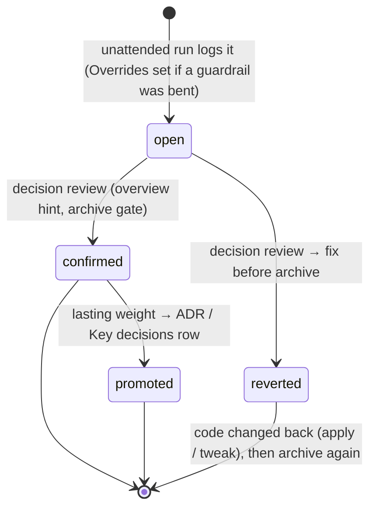
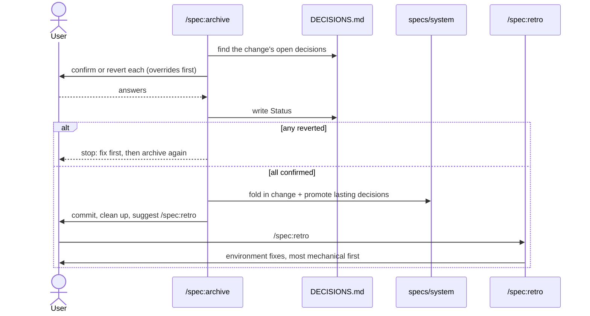
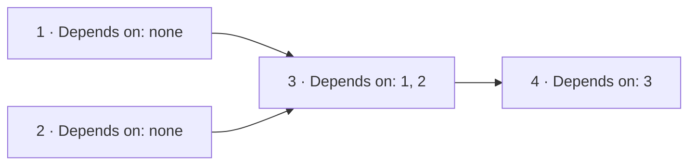
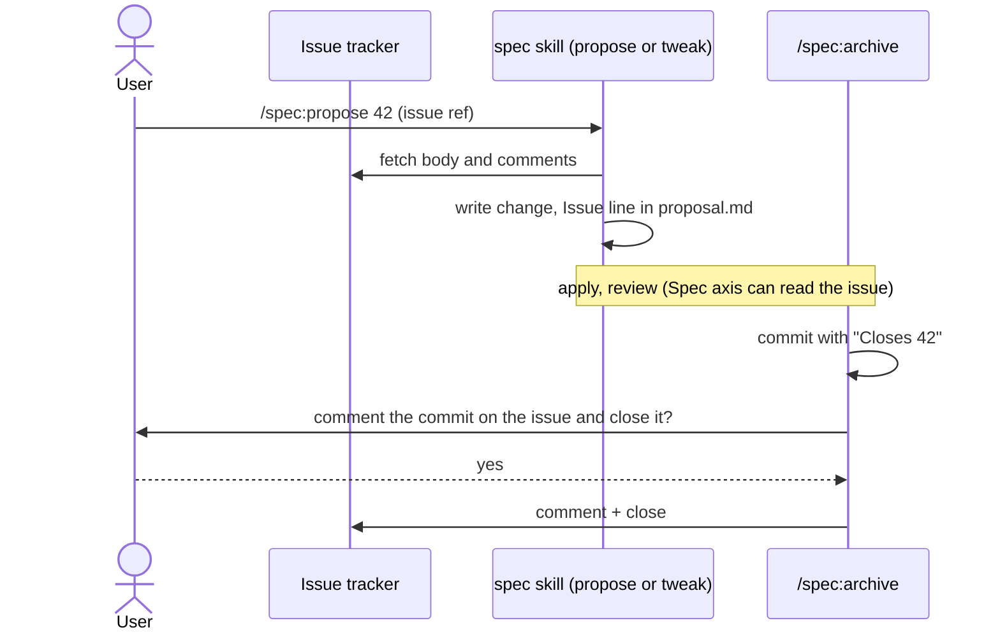

# Domain: Pocock-inspired spec flow

## New terms

| Term | Meaning | Not to be confused with |
|---|---|---|
| **Tweak** | A small change done with `/spec:tweak`. It has no change directory and one inline plan, and goes straight into `specs/system/` with one commit. | A *change* (`specs/changes/<name>/`, four artifacts, status lifecycle) |
| **Escalation** | A tweak handing over to `/spec:propose` because it outgrew the tweak limits | Pausing an apply |
| **Override** | A decision that bends a guardrail: a rule from a skill, from a CLAUDE.md, or from the user's instructions. Marked with the decision's `Overrides` field. | Any other open decision |
| **Decision review** | The user setting each open decision of a change to `confirmed` or `reverted` | Code review |
| **Change's decisions** | Open decisions whose run (`Started by` / `Task, as given`) or `Context` names the change | All open decisions in the project |
| **Promotion** | Moving a confirmed decision with lasting weight into an ADR (if `docs/adr/` exists) or into the Key decisions table of `specs/system/architecture.md` | Copying the decision into the change's `architecture.md` while the change is still open |
| **Retro** | `/spec:retro`: finds what went wrong in a change or tweak and proposes environment fixes | Adversarial review (which looks at the code) |
| **Environment fix** | A change to what the agent works *with*, not the product: a test, lint rule, hook, CI check, skill/reference text, or a CLAUDE.md pointer | A product bug fix |
| **Step dependency** | A plan step's `Depends on:` line: the step numbers that must be ticked first, or `none` | The order the steps appear in |
| **Ready step** | An unticked step whose dependencies are all ticked | — |
| **Orchestrator** | The `/spec:apply --parallel` session. It alone writes `plan.md` and `DECISIONS.md`, merges, and ticks. | Worker |
| **Worker** | A subagent that runs one step's red → green → verify cycle in its own worktree and commits there | — |
| **Serial fallback** | Re-running a step in the main tree, one at a time, after its merge conflicted or turned the suite red | — |
| **Issue tracker** | Where the project's issues live: GitHub (`gh`), GitLab (`glab`), local Markdown under `.scratch/`, or a freeform "Other" (Jira, Linear, …) | `specs/changes/` (where *changes* live) |
| **Tracker config** | `docs/agents/issue-tracker.md`, written by Pocock's `/setup-matt-pocock-skills` and read by his skills and by spec. It defines how to fetch, publish, comment on and close an issue. | `reports.json` (md2html config) |
| **Issue reference** | What a user passes to name an issue: `#42`, an issue URL, or a `.scratch/…` path | A change name |
| **Linked issue** | The issue a change or tweak answers, recorded as an `Issue:` line at the top of `proposal.md` (or in the tweak's commit) | Issues merely mentioned in the text |
| **Standing permission** | `/autonomous`'s permission, granted by invoking it, to do whatever the task needs to move on. Actions that bend a normal rule are still logged as Overrides. | Permission granted per question |
| **Override kind** | One rule bent in one run (e.g. "push to the default branch"). It is logged as one decision on its first occurrence; later occurrences in the same run are added to that decision's Consequences. | A single override action |
| **Plugin-level fix** | An environment fix that belongs in an installed plugin (a spec skill, md2html lint, a Pocock skill). Retro drafts it as an issue against the plugin's repo, never edits the plugin cache. | Project-level fix (applied in the project) |
| **Hard limit** | One of three things `/autonomous` never does, because none is needed to make progress and none can be undone: force-push or history rewrite of anything already pushed, deleting data it didn't create, exposing secrets | An Override (allowed, logged) |
| **AI disclaimer** | The first line of every issue or comment `/autonomous` writes, saying it was written by Claude while the user was away | — |
| **Decision trailer** | A `Decision: <decision id>` line at the end of a commit message, linking the commit to the `DECISIONS.md` entry it carries out | `Closes #N` (links to an issue) |
| **Tracking issue** | A short issue that `/spec:propose` publishes for a change that came without one. It points at `specs/changes/<name>/` and does not copy the spec. | Pocock's spec issue, which *is* the spec |

## Decision lifecycle (extended)

`promoted` is not a `Status` value. The decision stays `confirmed`, and the ADR or table row
links back to it.

## Who does what

## Parallel apply: step graph

Steps 1 and 2 are ready together and run in two workers. Step 3 becomes ready once both are
merged and ticked.

Rule: if any step in a plan has `Depends on:`, every step has it. A plan without such lines is
a plain sequence, and `--parallel` runs it serially.

## An issue through the flow

Without a tracker config, nothing in this flow touches a tracker. The issue reference is then
taken as plain text, and the user is told to run `/setup-matt-pocock-skills`.

## Tweak limits (when to escalate)

A tweak stays a tweak while **all** of these hold:

- at most ≈3 plan steps
- no new domain term, and no changed component boundary or interaction (nothing that would
  need `domain.md` or `architecture.md`)
- no open design question the user has to settle

Breaking any of these means escalation. The tweak stops before writing code if it can, and
otherwise after the current step is green. It then offers `/spec:propose` with what it has
learned.
