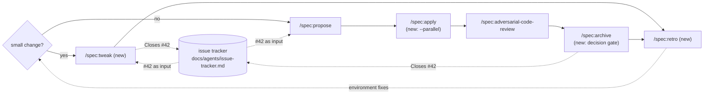

# Proposal: Pocock-inspired spec flow

## Why

The [comparison report](../../research/mattpocock-comparison-report.md) put our spec flow next to
Matt Pocock's skills (v1.3.1) and checked both against karpathy_app and w12-free. Four gaps
showed up. Each one has evidence from those projects and a working model in Pocock's or
w12-free's workflow:

| Gap | Evidence | Model |
|---|---|---|
| **Small changes cost as much as big ones** | karpathy_app: a 12-line request became ≈370 lines of spec for ≈50 lines of UI; spec size stays 400–1,400 lines whatever the change size | w12spec's `tweak` tier; Pocock's `/grill-with-docs` → `/implement` |
| **Nobody reviews unattended decisions** | karpathy_app: all 80 `DECISIONS.md` entries still `open`, several bending guardrails (prod deploy, test changes, skipped re-run) | Pocock has no log; this is our own gap |
| **Mistakes become more prose, not checks** | w12-free: ≈6,500 lines of SKILL.md, incident patches cited inline, 24 "thinness" fixes | Pocock's `/retro`: mechanical fixes become lint rules, hooks or CI |
| **Plan steps run one after another, never in parallel** | spec runs one change at a time and has no worktree flow | Pocock's `implement-spec`: task graph, worktree per ticket, merge onto one branch |
| **Specs never touch the issue tracker** | karpathy_app: 122 GitHub issues and a `docs/agents/issue-tracker.md`, but no change links to an issue and nothing gets closed at archive | Pocock: one tracker config chosen from `git remote`, read by every skill that fetches, publishes or closes work |

## What changes

1. **`/spec:tweak`** — a light lane for small changes. It creates no change directory and
   writes no proposal/domain/architecture. It takes one short inline plan, runs the same
   red → green → verify cycle, updates `specs/system/` in place, and makes one commit after
   the user approves it. If the change turns out to be bigger, it stops and hands over to
   `/spec:propose`.
2. **Decision review gate** — `DECISIONS.md` decisions get an optional **Overrides** field,
   filled in whenever a decision bends a guardrail.
   - `/spec:overview` shows how many decisions are open and how many of those are overrides,
     and offers to review them right away.
   - `/spec:archive` asks the user to confirm or revert each open decision that belongs to the
     change, and refuses to archive while any is left open. Inside `/autonomous` it archives
     anyway and lists the open decisions for later review (feature 6).
   - Confirmed decisions with lasting weight are promoted to an ADR, or to the Key decisions
     table in `specs/system/architecture.md`.
3. **`/spec:retro`** — a retrospective after archive (or after a tweak). It collects what
   went wrong (review findings, reverted or overriding decisions, red Verify runs, user
   corrections) and proposes **environment** fixes, most mechanical first: a test, lint rule,
   hook or CI check. Only after that does it suggest a skill or reference edit, and a
   CLAUDE.md line comes last. It applies only the fixes the user picks.

   A fix that belongs in an installed plugin is not made in the plugin cache. Retro drafts it
   as an issue against the plugin's own repo, which closes the loop back to this marketplace.
4. **`/spec:apply --parallel`** — plan steps may declare `Depends on:`. With `--parallel`,
   apply runs the steps that are ready in worker subagents, each in a git worktree under
   `.worktrees/`. It merges each finished step back, runs the full suite after every merge,
   and re-runs a step serially if its merge conflicts or turns the suite red.
5. **Issue tracker** — spec uses the same tracker as Pocock's skills, at the same points:
   - **Choosing the tracker** reuses his logic and his file: `/setup-matt-pocock-skills`
     proposes GitHub or GitLab from `git remote`, otherwise local `.scratch/` or a freeform
     "Other", and writes `docs/agents/issue-tracker.md`. `/spec:overview` suggests running it
     when that file is missing. No spec skill duplicates the selection.
   - **Issue as input:** `/spec:propose #42` and `/spec:tweak #42` fetch the issue as the
     request. The proposal records it on an `Issue:` line.
   - **Tracking issue:** like `to-spec`, `/spec:propose` offers to publish a short issue
     that points at the change, when none was given.
   - **Closing:** `/spec:archive` and `/spec:tweak` put `Closes #N` in the commit message.
     After asking, they comment the commit on the issue and close it.
   - **Review:** like `code-review`, the Spec axis of `/spec:adversarial-code-review` falls
     back to the issues referenced in the commits when there is no spec change.
   - The tracker is optional. Without the config file every skill works as today.
6. **`/autonomous` may do whatever it takes to move on.** Invoking `/autonomous` is
   the user's permission for every action the task needs. That includes what other runs must
   ask about: committing, pushing, creating a branch or PR when a push is refused, writing to
   the tracker, archiving a finished change, deploying, restarting services. Accountability
   replaces asking:
   - **Every action that bends a normal rule** (from a skill, a CLAUDE.md or the user's
     instructions) is a decision in `DECISIONS.md` with `Overrides` set.
   - **Commits** are green and carry a `Decision:` trailer when they carry out a logged
     decision.
   - **Tracker texts** start with an AI disclaimer.
   - **The report** lists every commit, push, branch, tracker write, archive and deploy.
   - **Logging:** one `Overrides` decision per kind of bent rule per run, so repeats don't
     drown the log.
   - **Applying:** it uses `--parallel` by default when the plan allows it.
   - **Retro:** it ends every run with a retro. It applies project-level fixes itself and
     drafts plugin-level issues for the user.

   Only three hard limits stay. None of them is ever needed to make progress, and none can be
   undone:
   - no force-push or history rewrite of anything already pushed (it reverts forward instead)
   - no deleting data it didn't create
   - no exposing secrets

## Out of scope

These came from the report but are left for later changes:

- mirroring plan steps as tracker tickets (`plan.md` stays the one task graph)
- `/triage` and backlog caps
- context-boundary guidance
- pinning the mattpocock-skills dependency
- the `GLOSSARY.md` rename in karpathy_app (that is that project's work, not this plugin's)

Also out of scope: parallel **changes** (several changes in flight). `--parallel` works on the
steps of one change.

## Impact

- **spec** gains 2 skills (`tweak`, `retro`) and a new `reference/issue-tracker.md`. It
  changes `apply`, `archive`, `overview`, `propose`, `adversarial-code-review` and
  `reference/{decisions,plan}.md`. Version 12.0.0 is
  **major**, because archive now refuses while the change has open decisions.
- **autonomous** has to carry the new decision field: `decisions-format.md` is the twin of
  `reference/decisions.md`, and its SKILL.md gets the inline summary. It also gets the
  standing permission to do whatever it takes. Version **2.0.0** is major, because it now
  pushes, archives and deploys where 1.x promised "no `git push`, no `/spec:archive`".
- **md2html** is unchanged. The new `Overrides` field and the `Depends on:` lines are plain
  Markdown that no lint rule inspects.
- README documents the new skills, the flag and the gate.

## Expected outcome

- A typo-sized or dialog-split change takes one inline plan and one commit, with tests still
  written first.
- No change is archived while its unattended decisions are unreviewed. Guardrail overrides are
  visible in `/spec:overview`.
- Each archived change ends with a short list of environment fixes on offer, instead of new
  prose in skills.
- A plan with independent steps finishes in fewer wall-clock rounds, without conflicting
  writes to `plan.md` or `DECISIONS.md`.
- An issue goes in at propose or tweak and comes out closed at archive, on whichever tracker
  the project already uses for Pocock's skills.
- Coming back after an `/autonomous` run, the work is already pushed in green, reviewable
  commits. Each commit points at the decision behind it, and the bugs it found are filed
  issues.
