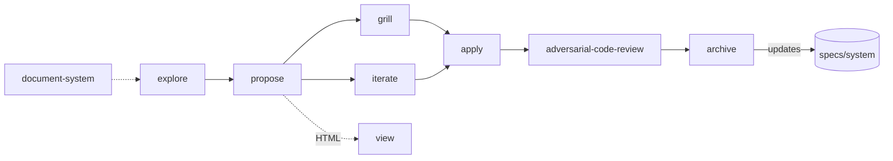

# Review: the spec workflow

Scope: the `spec` plugin v7.1.0 (`plugins/spec/skills/*`, 10 skills), its
companions (md2html 0.4.0 lint hook and viewer, `mattpocock-skills` for
grilling) and how this repo's own `specs/` uses them. Review only — nothing
was changed.

## Criteria

| # | Criterion | What "good" looks like |
|---|---|---|
| C1 | Lifecycle integrity | Every phase has an owner, a clear entry/exit, and the terminal step actually happens |
| C2 | Single source of truth | Schema and shared rules live in one place; other skills reference it |
| C3 | Cross-doc consistency | Skill list and flow agree across README, `/spec:overview` and `specs/system/` |
| C4 | Dogfooding | This repo's own `specs/` follows the workflow |
| C5 | Portability | No leftovers from another project; works in any repo |
| C6 | Graceful degradation | Optional dependencies (md2html, mattpocock-skills) fail softly with a clear message |
| C7 | Unattended operation | Autonomous runs have defined, non-contradictory behavior and a place to record choices |
| C8 | Mechanical enforcement | Invariants are checked by tools, not only by prose |
| C9 | Verification built in | Plans and apply steps carry tests/verify criteria |
| C10 | Testability of the skills | Skills have evals or fixtures that catch regressions |
| C11 | Safety of destructive steps | Deletes and commits are gated and reversible |
| C12 | Release hygiene | Versions synced; examples current |

## Findings and evidence

- **Rating** (state at review, spec 7.1.0, 2026-10-01): ✅ meets · ⚠️ partly · ❌ fails
- **Now** (2026-10-02, spec 8.0.0): ✅ resolved · 🟡 partly · ⏳ open · — nothing needed

Evidence and line numbers refer to the state at review time.

| # | Rating | Finding | Evidence | Now | What we did |
|---|---|---|---|---|---|
| C1 | ❌ | The terminal step is skipped in practice. Two changes are fully done but never archived. | `add-md2html-plugin` 29/29, `spec-frontmatter-html-view` 20/20, both `status: applied` since 2026-09-30. Last "– cleaned from change" commit: 2026-04-15. | ✅ | Archived both (`a4f6a35`/`20f0444`, `3270f90`/`675b0aa`). `/spec:propose` now checks for open changes and suggests archiving first; `/spec:overview` warns on unarchived `applied` changes (`9c31313`). |
| C1 | ⚠️ | `paused` exists only by user request; `proposing` exists only as an inferred phase. `archive/` is excluded in listings but archive deletes the directory instead. | `propose/SKILL.md` status table; `overview/SKILL.md:40` vs `archive/SKILL.md:101` (`rm -rf`) | 🟡 | Status meanings and the absence of an `archived` value are now documented in `reference/frontmatter.md`. `paused` was dropped entirely (spec 9.0.0, md2html 0.5.0): a change on hold stays `applying`. The `archive/` exclusions are still there. |
| C2 | ⚠️ | Frontmatter schema is canonical in `propose`, but restated (partly) in explore, iterate, apply, archive, document-system. The Edit/Write-not-sed guardrail is copied into 7 skills. | `grep -l frontmatter` → 7 skills; `grep -l sed/python` → 7 skills | ✅ | Schema, enum values and what each status means in practice now live only in `plugins/spec/reference/frontmatter.md`; the skills point to it (`9c31313`). The Edit/Write guardrail stays copied — **accepted by design**: it is one sentence, and each skill needs it in its own text (a pointer would be a copied line too). Enforcing it would need md2html's hook to watch Bash edits as well — a separate change. |
| C3 | ❌ | Three skill lists disagree. Overview's reference table omits `/spec:adversarial-code-review`; its one-line flow omits grill though its numbered flow includes it. `specs/system/` lists 7 skills only. | `overview/SKILL.md:165`, table at 170–179; `specs/system/functional.md:51–57`; `specs/system/domain.md:63–69`; README:143–152 lists all 10 | ✅ | README, overview and `specs/system/functional.md` list all 10 skills and share one flow line, `document-system → explore → propose → [grill \| iterate] → apply → adversarial-code-review → archive` (`9c31313`). |
| C4 | ❌ | System description is stale by ~5 months and two plugins. No mention of md2html, agent-bus, grill, view, adversarial review or spec frontmatter. | `specs/system/*.md` all `edited: 2026-04-15`; grep for `md2html\|grill\|agent-bus` in `specs/system` → no hits | ✅ | `/spec:document-system` rewrote all three files for the five plugins (`9c31313`); the archives added what existed only in the change artifacts (`a4f6a35`, `3270f90`). |
| C4 | ⚠️ | `.gitignore` lacks the negation `/spec:view` step 3 says to add. | `.gitignore` has `specs/**/*.html`, no `!specs/**/*-report.html` | ✅ | Added `!specs/**/*-report.html` (`9c31313`). |
| C5 | ❌ | Adversarial review carries another project's vocabulary and paths. | `adversarial-code-review/SKILL.md:12` (`complete-story`, `complete-epic`); `:105` (`src/db/schema.sql`, `CURRENT_DATABASE.md`) | ✅ | Rewritten in spec terms (change, plan step, after apply / before archive, `specs/system/`), with generic schema/migration checks; the Spec axis also checks test-first (`9c31313`). |
| C6 | ✅ | md2html and mattpocock-skills absences are handled: clear install message, proposal still succeeds, grill refuses to imitate. | `view/SKILL.md` step 1; `propose/SKILL.md:100–101`; `grill/SKILL.md` "Don't imitate the skills from memory" | — | — |
| C6 | ⚠️ | mattpocock-skills is a hard plugin dependency though only `/spec:grill` uses it. | `plugin.json` `dependencies` | ✅ | **Accepted by design**: installing spec should bring grill's skills along with no extra step; teammates get them through the shared settings anyway. |
| C7 | ⚠️ | `apply` says both "continue unattended" and "don't guess". Choices made unattended have no defined home; both autonomous changes invented `decisions.md` (`order: 5`), which no skill names. | `apply/SKILL.md:77` vs `:147`; `specs/changes/*/decisions.md` | 🟡 | apply's rule is now one rule: unattended it decides unclear steps and notes them, but never ticks a step whose Verify fails (`9c31313`). `decisions.md` is named as an extra file, not yet as the log for unattended choices. |
| C8 | ✅ | Frontmatter consistency, checkbox counts and the HTML view are mechanical (md2html lint hook, `grep -c`, deterministic build with tests). | `plugins/md2html/hooks/hooks.json`; `overview/SKILL.md:76–77`; 22 md2html test files | — | — |
| C8 | ⚠️ | The hook only sees Write/Edit, so enforcement depends on a prose rule; the long bash in `view` is prompt text rather than a script. | `hooks.json` matcher `Write\|Edit\|MultiEdit`; `view/SKILL.md` steps 1, 5 | ⏳ | — |
| C9 | ❌ | Plan steps have no verify criterion, and `apply` never runs tests. Neither skill mentions tests. | `propose/SKILL.md:76` ("small enough to implement in one step"); `grep -i test` in apply/propose → no hits | ✅ | Test-first throughout (`9c31313`): every plan step has `Test first:` and `Verify:` (`reference/plan.md`); apply runs red → green → refactor → Verify + full suite before ticking; archive re-runs the tests; overview rates a plan without them at best "Almost there". |
| C10 | ❌ | No evals for any spec skill; regressions (like C3, C5) go unnoticed. | Only `plugins/md2html/test/*` exist | ⏳ | — |
| C11 | ✅ | Archive asks for the change, asks before commit, and deletes only after the commit, so git history holds the change. | `archive/SKILL.md:24`, step 5–6 | — | Additionally, archive now runs the test suite first and needs an explicit "archive anyway" when it fails (`9c31313`). |
| C12 | ⚠️ | Versions are in sync (7.1.0 in both files). Overview still shows `v6.1.0` as its example output. | `.claude-plugin/marketplace.json`; `overview/SKILL.md:20,30` | 🟡 | Bumped to 8.0.0 in both files (`9c31313`). The `v6.1.0` example remains. |

## Conclusions

1. **The front half is strong.** explore → propose → grill/iterate produce
   rich, consistent artifacts, and md2html makes their structure checkable.
   Dependencies degrade well.
2. **The back half leaks.** Archive is the step that keeps `specs/system/`
   true, and it is the step skipped. With no archive, the system
   description — which every other skill reads as ground truth — is wrong
   about this repo.
3. **Drift comes from duplication.** Lists and rules repeated across skills,
   README and system docs fall out of step with each release (C2, C3, C12).
4. **"Done" means "checked off", not "verified".** Without verify steps and
   tests in the plan/apply loop, `applied` is a claim, not a result.
5. **Nothing tests the skills themselves**, so the leftovers in C5 and the
   mismatches in C3 shipped unnoticed.

## Recommendations

Ranked by impact. Each names the finding it addresses.

| Priority | Recommendation | Addresses | Status |
|---|---|---|---|
| 1 | Run `/spec:archive` on both applied changes; this refreshes `specs/system/` with md2html, agent-bus, the new skills and the frontmatter schema. | C1, C4 | ✅ Done — `/spec:document-system` refreshed `specs/system/`; both changes archived (`a4f6a35`/`20f0444`, `3270f90`/`675b0aa`) |
| 2 | Make `/spec:overview` flag `applied` changes older than a few days as "archive overdue", and have `/spec:apply` offer archive when it sets `applied`. | C1 | ✅ Done — overview warns on unarchived `applied` changes; `/spec:propose` checks for open changes and suggests archiving first; apply ends with review → archive |
| 3 | Strip the foreign references from `adversarial-code-review` (generic "story/epic" wording; "schema files" instead of named paths). | C5 | ✅ Done — uses change / plan step / `specs/system/` vocabulary; adds a test-first check on the Spec axis |
| 4 | Add a verify line to each plan step (`- [ ] step → verify: <command>`) in `propose`, and have `apply` run it before ticking the box. | C9 | ✅ Done, extended to TDD — every step has `Test first:` and `Verify:` (`plugins/spec/reference/plan.md`); apply runs red → green → verify + full suite before ticking; archive re-runs the tests |
| 5 | Reconcile the skill list and flow: one source (README table) that overview and `specs/system/functional.md` mirror; add adversarial review and grill to overview. | C3 | ✅ Done — README, overview and `specs/system/functional.md` list all 10 skills and share one flow line |
| 6 | Name `decisions.md` as the optional artifact for choices made unattended; make apply's unattended rule explicit ("log in decisions.md and continue"). | C7 | 🟡 Partly — apply's contradiction resolved (unattended never ticks a failing step); `decisions.md` is named as an extra file in the frontmatter reference, but not yet as the log for unattended choices |
| 7 | Add a small eval suite (`claude plugin eval`) or a lint script: every skill appears in overview and README, no unknown paths, frontmatter in examples is valid. | C10, C3, C5 | ⏳ Open |
| 8 | Move shared rules (frontmatter schema, Edit/Write guardrail, change selection) to one reference file the skills point to. | C2 | 🟡 Partly — frontmatter schema now lives only in `plugins/spec/reference/frontmatter.md`, with exact enum values and what each status means in practice; the Edit/Write guardrail stays copied (accepted by design, see C2); change selection is still copied |
| 9 | Move `view`'s bash into a bundled script; keep the skill as the "when and why". | C8 | ⏳ Open |
| 10 | Minor: update overview's version examples, add the missing `.gitignore` negation, drop the `archive/` exclusions (or create `archive/`), consider making mattpocock-skills optional. | C12, C4, C1, C6 | 🟡 Partly — `.gitignore` negation added; mattpocock-skills stays a hard dependency (accepted, see C6); version examples and `archive/` exclusions open |

### Follow-up — 2026-10-01 (spec 8.0.0)

Done in spec 8.0.0, which is a major bump because `/spec:apply` and `/spec:propose` behave differently by default:

- Two shared reference files: `plugins/spec/reference/frontmatter.md` (C2) and
  `plugins/spec/reference/plan.md` (C9, test-first).
- `/spec:propose` checks for open changes before it starts a new one (C1).
- One skill list and one flow line across the README and `/spec:overview` (C3).
- `adversarial-code-review` no longer refers to another project (C5).
- Test-first is now the method: the plan names each test, apply writes it
  first and sees it fail, and a step is ticked only when green (C9).

### Follow-up — 2026-10-02

- `specs/system/` rewritten by `/spec:document-system`: all five plugins, the
  spec 8.0.0 workflow, md2html and agent-bus (C4, C3).
- `add-md2html-plugin` and `spec-frontmatter-html-view` archived; the details
  that existed only in their artifacts were carried into `specs/system/` (C1).
- `specs/changes/` now holds only this review.

- `paused` status dropped (spec 9.0.0, md2html 0.5.0); a change on hold stays
  `applying` (C1).
- C2 closed: the copied Edit/Write guardrail is accepted by design.
- C6 closed: mattpocock-skills stays a hard dependency, accepted by design.

Still open: #7, #9 and the rest of #6, #8 (change selection) and #10.
