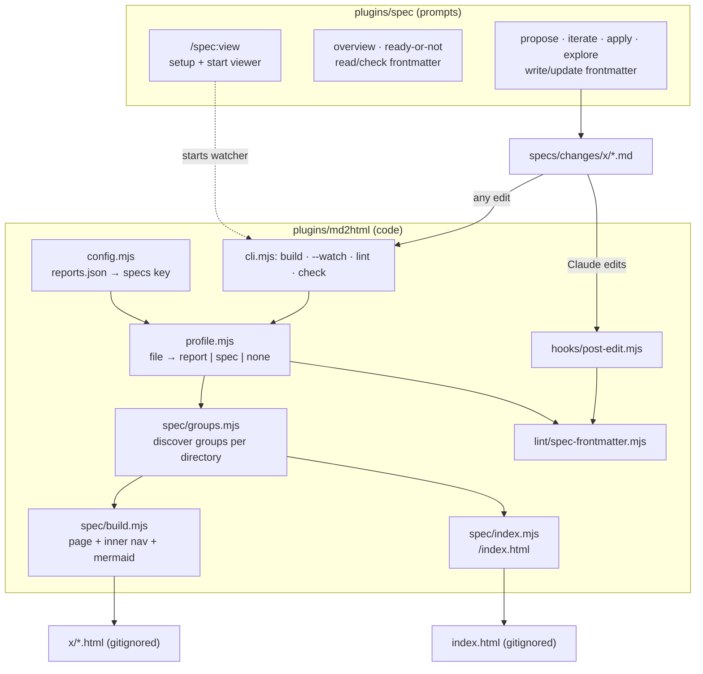

# Architecture: spec frontmatter and HTML view

Two plugins change. **spec** stays pure prompt: its skills write and read frontmatter.
**md2html** gains a second profile and does all rendering. The spec plugin never depends on
md2html for its core workflow; only `/spec:view` needs it.



## md2html changes

### Config

`reports.json` gets an optional `specs` key (closed schema, validated like the rest):

```json
{
  "specs": {
    "sources": ["specs/**/*.md"],
    "index": "index.html",
    "mermaid": "https://cdn.jsdelivr.net/npm/mermaid@<pinned>/dist/mermaid.esm.min.mjs"
  }
}
```

All three sub-keys are optional; the values above are the defaults, and `"specs": {}` turns
the profile on. Without a `specs` key nothing changes for existing projects.

### Profile selection (`src/profile.mjs`)

`profileOf(relPath, config)` → `'report'` if it matches `sources`, else `'spec'` if it
matches `specs.sources`, else `null`. Report wins when both match, so reports under `specs/`
(the default `specs/**/*-report.md`, karpathy.app-style `specs/NN_x/*-report.md`) stay reports
and keep their committed HTML; a project whose report glob is as broad as `specs/**/*.md` must
narrow it. Stale spec-HTML removal only ever considers files whose `.md` is spec-profile, and
never the index. The CLI, hook and watcher all call it.

| Command | report files | spec files |
|---|---|---|
| `fmt` | canonical rewrite | **skipped** (we don't rewrite people's specs) |
| `lint` | all report rules | spec frontmatter (errors) + links, directives (warnings) |
| `build` | report page | spec page + its group's siblings (nav) + project index |
| `build --check` / `check` | stale = error | **skipped** (HTML is gitignored) |
| `build --watch` | rebuild | rebuild page; a file added/removed in a group rebuilds the whole group; always the index |
| `build --specs` (also `--watch`) | **skipped** | spec pages + index only (what `/spec:view` runs) |
| hook | lint → fmt → lint | lint only (frontmatter errors → exit 2); **never builds** |

Why only the watcher builds spec HTML: it sees every edit, Claude's included, so a hook build
would do the same work twice. The hook stays for what the watcher can't do: give Claude lint
feedback in the same turn. If the watcher isn't running, HTML is stale until `/spec:view` (or
`md2html build`) runs again; that is accepted for a local view.

### Groups (`src/spec/groups.mjs`)

`groups(files, readFrontmatter)` → one group per directory holding spec files:
`{dir, items: [{file, label, order, title, feature, status, edited}]}`. Items sort by `order`
(missing = after all numbered ones), then file name. Label = file name without `.md`, `-`/`_`
→ space, first letter upper. Nothing in md2html knows the names `proposal`, `plan`, etc.

### Spec page (`src/spec/build.mjs`)

`buildSpec(source, {file, config, group})` → HTML string. Pure, like `build`. `group` comes
from `groups.mjs` (the CLI reads the directory), so the function never reads the filesystem.

- Reuses the parse chain, heading ids (no numbering), tables, figures, links (`.md` → `.html`
  for spec and report targets), directives (so a `:::tldr` in a proposal works).
- ` ```mermaid ` fences render as `<pre class="mermaid">` with the source escaped.
- Template: `nav.spec-nav` (↑ up link to the project index, one link per group item, status
  pill), `main`
  with the body, and — only if the page has a Mermaid block — one module script:
  `import mermaid from '<config url>'; mermaid.initialize({ startOnLoad: false, theme:
  matchMedia('(prefers-color-scheme: dark)').matches ? 'dark' : 'default' }); mermaid.run();`
  If the script can't load (offline), the `<pre>` stays visible as code.
- Same `base.css` + theme. New contract classes: `spec-nav`, `spec-status` (+ one class per
  status), `mermaid`.

### Project index (`src/spec/index.mjs`)

`buildIndex(groups, {config})` → HTML for `specs.index` (default `index.html` in the project
root). One row per group, sorted by directory: directory, feature + status (if the items carry
them; `—` otherwise), title of the first item, newest `edited`, and links to every page.
Rebuilt whenever any spec page is. **Overwrite guard:** the CLI writes it only if the target is
missing or contains md2html's generator meta; otherwise `build` errors (exit 2) and says to set
`specs.index` (e.g. `specs/index.html`) — a web project's own `index.html` is never touched.

### Lint (`src/lint/spec-frontmatter.mjs`)

Closed schema from domain.md. Errors: missing/unknown key, bad `status` value, non-integer `order`,
non-ISO date, `edited < created`, `feature` ≠ directory name. Cross-file (CLI `lint` over all
sources only): files of one group disagreeing on `status` or `feature` → error at each odd one
out.
Files with **no frontmatter** get one warning (`add spec frontmatter`), not an error, so legacy
changes don't break `check`.

## spec plugin changes

| Skill | Change |
|---|---|
| `propose` | every artifact starts with spec frontmatter, `status: proposed`, `order` 1–4 |
| `iterate` | keeps/adds frontmatter, bumps `edited` on changed files |
| `apply` | first completed step → `status: applying` on all artifacts; all steps done → `applied` |
| `explore` | if it writes into a change dir: `status: exploring` |
| `document-system` | system docs get frontmatter with title and dates only (no feature/status) |
| `overview` | Phase column reads `status`; falls back to the checkbox heuristic when absent; shows a mismatch warning |
| `ready-or-not` | missing/inconsistent frontmatter is a MEDIUM finding |
| `archive` | unchanged (dir is removed); strips frontmatter when merging content into `specs/system/` |
| **`view`** (new, user-invoked) | locate md2html (same lookup as md2html skills), ensure `reports.json` has `specs` (create a minimal one if absent), ensure `.gitignore` has `specs/**/*.html` and the index path (`/index.html`), build once, start `build --watch` and `python3 -m http.server` in the background, poll until it answers, `open` the change's `proposal.html` (or the index) |

If md2html is not installed, `/spec:view` says how to install it and stops; everything else
in the spec plugin works without it.

## Key decisions

| Decision | Alternatives | Why |
|---|---|---|
| Status repeated in every file | only in `proposal.md` | the user asked for it in every spec file; each HTML page shows it without reading siblings; lint catches drift |
| Groups discovered per directory, `order` key | hard-wired artifact list | user decision; new files (risks.md, decisions.md) join the nav with no code change |
| Watcher builds, hook only lints | both build | user decision; the watcher already sees Claude's edits |
| Index at project root, overwrite guard | `specs/index.html` | user decision; the guard protects web projects that own `index.html` |
| Report wins when both globs match | spec wins | reports under `specs/` (default `*-report.md`) are committed HTML; rendering them as gitignored spec pages broke them (review X1) |
| Render via md2html profile | separate renderer in spec plugin | one pipeline, one theme, the hook and watcher already exist |
| HTML gitignored | committed | user decision; no diff noise, no staleness checks |
| Client-side Mermaid, pinned CDN | inline 3 MB, mermaid-cli | user decision; instant rebuilds, no Chromium |
| No fmt for specs | same as reports | specs are prose written by many hands; rewriting them is noise |
| Spec lint mostly warnings | errors like reports | don't block the lifecycle on cosmetic issues; frontmatter is the contract, so it errors |

## Risks

- **CDN availability / version drift**: exact version pin; offline shows code. Accepted.
- **Legacy changes** without frontmatter: warning + overview fallback. Accepted.
- **Glob overlap** with report sources: report wins (profile selection). Tested. Default spec
  glob `specs/**/*.md` also matches karpathy.app-style `specs/NN_x/*-report.md`; those stay
  reports because the report glob wins. A report glob as broad as `specs/**/*.md` swallows the
  specs: narrow it.
- **Stale HTML when the watcher isn't running**: accepted; `/spec:view` builds once on start.
- **Watcher left running**: `/spec:view` prints the PIDs and how to stop them.
