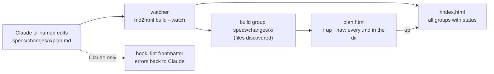

# Proposal: spec frontmatter and an HTML view of changes

## What

Two additions to the spec workflow, usable by every project that installs the marketplace:

1. **Frontmatter on every spec file.** Each `.md` in a change directory (and in
   `specs/system/`) starts with YAML that names the **feature** and its **status**. The spec
   skills write and update it; `/spec:overview` reads status from it instead of guessing from
   checkboxes.
2. **A read-only HTML view.** Every spec `.md` gets a generated `.html` next to it. The
   `.html` files of one directory form a **group** with an **inner navigation** bar between
   them and an "up" link to a generated **project index** (`/index.html`) that lists every
   group. Which files a group has is **discovered** by the build, not hard-wired. Mermaid
   diagrams render in the browser. A watcher regenerates the HTML whenever a `.md` changes.
   The HTML is gitignored: a local reading aid, never a source.

The HTML is produced by the `md2html` plugin through a new **spec profile**. The spec plugin
gets a `/spec:view` skill that sets up and starts the viewer.

## Why

- Status today is inferred (`/spec:overview` counts `[x]` in `plan.md`). It is invisible in the
  files themselves and can't express "proposed but not yet ready" or "paused".
- Reading four long Markdown files with Mermaid source in an editor is hard work. A user who
  follows the lifecycle (explore → propose → ready-or-not → apply → archive) mostly *reads*;
  they should be able to do that in a browser, with diagrams drawn.
- md2html already has the pipeline (build, `--watch`, menu bar, hook, themes). Reusing it
  avoids a second renderer.

## Scope

In scope:

- The spec frontmatter schema (domain.md) and its use in all spec skills.
- md2html: a `spec` profile (frontmatter schema, groups discovered per directory, inner nav,
  project index, client-side Mermaid, no section numbering, no fmt), configured in
  `reports.json`.
- Watcher: `md2html build --watch` builds spec HTML on every change, from Claude or any
  editor. Hook: lints spec frontmatter after Claude's edits so Claude fixes it in the same
  turn; it does not build.
- `/spec:view`: configure the profile if missing, add the `.gitignore` lines, start the
  watcher and a local server, open the change's HTML.
- `/spec:overview`, `/spec:ready-or-not`: read and check the frontmatter.
- Backward compatibility with existing changes that have no frontmatter.

Out of scope:

- Committing spec HTML, GitHub Pages publishing.
- Editing in the browser.
- Rendering Mermaid at build time (reports keep committed `.svg`s).
- Offline Mermaid (the script comes from a pinned CDN URL; diagrams show as code offline).

## Decisions taken with the user (2026-09-30)

| Question | Answer |
|---|---|
| Commit the spec HTML? | No: local-only, gitignored |
| Mermaid in the HTML? | Rendered in the browser by a pinned Mermaid script |
| What triggers the build? | The watcher only; it sees Claude's edits too. The hook only lints spec frontmatter and reports back to Claude |
| Which files form a page group? | Discovered: every `.md` in a directory; no hard-wired artifact names |
| Where is the index? | A generated `index.html` in the project root, linking every group; each page has an "up" link to it |

## Expected outcome

- `/spec:propose add-x` writes four artifacts, each starting with `feature: add-x` and
  `status: proposed`.
- `/spec:apply` sets `status: applying` on all artifacts of the change, `applied` when the
  plan is done.
- `/spec:view add-x` opens `http://localhost:<port>/specs/changes/add-x/proposal.html`; editing
  `plan.md` in any editor (or by Claude) updates `plan.html` within a second.
- Adding `specs/changes/add-x/risks.md` makes a "Risks" entry appear in the group's nav with no
  configuration.
- `http://localhost:<port>/index.html` lists every group; every page's "up" link goes there.
- `git status` never shows spec `.html` files.

## Compatibility

- **spec** plugin: MINOR (6.3.0 → 6.4.0). Existing changes without frontmatter keep working;
  skills add frontmatter the next time they write an artifact, and `/spec:overview` falls back
  to today's checkbox heuristic.
- **md2html**: MINOR (0.1.0 → 0.2.0). The report profile is unchanged; `reports.json` gains an
  optional `specs` key.
