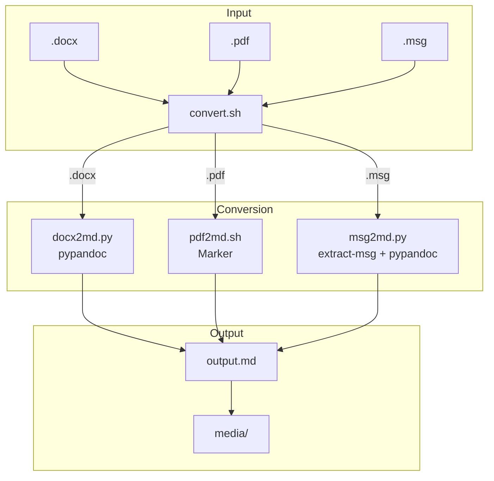

# Architecture: Claude Code Plugin Marketplace

## Repository Structure

```
.claude-plugin/
  marketplace.json           # Registry manifest — lists all plugins

plugins/
  spec/                      # Spec workflow plugin (v6.1.0)
    .claude-plugin/plugin.json
    skills/
      overview/SKILL.md
      document-system/SKILL.md
      explore/SKILL.md
      propose/SKILL.md
      iterate/SKILL.md
      apply/SKILL.md
      archive/SKILL.md

  md2pdf/                    # Markdown → PDF converter (v1.0.0)
    .claude-plugin/plugin.json
    package.json             # Node.js dependencies
    scripts/convert.mjs      # Conversion script (Node.js)
    templates/               # HTML template + CSS

  transform/                 # Document → Markdown converter (v1.0.0)
    .claude-plugin/plugin.json
    requirements.txt         # Python dependencies
    scripts/
      setup.sh               # .venv creation + pip install
      convert.sh             # Format dispatcher
      batch.sh               # Directory batch conversion
      docx2md.py             # DOCX → MD (pypandoc)
      pdf2md.sh              # PDF → MD (Marker)
      msg2md.py              # MSG → MD (extract-msg + pypandoc)
    skills/
      doc2md/SKILL.md
      batch/SKILL.md
    testdata/                # Sample files + generator script

specs/
  system/                    # Living system description
  changes/                   # Active spec changes
```

## Plugin Architecture Patterns

### Pure Prompt (spec)
Skills are SKILL.md files only — no scripts, no dependencies. Claude uses its
built-in tools (Read, Write, Bash, Glob, etc.) to perform the work. The prompt
is the entire implementation.

### Script + Prompt (md2pdf, transform)
Real scripts handle the deterministic work; SKILL.md prompts tell Claude how
to invoke them and handle the user-facing parts.


## Dependency Management

| Plugin | Runtime | Dependencies | Install mechanism |
|--------|---------|-------------|-------------------|
| spec | None | None | Pure prompt |
| md2pdf | Node.js | markdown-it, highlight.js, playwright | `npm install` in plugin dir |
| transform | Python 3.11-3.13 | pypandoc_binary, extract-msg, marker-pdf | `.venv` via `setup.sh` |

Dependencies are installed on first use, not at plugin install time. Each
plugin manages its own dependencies in isolation (node_modules/ or .venv/).

## Key Technologies

| Component | Technology | Purpose |
|-----------|-----------|---------|
| Pandoc | Via `pypandoc_binary` (pip) | DOCX → MD, HTML → MD conversions |
| Marker | `marker-pdf` (pip) | PDF → MD with ML-based layout understanding |
| extract-msg | Python library (pip) | Parse Outlook MSG files |
| Playwright | Node.js (npm) | Headless browser for PDF rendering in md2pdf |
| markdown-it | Node.js (npm) | Markdown → HTML rendering in md2pdf |

## Data Flow: transform Plugin


