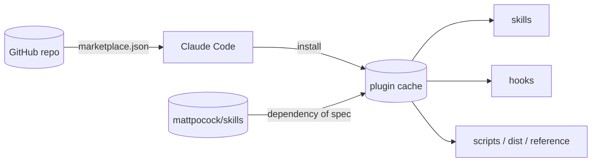
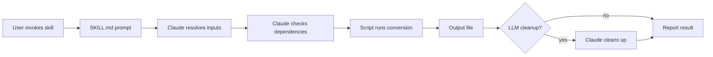
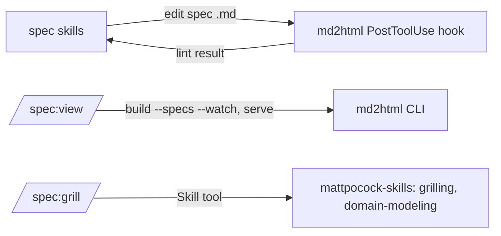
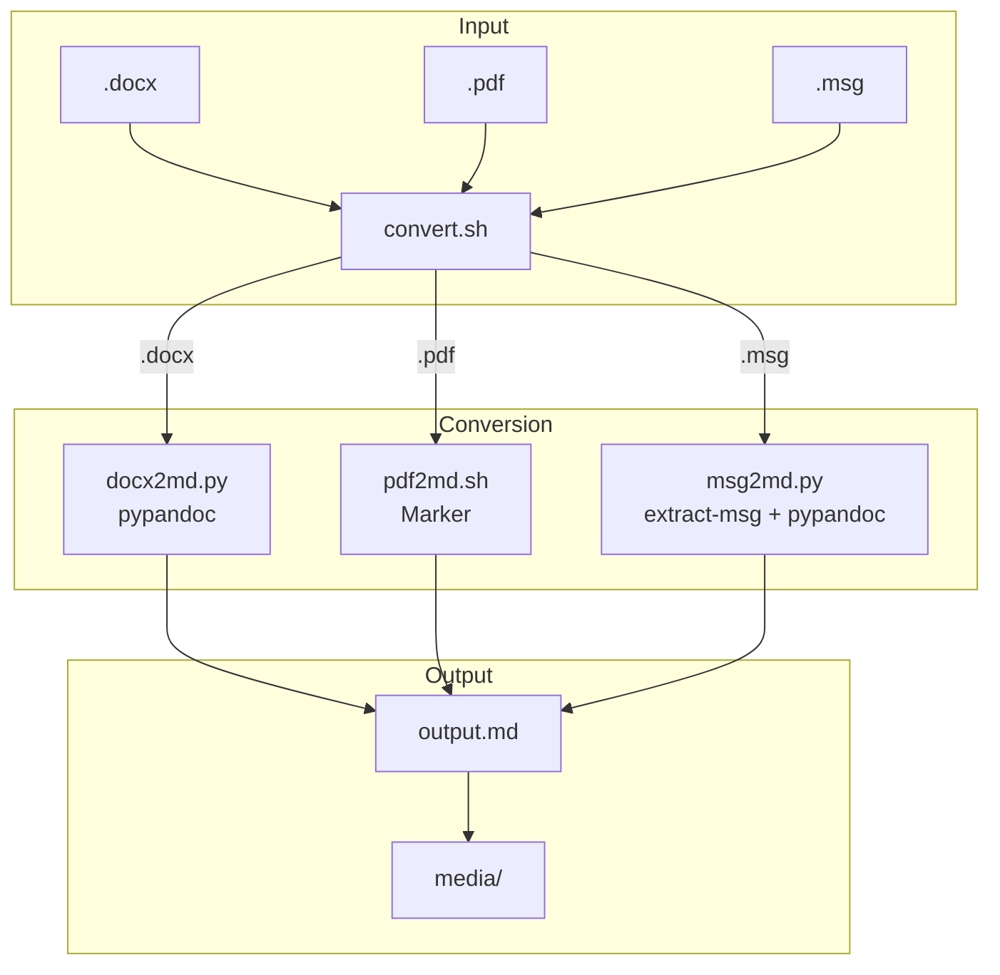

# Architecture: Claude Code Plugin Marketplace

## Overview

A Git repository served as a Claude Code marketplace. Claude Code fetches
`marketplace.json` from GitHub and copies each installed plugin directory —
all of it, not just `skills/` — into `~/.claude/plugins/cache/<marketplace>/<plugin>/<version>/`.
There is no server or build pipeline for the marketplace itself; md2html is
the only plugin with a build step (its bundle is committed).


```mermaid
graph LR
    GH[(GitHub repo)] -->|marketplace.json| CC[Claude Code]
    CC -->|install| Cache[(plugin cache)]
    Cache --> SK[skills]
    Cache --> HK[hooks]
    Cache --> SC[scripts / dist / reference]
    MPS[(mattpocock/skills)] -->|dependency of spec| Cache
```

## Repository Structure

```
.claude-plugin/
  marketplace.json           # Registry manifest — lists all plugins

plugins/
  spec/                      # Spec workflow (v8.0.0), pure prompt
    .claude-plugin/plugin.json   # depends on mattpocock-skills
    reference/
      frontmatter.md         # canonical spec frontmatter + status lifecycle
      plan.md                # plan-step format + test-first cycle
    skills/
      overview/ document-system/ explore/ propose/ grill/
      iterate/ apply/ adversarial-code-review/ archive/ view/

  md2html/                   # Markdown → HTML (v0.4.0), Node
    .claude-plugin/plugin.json
    hooks/hooks.json         # PostToolUse Write|Edit|MultiEdit
    hooks/post-edit.mjs      # fmt + lint after edits
    dist/md2html.mjs         # committed esbuild bundle (CLI + library)
    src/                     # sources (cli, config, build, render, lint/, spec/, transforms/, serve)
    scripts/bundle.mjs
    test/                    # 22 node:test files
    skills/write/ build/ setup/

  agent-bus/                 # Multi-agent inbox protocol (v0.4.0)
    scripts/check-inbox-hook.sh  # UserPromptSubmit wake-up
    scripts/watch.mjs            # fs.watch → spawns claude -p
    skills/coordinate/

  md2pdf/                    # Markdown → PDF (v1.0.0), Node
    package.json             # markdown-it, highlight.js, playwright
    scripts/convert.mjs
    templates/               # HTML template + CSS
    skills/convert/

  transform/                 # Document → Markdown (v1.0.0), Python
    requirements.txt
    scripts/ setup.sh convert.sh batch.sh docx2md.py pdf2md.sh msg2md.py
    skills/doc2md/ batch/
    testdata/

specs/
  system/                    # Living system description
  changes/                   # Active spec changes
reports.json                 # md2html config for this repo ({"specs": {}})
```

## Plugin Architecture Patterns

### Pure Prompt (spec, agent-bus)
Skills are prompts; Claude uses built-in tools (Read, Write, Bash, …) to do
the work. `spec` keeps shared rules in `reference/*.md`, which skills read via
`../../reference/<file>` relative to their own directory. agent-bus adds two
optional helper scripts for waking agents.

### Script + Prompt (md2pdf, transform)
Scripts handle the deterministic work; SKILL.md tells Claude how to invoke
them and handles the user-facing parts.


```mermaid
graph LR
    U[User invokes skill] --> S[SKILL.md prompt]
    S --> C[Claude resolves inputs]
    C --> D[Claude checks dependencies]
    D --> R[Script runs conversion]
    R --> O[Output file]
    O --> L{LLM cleanup?}
    L -->|yes| CL[Claude cleans up]
    L -->|no| E[Report result]
    CL --> E
```

### Tool + Hook + Prompt (md2html)
A deterministic CLI (`dist/md2html.mjs`, no runtime `npm install`), a hook
that lints/formats every edited Markdown file and feeds the result back to
Claude, and skills that tell Claude how to write and build.

## Cross-plugin integration


```mermaid
graph LR
    SP[spec skills] -->|edit spec .md| HK[md2html PostToolUse hook]
    HK -->|lint result| SP
    SV[/spec:view/] -->|build --specs --watch, serve| MD[md2html CLI]
    SG[/spec:grill/] -->|Skill tool| MP[mattpocock-skills: grilling, domain-modeling]
```

- **spec → md2html**: spec skills edit spec files with Write/Edit so the hook
  lints frontmatter (`md2html:spec-frontmatter`, `spec-consistency`).
  `/spec:view` locates the newest md2html ≥ 0.3.0 (project
  `tools/md2html.mjs`, plugin cache, marketplace checkout), adds `specs` to
  `reports.json`, gitignores spec HTML, and runs one watcher and one server
  per project. Without md2html everything else in spec still works.
- **spec → mattpocock-skills**: declared in `plugin.json` `dependencies`;
  `marketplace.json` allows it via `allowCrossMarketplaceDependenciesOn:
  ["mattpocock"]`. Only `/spec:grill` uses it.

## md2html internals

| Module | Role |
|---|---|
| `src/cli.mjs` | Command dispatch (`new`, `fmt`, `lint`, `build`, `check`, `syntax`, `serve`), file listing, watch |
| `src/config.mjs` | Finds `reports.json` (walks up to the git root), validates a closed schema |
| `src/profile.mjs`, `src/glob.mjs` | Report vs spec profile, glob matching |
| `src/registry.mjs` | Directive registry — single source for syntax, lint, render |
| `src/processor.mjs`, `src/transforms/*` | unified/remark pipeline: TOC, tables, links, figures, headings, callouts, directives |
| `src/fmt.mjs` | Canonical Markdown rewrite (reports only) |
| `src/lint.mjs`, `src/lint/*` | Lint rules per family, incl. spec frontmatter |
| `src/build.mjs`, `src/render.mjs` | HTML page template, inlined CSS |
| `src/spec/*` | Spec grouping, nav, index page |
| `src/serve.mjs` | Local page server |

Determinism: build output is a pure function of source bytes, config,
theme and tool version — no clock, mtimes, git or locale; exact dependency
pins; files written only when bytes change. Tests build fixtures twice under
different TZ/LANG and check `dist/` matches a fresh bundle.

`serve` binds 127.0.0.1, answers GET/HEAD only, serves page types only
(`.html`, `.css`, images), rejects dot-segments, `node_modules` and symlinks
escaping the root.

## agent-bus transport

```
<workspace>/.agent-bus/
  agents/<agent-id>/{inbox,processing,done,failed}/
  archive/  threads/  chat.md
```

Messages are written as `.tmp_<id>.json` and renamed into the recipient's
inbox (atomic). The receiver moves each file inbox → processing → done (or
failed, answering with a `blocker`). Wake-ups: the `UserPromptSubmit` script,
`watch.mjs` (spawns `claude -p` in the agent's repo), or `/loop`. Hooks are
not registered by `plugin.json`; projects wire them up.

## Dependency Management

| Plugin | Runtime | Dependencies | Install mechanism |
|--------|---------|-------------|-------------------|
| spec | None | Plugin: mattpocock-skills (for grill); optional md2html ≥ 0.3.0 (for view) | Claude Code plugin dependencies |
| md2html | Node.js 20+ | None at runtime (bundled); dev: unified/remark, yaml, esbuild | Committed `dist/` |
| agent-bus | Node.js (watch.mjs only), sh | None | — |
| md2pdf | Node.js | markdown-it, markdown-it-footnote, highlight.js, playwright | `npm install` in plugin dir |
| transform | Python 3.11–3.13 | pypandoc_binary, extract-msg, marker-pdf | `.venv` via `setup.sh` |

md2pdf and transform install dependencies on first use, in isolation
(`node_modules/` or `.venv/`).

## Key Technologies

| Component | Technology | Purpose |
|-----------|-----------|---------|
| unified / remark | Node.js | Markdown parsing and HTML in md2html |
| esbuild | Node.js (dev) | Bundles md2html into one file |
| Mermaid | Browser, CDN (`mermaid@12.0.0`) | Diagrams in spec pages and md2pdf |
| Pandoc | Via `pypandoc_binary` (pip) | DOCX → MD, HTML → MD conversions |
| Marker | `marker-pdf` (pip) | PDF → MD with ML-based layout understanding |
| extract-msg | Python library (pip) | Parse Outlook MSG files |
| Playwright | Node.js (npm) | Headless browser for PDF rendering in md2pdf |
| markdown-it | Node.js (npm) | Markdown → HTML rendering in md2pdf |

## Data Flow: transform Plugin


```mermaid
graph TD
    subgraph "Input"
        A[.docx] --> D[convert.sh]
        B[.pdf] --> D
        C[.msg] --> D
    end

    subgraph "Conversion"
        D -->|.docx| E[docx2md.py<br>pypandoc]
        D -->|.pdf| F[pdf2md.sh<br>Marker]
        D -->|.msg| G[msg2md.py<br>extract-msg + pypandoc]
    end

    subgraph "Output"
        E --> H[output.md]
        F --> H
        G --> H
        H --> I[media/]
    end
```

## Testing

Only md2html has an automated suite (`npm test` → `node --test`, 22 files:
golden fixtures, fmt fuzz/idempotence, lint, CLI, hook, serve, determinism,
bundle sync). spec, agent-bus, md2pdf and transform have no tests; transform
has sample input files in `testdata/`.
