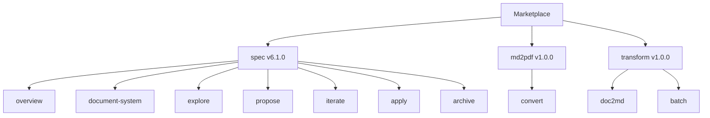

# Domain: Claude Code Plugin Marketplace

## Core Concepts

### Marketplace
A registry of plugins that can be installed into Claude Code. Defined by a
`marketplace.json` manifest that lists available plugins with their names,
source paths, versions, and metadata. Users register the marketplace via
`/plugin marketplace add` and then install individual plugins.

### Plugin
A self-contained package of skills and optional supporting files (scripts,
templates, dependencies). Each plugin has:
- A `plugin.json` manifest with name, version, description, and author
- One or more skills in `skills/<name>/SKILL.md`
- Optional scripts, templates, and dependency files

### Skill
A Claude Code capability defined by a `SKILL.md` file. The file contains YAML
frontmatter (description, argument hints, flags) and a Markdown prompt body
that instructs Claude how to perform the task. Skills are invoked as
`/<plugin>:<skill>` (e.g., `/spec:propose`, `/transform:doc2md`).

### Versioning
Plugins use semantic versioning. The version appears in both `plugin.json` and
`marketplace.json` and must be kept in sync. Patch for fixes, minor for new
features, major for breaking changes.

## Actors

### Plugin Author
Creates and maintains plugins. Defines skills, writes scripts, manages
versions. Currently the sole author is Till Gartner.

### Plugin User
Installs plugins from the marketplace into their Claude Code environment.
Invokes skills during their workflows.

## Vocabulary

| Term | Meaning |
|------|---------|
| Marketplace manifest | `.claude-plugin/marketplace.json` — the registry index |
| Plugin manifest | `plugins/<name>/.claude-plugin/plugin.json` — per-plugin metadata |
| Skill prompt | `SKILL.md` — the instruction file Claude receives when a skill is invoked |
| Frontmatter | YAML header in SKILL.md defining skill behavior |
| Namespace | Plugin name used as prefix for skills (`/spec:*`, `/transform:*`) |

## Current Plugins

