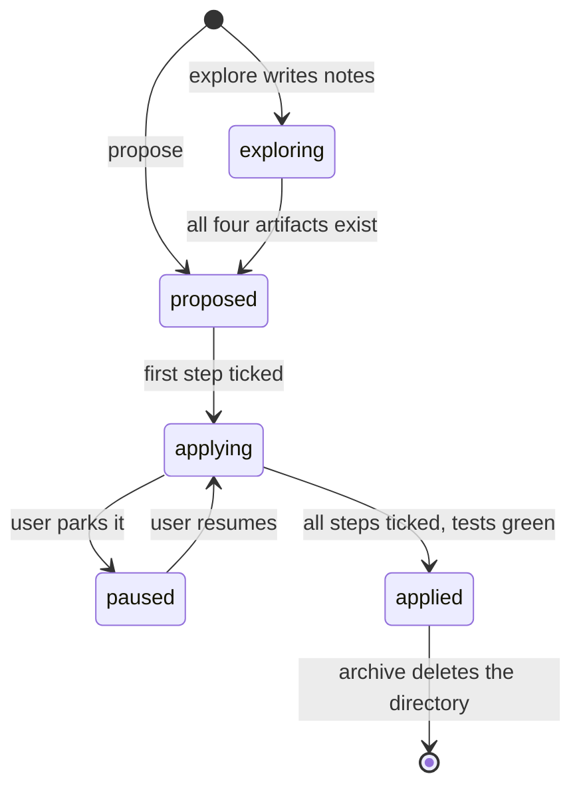
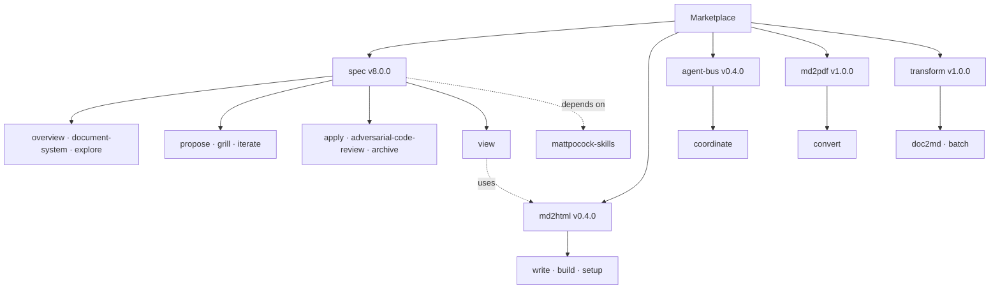

# Domain: Claude Code Plugin Marketplace

## Purpose

A personal Claude Code plugin marketplace by Till Gartner. It bundles the
skills he uses across projects — spec-driven change management, document
conversion, deterministic HTML reports and multi-agent coordination — so a
project (and its teammates) can install them with one settings file.

## Core Concepts

### Marketplace
A registry of plugins that can be installed into Claude Code. Defined by
`.claude-plugin/marketplace.json` (name `till-claude-code-marketplace`), which
lists every plugin with name, source path, version and description. Users
register it via `/plugin marketplace add tillg/till-claude-code-marketplace`
or a project's committed `.claude/settings.json` (see README, "Link the skills
into a project").

### Plugin
A self-contained package of skills and optional supporting files (scripts,
templates, hooks, reference docs, dependencies). Each plugin has:
- A `plugin.json` manifest with name, version, description, author and
  optionally `dependencies` on plugins of other marketplaces
- One or more skills in `skills/<name>/SKILL.md`
- Optional `hooks/hooks.json`, scripts, templates, reference files

### Skill
A Claude Code capability defined by a `SKILL.md` file: YAML frontmatter
(`description`, `argument-hint`, `disable-model-invocation`, …) plus a Markdown
prompt body. Invoked as `/<plugin>:<skill>`. The namespace comes from the
plugin; a `name` field in the frontmatter would break it and is never used.
`disable-model-invocation: true` makes a skill user-only.

### Hook
A command Claude Code runs on an event. md2html ships a `PostToolUse` hook
(fmt + lint after every Write/Edit of a Markdown file); agent-bus ships a
`UserPromptSubmit` script projects can register.

### Versioning
Semantic versioning per plugin. The version appears in both `plugin.json` and
`marketplace.json` and must match; every commit touching a plugin bumps it
(rules in `CLAUDE.md`).

## Domain: spec-driven change management (`spec`)

| Term | Meaning |
|------|---------|
| System description | `specs/system/*.md` — what the system **is** and does now (domain, architecture, functional). Updated at archive. |
| Change | One planned modification, `specs/changes/<name>/`, kebab-case name. Temporary: deleted at archive. |
| Artifact | A file of a change: `proposal.md` (what/why), `domain.md` (concepts), `architecture.md` (how), `plan.md` (steps); extras such as `decisions.md` allowed. |
| Spec frontmatter | YAML block on every spec file. Change files: `feature`, `title`, `status`, `order`, `created`, `edited`. System files: `title`, `created`, `edited`. Defined in `plugins/spec/reference/frontmatter.md`. |
| Status | Lifecycle of a whole change, same in every file: `exploring`, `proposed`, `applying`, `paused`, `applied`. |
| Plan step | A checkbox in `plan.md` with a `Test first:` and a `Verify:` line (`plugins/spec/reference/plan.md`). |
| Test-first | Per step: write the test, see it fail, implement, run Verify + full suite, then tick. |
| Grilling | An interview that settles a change's open decisions (via Matt Pocock's `grilling` + `domain-modeling`). |
| Annotation | User markup in artifacts (`->`, `xxx`, `[ACCEPTED]`, `[REJECTED]`, `[DECISION]`, comments) that `/spec:iterate` folds in. |
| Archive | Folding a finished change into `specs/system/`, committing, deleting the change directory. Git history is the archive. |

```mermaid
stateDiagram-v2
    [*] --> exploring: explore writes notes
    [*] --> proposed: propose
    exploring --> proposed: all four artifacts exist
    proposed --> applying: first step ticked
    applying --> paused: user parks it
    paused --> applying: user resumes
    applying --> applied: all steps ticked, tests green
    applied --> [*]: archive deletes the directory
```

Rules: one `status` per change in every file; `feature` = directory name;
status never downgrades; a plan step is ticked only when its verify command
and the full suite pass; a new proposal is recommended only once open
changes are archived.

## Domain: deterministic reports (`md2html`)

| Term | Meaning |
|------|---------|
| Report | A Markdown file matching `sources` (default `specs/**/*-report.md`), built to a committed, self-contained `.html`. |
| Spec page | A spec `.md` rendered to gitignored HTML with per-directory nav, status pill and Mermaid in the browser. |
| Profile | `report` or `spec` — decides frontmatter schema, formatting and layout. Report wins when both match. |
| `reports.json` | Project config at the project root: `sources`, `reports` (menu), `brand`, `lang`, `theme`, optional `specs`. |
| Directive | Block syntax from the registry: `tldr`, `cards`, `card`, `verdict`. |
| Theme | Per-project CSS layered after the base CSS; may change tokens and contract classes, not structure. |
| Report status | `research`, `ongoing`, `implemented`. |

## Domain: agent coordination (`agent-bus`)

| Term | Meaning |
|------|---------|
| Bus | `.agent-bus/` at the shared parent of sibling repos. |
| Agent ID | Project directory basename, lowercased, non-alphanumerics → `-` (override via CLAUDE.md or `AGENT_ID`). |
| Message | JSON file `<created_at>__<from>__<to>__<type>__<id>.json`, schema `agent-bus-message-v1`. |
| Message type | `request`, `reply`, `status`, `handoff`, `blocker`, `decision`, `alert`. |
| Priority | `low`, `normal`, `high`, `urgent`. |
| Mailbox states | `inbox` → `processing` → `done`, or `failed`. |
| Chat transcript | `.agent-bus/chat.md` — human-readable log, not the transport. |

## Domain: document conversion (`transform`, `md2pdf`)

- **transform**: DOCX, PDF, MSG → `<basename>.md` plus `media/<basename>/`.
- **md2pdf**: Markdown → PDF with highlighted code, tables, Mermaid, images.

## Actors

### Plugin Author
Creates and maintains plugins, skills, scripts and versions. Currently the
sole author is Till Gartner.

### Plugin User
Installs plugins and invokes skills. Often a teammate whose project commits
a `.claude/settings.json` that registers the marketplaces and installs the
plugins on first session.

### Claude (agent)
Executes skills; edits spec and report files under the md2html hook; in
agent-bus, one Claude session per repo acts as an agent.

### External: Matt Pocock's `mattpocock-skills`
Separate marketplace (`mattpocock/skills`), a declared dependency of `spec`
for `/spec:grill`.

## Vocabulary (marketplace)

| Term | Meaning |
|------|---------|
| Marketplace manifest | `.claude-plugin/marketplace.json` — the registry index |
| Plugin manifest | `plugins/<name>/.claude-plugin/plugin.json` — per-plugin metadata |
| Skill prompt | `SKILL.md` — the instruction file Claude receives when a skill is invoked |
| Skill frontmatter | YAML header in SKILL.md defining skill behavior (no `name`) |
| Namespace | Plugin name used as prefix for skills (`/spec:*`, `/md2html:*`) |
| Cross-marketplace dependency | A plugin dependency from another marketplace, allowed via `allowCrossMarketplaceDependenciesOn` |

## Current Plugins

```mermaid
graph TD
    M[Marketplace] --> S[spec v8.0.0]
    M --> H[md2html v0.4.0]
    M --> B[agent-bus v0.4.0]
    M --> P[md2pdf v1.0.0]
    M --> T[transform v1.0.0]

    S --> S1[overview · document-system · explore]
    S --> S2[propose · grill · iterate]
    S --> S3[apply · adversarial-code-review · archive]
    S --> S4[view]
    S -. depends on .-> MP[mattpocock-skills]
    S4 -. uses .-> H

    H --> H1[write · build · setup]
    B --> B1[coordinate]
    P --> P1[convert]
    T --> T1[doc2md · batch]
```
