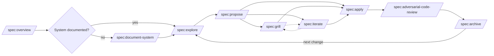
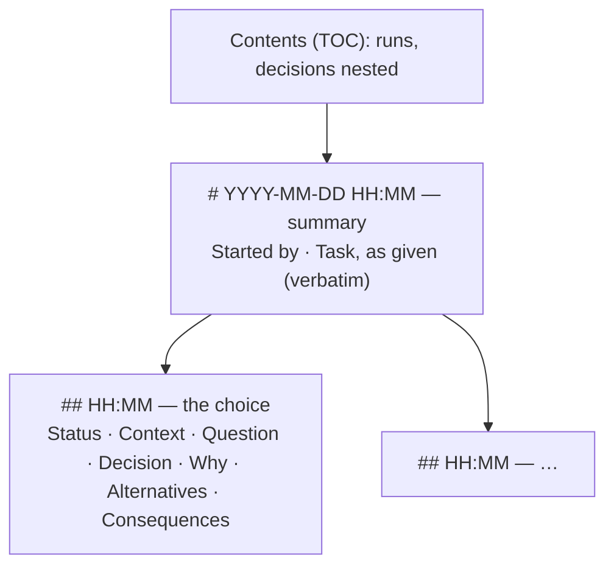

# Functional: Claude Code Plugin Marketplace

## Marketplace Functions

### Register marketplace
```
/plugin marketplace add tillg/till-claude-code-marketplace
```
Registers the marketplace with Claude Code. Fetches `marketplace.json` from
the GitHub repository.

### Install a plugin
```
/plugin install <name>@till-claude-code-marketplace
```
Downloads the plugin directory to the local plugin cache. Installing `spec`
also installs its dependency `mattpocock-skills` from the `mattpocock`
marketplace.

### Link the skills into a project (teammates)
A project commits `.claude/settings.json` with `extraKnownMarketplaces` (this
marketplace and `mattpocock/skills`, `autoUpdate: true`), `enabledPlugins`
(spec, md2html, mattpocock-skills) and a `SessionStart` hook that installs
missing plugins with project scope. A teammate clones, runs `claude`, trusts
the folder; plugins are installed in the first session and load after a
restart or `/reload-plugins`. Details: README, "Link the skills into a
project".

### Auto-update
When enabled, Claude Code checks for new plugin versions at startup.
`/spec:overview` also compares its version with the remote
`marketplace.json`.

## Plugin: spec (v11.0.0)

### User Journey: Spec-driven change

```
document-system → explore → propose → [grill | iterate] → apply → adversarial-code-review → archive
```



`/spec:explore` fits anywhere; grill and iterate are optional and
repeatable; `/spec:view` opens the specs as HTML at any time.

### Skills

| Skill | Input | Output | Side effects |
|-------|-------|--------|-------------|
| `/spec:overview` | None | Status table, phase, maturity, workflow reference, version/update check | None (read-only); warns on status mismatches and unarchived `applied` changes |
| `/spec:document-system` | Codebase | `specs/system/*.md` | Creates/updates system description files |
| `/spec:explore` | Idea/question | Conversation | None, or `exploring` notes in a change dir on request |
| `/spec:propose` | Change name or description | `specs/changes/<name>/` with proposal, domain, architecture, test-first plan; HTML view opened | First checks open changes and recommends archiving them; may run archive |
| `/spec:grill` | Change name | Settled decisions written into the artifacts | Needs `mattpocock-skills` and a user to answer; stops otherwise |
| `/spec:iterate` | Annotated artifacts | Clean consolidated artifacts | Rewrites artifact files; asks before finalizing |
| `/spec:apply` | Change name | Code + tests | Per step: test first (red), code (green), Verify + full suite, tick; sets `applying` / `applied` |
| `/spec:adversarial-code-review` | `[fixed-point] [change]` | Findings in three axes: Defects, Standards, Spec | Read-only; three parallel sub-agents |
| `/spec:archive` | Change name | Two commits | Runs tests, updates `specs/system/`, commits (after approval), deletes the change dir, commits again |
| `/spec:view` | `[change]` | Browser page on `http://localhost:<port>` | Adds `specs` (with `DECISIONS.md` in its sources) to `reports.json`, `.gitignore` lines; starts one md2html watcher + server per project |

### States and transitions
A change's `status` runs `exploring → proposed → applying → applied`, then
archive deletes the directory. Full meanings in
`plugins/spec/reference/frontmatter.md`. Legacy changes without frontmatter
still work: `/spec:overview` infers the phase from the files and checkboxes
and marks it "(inferred)"; md2html lint warns.

### Artifacts
- `specs/system/` — persistent system description (domain, architecture, functional)
- `specs/changes/<name>/` — temporary change artifacts (proposal, domain,
  architecture, plan; optional extras such as `risks.md`)
- `DECISIONS.md` (project root) — append-only log of choices made in
  unattended runs, across all changes; rendered to gitignored `DECISIONS.html`
- Spec HTML next to each `.md` and `index.html` — gitignored, local only

### Unattended runs
Skills that would ask (and `/autonomous`) make a sensible choice and log it
in `DECISIONS.md` at the project root — except grill (stops), archive selection (always asks) and propose's archive
offer (never archives unattended). apply never ticks a step whose Verify
fails. Each run's summary lists the decisions it logged.



One run per unattended invocation (a skill driven by `/autonomous` adds to
the `/autonomous` run), appended in chronological order; a decision's
`Status` goes `open` → `confirmed` / `reverted` when the user reviews it.
Format, ids and rules: `plugins/spec/reference/decisions.md` (identical copy
in the autonomous plugin). `/spec:view` adds `DECISIONS.md` to the spec
sources, so it is rendered (`/DECISIONS.html`, one row in the index) and
linted — broken Contents links are warnings.

## Plugin: md2html (v0.6.0)

### Skills

| Skill | Invocation | What it does |
|---|---|---|
| `/md2html:write` | Model or user, `[path] [what to write]` | Guides writing a `*-report.md`: layout rules, directive syntax (`syntax.md`) |
| `/md2html:build` | Model or user, `[--check] [paths…]` | Builds or checks reports, lists stale/failed files, opens the result over localhost via `md2html serve` (pages only; one server per project, reused) |
| `/md2html:setup` | User only, `[project-dir]` | Writes `reports.json`, optional theme stub, optional vendored `tools/md2html.mjs`, editor and `just` config, CLAUDE.md pointer |

### CLI (`node dist/md2html.mjs <cmd>`)

| Command | Effect |
|---|---|
| `new <path> [--title]` | Canonical report skeleton; never overwrites |
| `fmt [--check] [paths]` | Canonical rewrite of reports |
| `lint [--format json] [paths]` | `path:line:col severity message [rule]` |
| `build [--check] [--watch] [--specs] [paths]` | `.md` → `.html`; `--specs` = spec pages + index only |
| `check` | fmt --check + lint + build --check over all sources |
| `syntax [--json]` | Directive cheat sheet |
| `serve [--port N]` | Local page server (127.0.0.1, pages only) |

Exit codes: `0` clean, `1` findings (lint errors, stale HTML, non-canonical
Markdown), `2` usage/config error.

### Hook
After every Write/Edit/MultiEdit of a `.md` under a `reports.json` root:
report files are linted, then formatted if clean (Claude is told to re-read);
spec files are linted only. Errors are fed back to Claude.

### Inputs and outputs
- Report: `*-report.md` with `title`, `created`, `edited`, `status`
  (`research | ongoing | implemented`), optional `subtitle`, `description` →
  committed single-file HTML, numbered sections, TOC at ≥ 4 sections, menu.
- Spec: spec `.md` → gitignored HTML with per-directory nav, status pill,
  project index, Mermaid via CDN.

## Plugin: agent-bus (v0.4.0)

### User Journey: Coordinate agents across sibling repos

```
/agent-bus:coordinate
```

1. Find `.agent-bus/` in the shared parent directory; derive the agent ID.
2. Process own inbox by priority, then age: move each message to
   `processing`, act, move to `done` (or `failed` + `blocker` to the sender).
3. Send requests/replies/status/handoffs as atomic JSON files into the
   recipient's inbox; append a prose line to `chat.md`.

Wake-up options: `UserPromptSubmit` hook script, `watch.mjs` (starts
`claude -p` on new mail), or `/loop 2m /agent-bus:coordinate`. Humans follow
along with `tail -f .agent-bus/chat.md`.

## Plugin: autonomous (v1.0.0)

### User Journey: Make progress while the user is away

```
/autonomous [task]
```

1. Decide instead of asking; log each decision in `DECISIONS.md` at the
   project root (status `open` → `confirmed` / `reverted` by the user).
2. Work until done, test-first; parallel agents for independent sub-tasks;
   a spec change is worked like `/spec:apply`.
3. Self-review and fix (`/spec:adversarial-code-review` for spec changes).
4. Test end-to-end until the user returns (Playwright MCP for web apps).
5. Report decisions, what was built and tested, what is open.

Never pushes, archives, deletes non-test data or runs destructive git
commands. Invoked as `/autonomous`: its `SKILL.md` sets `name` on purpose,
the one exception to the repo's no-`name` rule.

## Plugin: md2pdf (v1.0.0)

### User Journey: Convert Markdown to PDF

```
/md2pdf:convert <file.md> [output.pdf]
```

1. Resolve input file
2. Install Node.js dependencies if missing (`npm install`)
3. Run `scripts/convert.mjs` — renders Markdown → HTML → PDF via Playwright
4. Open the resulting PDF

### Features
- Syntax-highlighted code blocks
- Styled tables with striped rows
- Mermaid diagram rendering (via CDN)
- Local image embedding as data URIs
- Footnotes
- Print-optimized CSS with page numbers

## Plugin: transform (v1.0.0)

### User Journey: Convert document to Markdown

```
/transform:doc2md <file> [output-dir]
```

1. Resolve input file
2. Create `.venv` and install Python deps if missing (`setup.sh`)
3. Detect format by extension, dispatch to converter script
4. Optionally apply LLM cleanup on output
5. Report result

### User Journey: Batch convert

```
/transform:batch <directory> [output-dir]
```

1. Scan directory (top level only) for .docx, .pdf, .msg files
2. Create `.venv` if missing
3. Ask about LLM cleanup
4. Convert each file sequentially via `batch.sh`
5. Show summary (success/failure counts)

### Supported Formats

| Format | Converter | Tool | Notes |
|--------|-----------|------|-------|
| DOCX | `docx2md.py` | pypandoc (bundled Pandoc) | High fidelity, clean output |
| PDF | `pdf2md.sh` | Marker (ML-based) | Downloads ~2GB models on first use |
| MSG | `msg2md.py` | extract-msg + pypandoc | Extracts headers, body, attachments |

### Output Contract
All converters produce:
- `<basename>.md` — the Markdown file
- `media/<basename>/` — extracted images/attachments (if any)

## Edge cases and known limitations

- Spec pages need network for Mermaid (CDN); offline they show the source.
- `/spec:view` needs md2html ≥ 0.3.0; `/spec:grill` needs mattpocock-skills.
- agent-bus hooks must be registered by the consuming project.
- Only md2html has automated tests; the prompt-only plugins are unverified
  by tooling.
